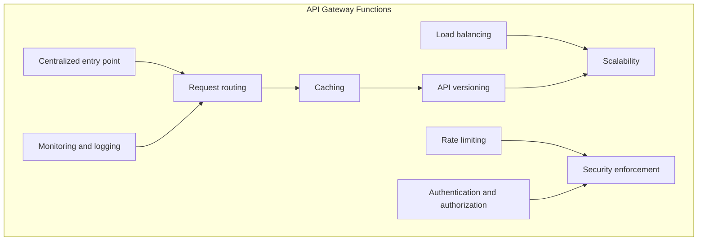
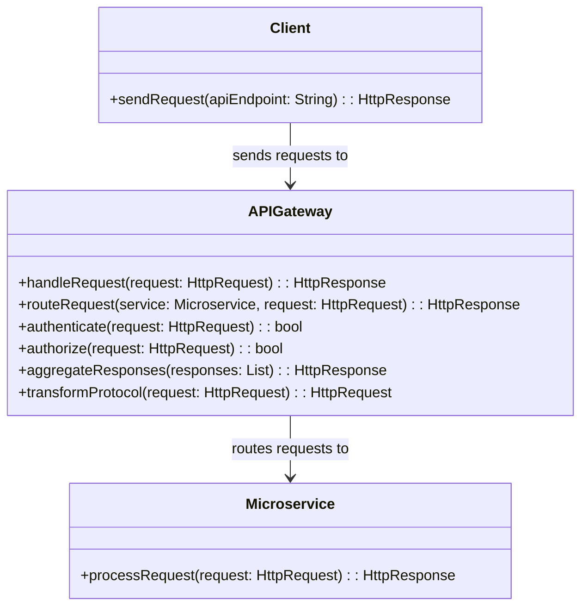
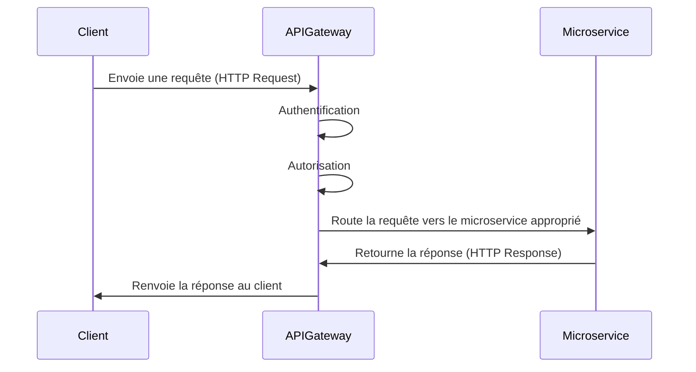
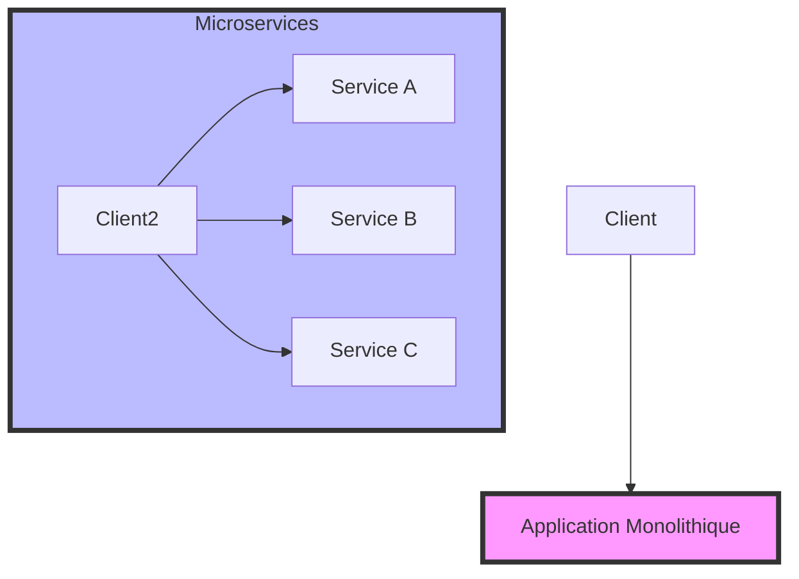
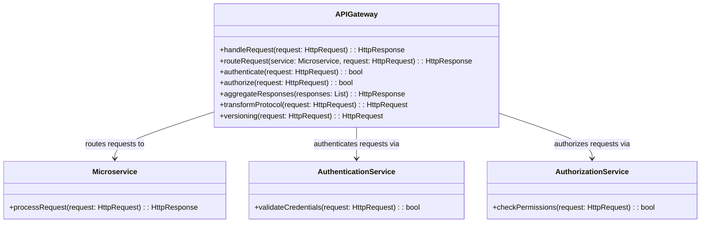
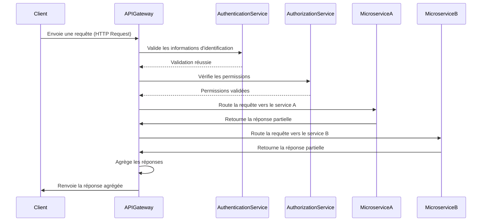

# Introduction à l'API Gateway

#### Qu'est-ce qu'un API Gateway ?
Un **API Gateway** est un serveur intermédiaire placé entre un client (comme une application mobile ou web) et un ensemble de microservices backend. Il agit comme un point d'entrée unique pour toutes les demandes des clients, les dirigeant ensuite vers le microservice approprié.

  
#### Diagramme de Classe : API Gateway

Voici un diagramme de classe simplifié illustrant le rôle de l'API Gateway dans un environnement microservices :

Dans ce diagramme :
- **Client** : Envoie des demandes à l'API Gateway.
- **API Gateway** : Reçoit les demandes, les authentifie, les autorise, puis les route vers le microservice approprié.
- **Microservice** : Traite la demande spécifique et renvoie la réponse à l'API Gateway.

#### Diagramme de Séquence : API Gateway

Un diagramme de séquence illustrant le flux d'une requête client passant par l'API Gateway pour atteindre un microservice :

Dans ce diagramme :
- Le **Client** envoie une requête à l'API Gateway.
- L'**API Gateway** authentifie et autorise la requête.
- L'API Gateway achemine la requête au **Microservice** approprié.
- Le **Microservice** traite la requête et retourne une réponse.
- L'**API Gateway** retourne cette réponse au **Client**.

# La particularité de l'API Gateway dans un contexte microservices

#### Introduction

Dans un contexte microservices, l'API Gateway joue un rôle crucial en agissant comme une interface centralisée entre les clients et les services backend. 

Contrairement à une architecture monolithique où un client peut interagir directement avec une seule application, les microservices se composent de multiples services indépendants, chacun ayant sa propre responsabilité. 

L'API Gateway permet de simplifier cette complexité en offrant un point d'entrée unique.

#### Avantages de l'API Gateway dans un contexte microservices

1. **Centralisation du routage** : L'API Gateway gère le routage des requêtes vers les microservices appropriés, évitant ainsi au client d'avoir à connaître les détails de l'architecture interne.
   
3. **Sécurité améliorée** : L'API Gateway peut gérer l'authentification et l'autorisation de manière centralisée, appliquant des politiques de sécurité cohérentes à travers tous les microservices.
   
5. **Gestion des versions d'API** : Permet de gérer différentes versions d'API pour différents clients ou environnements, réduisant ainsi les impacts des changements sur les services backend.
   
7. **Agrégation des réponses** : L'API Gateway peut combiner les réponses de plusieurs microservices en une seule réponse pour le client, réduisant ainsi le nombre d'appels réseau nécessaires.
   
9. **Transformation de protocole** : Il permet de transformer des protocoles (par exemple, REST en gRPC), rendant les microservices plus flexibles et interopérables.

#### Diagramme de Classe : API Gateway dans un contexte microservices

Voici un diagramme de classe mettant en évidence les particularités d'un API Gateway dans un environnement microservices :

Dans ce diagramme :

- **APIGateway** gère les demandes des clients en les authentifiant via un **AuthenticationService**, les autorisant via un **AuthorizationService**, et les routant vers le **Microservice** approprié.
- Le **versioning** est également géré au niveau de l'API Gateway, permettant de servir différentes versions des microservices selon les besoins du client.

#### Diagramme de Séquence : Gestion des particularités par l'API Gateway

Un diagramme de séquence montrant comment l'API Gateway gère les particularités dans un contexte microservices :

Dans ce diagramme :
- L'**API Gateway** reçoit une requête du **Client** et la passe au **Service d'authentification** pour validation.
- Après validation, l'API Gateway vérifie les **Permissions** avec le **Service d'autorisation**.
- La requête est ensuite routée vers le ou les **Microservices** appropriés.
- Les réponses des microservices sont agrégées par l'API Gateway et renvoyées au client.

# Cas partiques: 

L'API Gateway peut gérer différentes tâches, notamment :

- **Routage des requêtes** : Il détermine quel microservice doit traiter une demande.

  - [Exemple de configuration de routage Api Gateway avec YARP](https://github.com/bejaouibechir/CSharpLevel2/blob/J5/Configuration%20Yarp.md)
  - [Exemple de configuration de routage avancé](https://github.com/bejaouibechir/CSharpLevel2/blob/J5/Routage%20avanc%C3%A9(Cas%20Yarp).md)

- **Enregistrement des services**: C'est une operation qui permet de monitorer les services d'une manière transparente et centralisé
  - [Exemple d'enregistrement des services (Consul)](https://github.com/bejaouibechir/CSharpLevel2/blob/J5/Enregistrement%20des%20services.md)
  
- **Load Balancing** : Il permet l'équilibrage de charges.
    - [Exemple de load balancing avec YARP](https://github.com/bejaouibechir/CSharpLevel2/blob/J5/LoadBalancing.md)

- **Agrégation des réponses** : Il peut combiner les réponses de plusieurs microservices en une seule réponse pour le client.
    - [Exmeple d'aggregation des réponses](https://github.com/bejaouibechir/CSharpLevel2/blob/J5/Aggregation%20des%20reponses.md)
      
- **Gestion des erreurs** : Il centralise la gestion des erreurs pour améliorer la résilience.
   - [Exemple de gestion des erreurs](https://github.com/bejaouibechir/CSharpLevel2/edit/J5/Gestion%20des%20erreurs.md)
- **Transformation de protocole** : Il peut convertir un protocole à un autre (par exemple, HTTP en gRPC).
  
    -[Exemple de tansformation de protocoles Grpc vers Http avec YARP](https://github.com/bejaouibechir/CSharpLevel2/blob/J5/6.Transformation%20des%20protocoles.md)

### Conclusion

L'API Gateway dans un contexte microservices simplifie l'interaction entre les clients et un ensemble complexe de services backend. Il centralise des fonctions critiques telles que l'authentification, l'autorisation, le routage, et l'agrégation des réponses, rendant ainsi l'architecture microservices plus facile à gérer et plus sécurisée.
