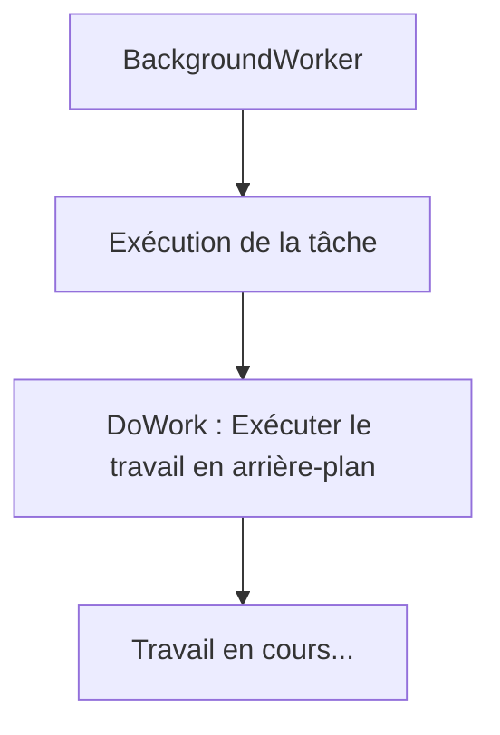
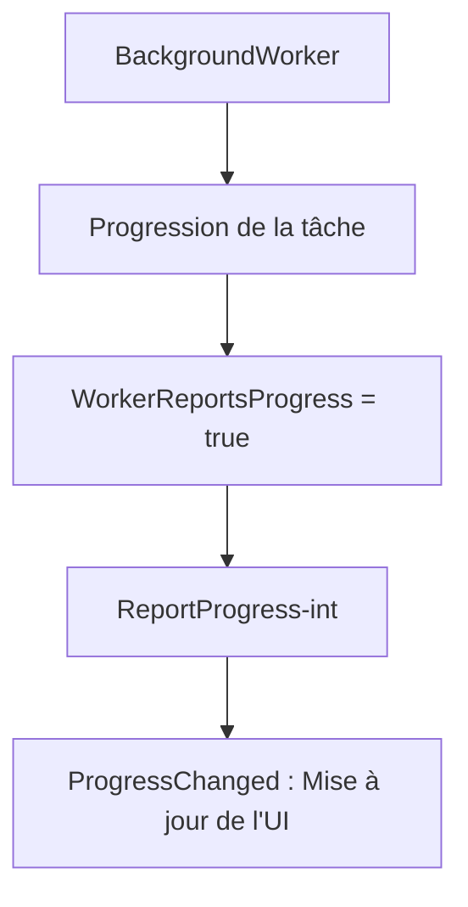
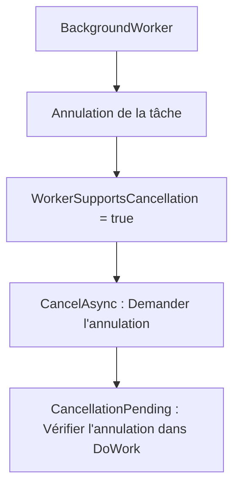
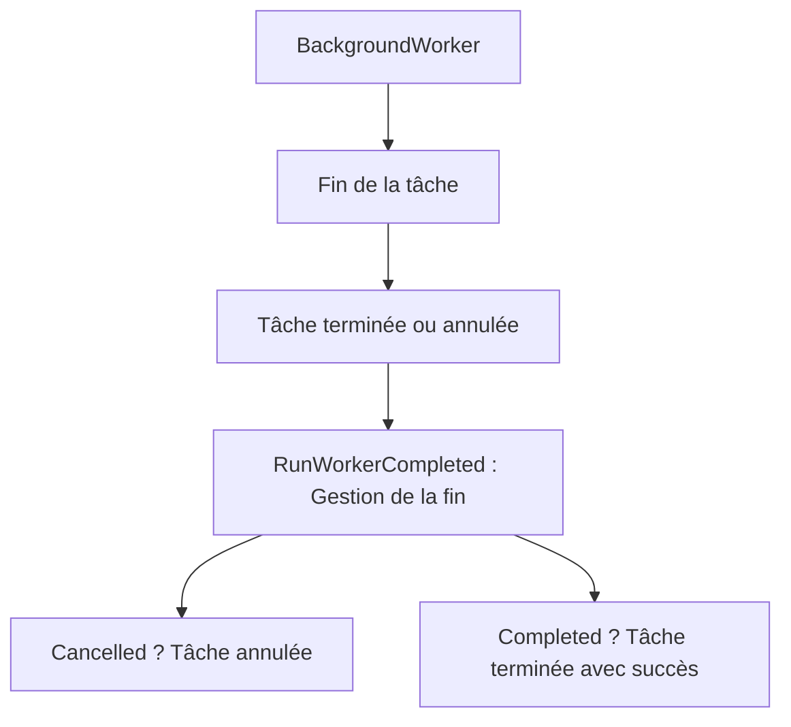

# Le BackgroundWorker

La classe `BackgroundWorker` en .NET est utilisée pour exécuter des opérations sur un thread en arrière-plan, tout en offrant un moyen de `rapporter la progression` 

et `gérer l'annulation`. 

Elle est particulièrement utile dans les applications `Windows Forms`, `WPF` ou `MAUI`, où il est nécessaire d'exécuter des tâches longues en arrière-plan tout en maintenant une interface utilisateur réactive.

**Quand utiliser `BackgroundWorker` ?**

- **Utile dans les applications de bureau avec une UI** : `BackgroundWorker` est souvent préféré pour les applications Windows Forms ou WPF, car il offre un mécanisme simple pour **communiquer la progression** et **éviter de bloquer l'interface utilisateur**. Il gère aussi automatiquement le **reporting des événements dans le thread UI**, ce qui simplifie la gestion du multitâche dans une application avec une interface graphique.
  
- **Alternatives modernes** : Dans les applications **non-UI** ou dans les scénarios modernes, on utilise plutôt des classes comme `Task` ou `TaskFactory`, qui offrent un meilleur contrôle sur l'exécution parallèle et l'asynchronie, avec plus de flexibilité. Cependant, `BackgroundWorker` reste utile lorsqu'on a besoin d'un modèle simple avec un rapport de progression dans les applications avec UI.

D'accord ! Je vais diviser le schéma en **quatre parties** pour rendre chaque fonctionnalité de **`BackgroundWorker`** plus lisible : **exécution de la tâche**, **rapport de progression**, **annulation**, et **fin de la tâche**.

---

### 1. Schéma Mermaid : Exécution de la tâche en arrière-plan



### Explication :
- **`DoWork`** est l'événement déclenché pour exécuter la tâche en arrière-plan.
- Le code métier à exécuter en arrière-plan est contenu dans cet événement.

---

### 2. Schéma Mermaid : Rapport de progression



### Explication :
- **`WorkerReportsProgress = true`** permet d'activer le rapport de progression.
- **`ReportProgress`** est utilisé pour rapporter l'avancement du travail.
- **`ProgressChanged`** est l'événement où l'interface utilisateur est mise à jour en fonction de la progression.

---

### 3. Schéma Mermaid : Annulation de la tâche



### Explication :
- **`WorkerSupportsCancellation = true`** active la possibilité d'annuler la tâche.
- **`CancelAsync`** est appelé pour demander l'annulation.
- Dans **`DoWork`**, vous devez vérifier **`CancellationPending`** pour voir si l'annulation a été demandée.

---

### 4. Schéma Mermaid : Fin de la tâche



### Explication :
- **`RunWorkerCompleted`** est l'événement déclenché lorsque la tâche se termine, qu'elle soit annulée ou réussie.
- Si la tâche est **annulée**, un traitement spécial est effectué (par exemple, informer l'utilisateur que la tâche a été annulée).
- Si la tâche est **terminée avec succès**, le traitement normal s'exécute.


# Comparaison entre **`BackgroundWorker`** et les classes précédentes (`Task`, `TaskFactory`, `ThreadPool`)

| Fonctionnalité                    | `BackgroundWorker`                           | `Task`                                 | `TaskFactory`                           | `ThreadPool`                              |
|------------------------------------|---------------------------------------------|----------------------------------------|-----------------------------------------|-------------------------------------------|
| **Simplicité pour les applications UI** | ✔️ Excellente pour Windows Forms/WPF          | ❌ Nécessite des callbacks manuels     | ❌ Nécessite des callbacks manuels      | ❌ Non recommandé pour les tâches UI      |
| **Rapport de progression**         | ✔️ Intégré avec `ProgressChanged`            | ❌ Doit être implémenté manuellement   | ❌ Doit être implémenté manuellement    | ❌ Pas de support intégré pour la progression |
| **Annulation**                     | ✔️ Intégré avec `CancellationPending`        | ✔️ Via `CancellationToken`            | ✔️ Via `CancellationToken`             | ✔️ Via `CancellationToken`                |
| **Asynchronie avancée**            | ❌ Non recommandé pour des opérations complexes | ✔️ Très flexible pour la gestion des tâches | ✔️ Personnalisable via des planificateurs | ✔️ Efficace pour des tâches courtes      |
| **Mise à jour de l'UI**            | ✔️ Gère automatiquement la mise à jour de l'UI | ❌ Nécessite des mécanismes d'invocation | ❌ Nécessite des mécanismes d'invocation | ❌ Non recommandé pour l'UI               |

**Résumé** : 
- Utilisez **`BackgroundWorker`** si vous travaillez avec une **interface utilisateur (UI)** et avez besoin d'une gestion simple de la **progression** et de **l'annulation**.
- Utilisez **`Task`**, **`TaskFactory`**, ou **`ThreadPool`** pour des scénarios plus complexes ou modernes, en particulier pour des **opérations sans UI** ou pour une gestion plus avancée de l'asynchronie et du parallélisme.

---

## 1. Nouveautés ajoutées par **`BackgroundWorker`** : Annulation et Progression

#### Annulation

`BackgroundWorker` permet l'annulation via la propriété **`CancellationPending`**. L'annulation ne se fait pas automatiquement : vous devez régulièrement vérifier cette propriété dans la tâche d'arrière-plan.

**Exemple d'annulation avec `BackgroundWorker`** :
```csharp
BackgroundWorker worker = new BackgroundWorker();
worker.WorkerSupportsCancellation = true;

worker.DoWork += (sender, e) =>
{
    for (int i = 0; i < 10; i++)
    {
        if (worker.CancellationPending)
        {
            e.Cancel = true;  // Indiquer que la tâche a été annulée
            return;
        }
        Console.WriteLine($"Travail en arrière-plan : {i}");
        Thread.Sleep(500);  // Simuler un travail
    }
};

worker.RunWorkerAsync();

// Annuler la tâche après 2 secondes
Task.Delay(2000).ContinueWith(t => worker.CancelAsync());
```

#### Rapport de progression

Le rapport de progression est une fonctionnalité intégrée dans `BackgroundWorker`. Elle permet de signaler la progression d'une tâche longue à l'interface utilisateur via l'événement **`ProgressChanged`**.

**Exemple de rapport de progression avec `BackgroundWorker`** :
```csharp
BackgroundWorker worker = new BackgroundWorker();
worker.WorkerReportsProgress = true;

worker.DoWork += (sender, e) =>
{
    for (int i = 0; i < 10; i++)
    {
        Thread.Sleep(500);  // Simuler un travail
        worker.ReportProgress(i * 10);  // Rapport de progression
    }
};

worker.ProgressChanged += (sender, e) =>
{
    Console.WriteLine($"Progression : {e.ProgressPercentage}%");
};

worker.RunWorkerAsync();
```

---

## 2. Diverses techniques d'instanciation de **`BackgroundWorker`**

1. **Instanciation simple avec `RunWorkerAsync`** :
   - `RunWorkerAsync` est la méthode qui démarre l'exécution d'une tâche d'arrière-plan.
   ```csharp
   BackgroundWorker worker = new BackgroundWorker();
   worker.DoWork += (sender, e) => Console.WriteLine("Tâche en arrière-plan.");
   worker.RunWorkerAsync();
   ```

2. **Activation du rapport de progression et de l'annulation** :
   - Pour utiliser les fonctionnalités de progression et d'annulation, vous devez les activer explicitement via les propriétés `WorkerReportsProgress` et `WorkerSupportsCancellation`.
   ```csharp
   BackgroundWorker worker = new BackgroundWorker();
   worker.WorkerReportsProgress = true;
   worker.WorkerSupportsCancellation = true;
   ```

3. **Passage de paramètres à la tâche d'arrière-plan** :
   - Vous pouvez passer des paramètres à la tâche d'arrière-plan via `RunWorkerAsync(object argument)`.
   ```csharp
   BackgroundWorker worker = new BackgroundWorker();
   worker.DoWork += (sender, e) =>
   {
       string param = (string)e.Argument;
       Console.WriteLine($"Tâche exécutée avec l'argument : {param}");
   };
   worker.RunWorkerAsync("Paramètre de tâche");
   ```

---

## 3. Membres importants de **`BackgroundWorker`** (énumération)

1. **`DoWork`** :
   - L'événement principal qui contient le code à exécuter en arrière-plan.
   
2. **`RunWorkerAsync()`** :
   - Démarre l'exécution de la tâche en arrière-plan.
   
3. **`ProgressChanged`** :
   - Événement déclenché lorsqu'un rapport de progression est envoyé via `ReportProgress`.
   
4. **`ReportProgress(int percentProgress)`** :
   - Méthode utilisée pour rapporter la progression de la tâche en arrière-plan.
   
5. **`RunWorkerCompleted`** :
   - Événement déclenché lorsque la tâche en arrière-plan est terminée, annulée ou a échoué.
   
6. **`CancelAsync()`** :
   - Méthode utilisée pour demander l'annulation d'une tâche en arrière-plan.
   
7. **`WorkerSupportsCancellation`** :
   - Propriété qui détermine si l'annulation est supportée.
   
8. **`CancellationPending`** :
   - Propriété qui indique si une demande d'annulation a été faite.
   
9. **`WorkerReportsProgress`** :
   - Propriété qui détermine si le rapport de progression est supporté.

---

## 4. Membres importants de **`BackgroundWorker`** (exemple d'implémentation)

#### 1. **`DoWork` et `RunWorkerAsync()`**
```csharp
BackgroundWorker worker = new BackgroundWorker();
worker.DoWork += (sender, e) =>
{
    Console.WriteLine("Tâche en arrière-plan démarrée.");
    Thread.Sleep(1000);  // Simuler un travail
    Console.WriteLine("Tâche en arrière-plan terminée.");
};
worker.RunWorkerAsync();
```

### 5. **`ProgressChanged` et `ReportProgress`**
```csharp
BackgroundWorker worker = new BackgroundWorker();
worker.WorkerReportsProgress = true;

worker.DoWork += (sender, e) =>
{
    for (int i = 0; i <= 100; i += 10)
    {
        Thread.Sleep(100);  // Simuler du travail
        worker.ReportProgress(i);  // Rapporter la progression
    }
};

worker.ProgressChanged += (sender, e) =>
{
    Console.WriteLine($"Progression : {e.ProgressPercentage}%");
};

worker.RunWorkerAsync();
```

### 6. **`CancelAsync()` et `CancellationPending`**
```csharp
BackgroundWorker worker = new BackgroundWorker();
worker.WorkerSupportsCancellation = true;

worker.DoWork += (sender, e) =>
{
    for (int i = 0; i < 10; i++)
    {
        if (worker.CancellationPending)
        {
            e.Cancel = true;
            return;
        }
        Console.WriteLine($"Itération :

 {i}");
        Thread.Sleep(500);  // Simuler du travail
    }
};

worker.RunWorkerCompleted += (sender, e) =>
{
    if (e.Cancelled)
        Console.WriteLine("Tâche annulée.");
    else
        Console.WriteLine("Tâche terminée.");
};

worker.RunWorkerAsync();
Task.Delay(2000).ContinueWith(t => worker.CancelAsync());
```

---

## 7. Exemple de synthèse qui groupe l'ensemble des membres importants

Cet exemple combine plusieurs fonctionnalités : **annulation**, **rapport de progression**, et **fin de tâche**.

```csharp
using System;
using System.Threading;
using System.ComponentModel;

class Program
{
    static void Main(string[] args)
    {
        BackgroundWorker worker = new BackgroundWorker
        {
            WorkerReportsProgress = true,
            WorkerSupportsCancellation = true
        };

        worker.DoWork += (sender, e) =>
        {
            for (int i = 0; i < 10; i++)
            {
                if (worker.CancellationPending)
                {
                    e.Cancel = true;
                    return;
                }
                Thread.Sleep(500);  // Simuler du travail
                worker.ReportProgress(i * 10);  // Rapporter la progression
            }
        };

        worker.ProgressChanged += (sender, e) =>
        {
            Console.WriteLine($"Progression : {e.ProgressPercentage}%");
        };

        worker.RunWorkerCompleted += (sender, e) =>
        {
            if (e.Cancelled)
                Console.WriteLine("Tâche annulée.");
            else
                Console.WriteLine("Tâche terminée.");
        };

        // Démarrer le BackgroundWorker
        worker.RunWorkerAsync();

        // Annuler la tâche après 3 secondes
        Task.Delay(3000).ContinueWith(t => worker.CancelAsync());

        Console.ReadLine();  // Empêcher la fermeture immédiate de l'application
    }
}
```

### Explication :
- La tâche d'arrière-plan effectue un travail avec **progression**.
- Après 3 secondes, la tâche est **annulée**.
- Le programme gère aussi la fin de la tâche avec un message lorsque celle-ci est annulée ou terminée.

### Conclusion

- **`BackgroundWorker`** est idéal pour les applications avec interface utilisateur, surtout sous **Windows Forms** ou **WPF**, où il simplifie la gestion de tâches longues avec **rapport de progression** et **annulation**.

- Comparé aux classes modernes comme **`Task`** et **`TaskFactory`**, `BackgroundWorker` est moins flexible pour les scénarios non-UI, mais reste très utile dans les environnements nécessitant une gestion automatique des événements dans l'UI.
