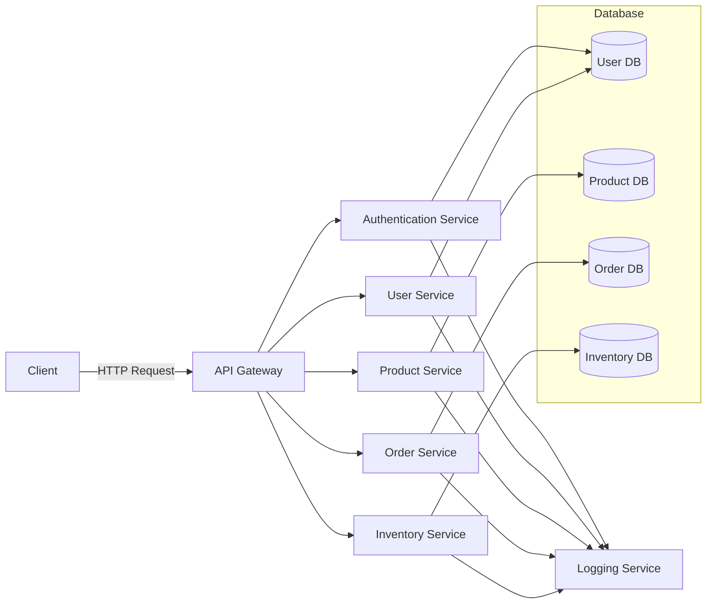
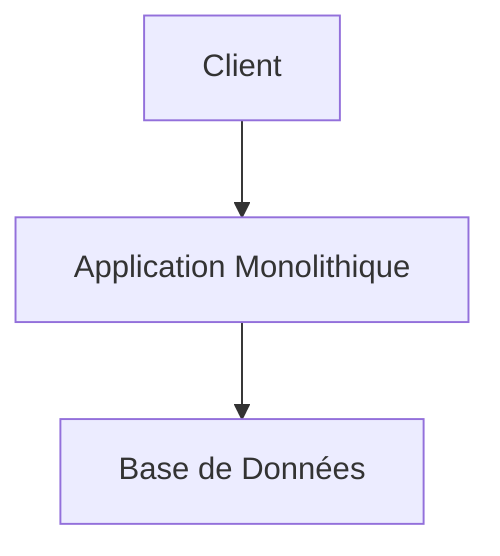
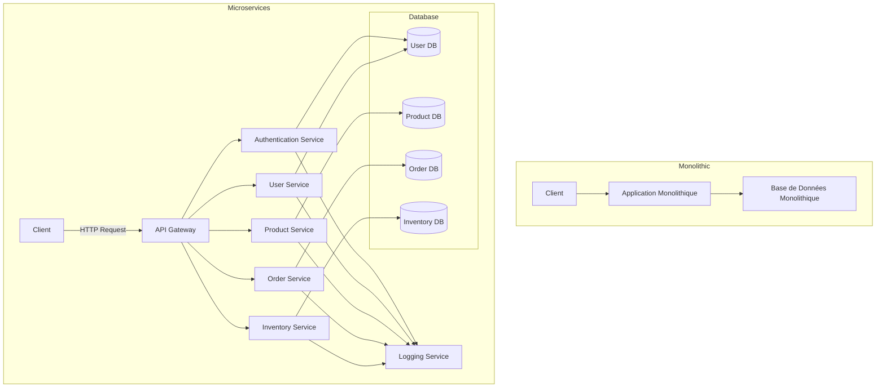

# Introduction aux Microservices

## Définition

Les microservices sont une approche architecturale où une application est structurée en une collection de services faiblement couplés. Chaque service est autonome, déployable indépendamment et responsable d'une fonction métier spécifique. Cette approche contraste avec les architectures monolithiques où toutes les fonctionnalités sont regroupées dans une seule application.

## Principes de Base

1. **Modularité** : Chaque microservice est un module distinct qui peut être développé, testé et déployé indépendamment des autres.
2. **Faible Couplage** : Les microservices interagissent entre eux via des interfaces bien définies, réduisant ainsi les dépendances entre eux.
3. **Responsabilité Unique** : Chaque microservice est responsable d'une seule fonction ou d'un ensemble cohérent de fonctionnalités.
4. **Déploiement Indépendant** : Les microservices peuvent être déployés indépendamment, ce qui permet une mise à jour et une scalabilité plus flexibles.
5. **Communication via des APIs** : Les microservices communiquent entre eux via des APIs, souvent à l'aide de protocoles légers comme HTTP/REST ou des messages asynchrones.
6. **Scalabilité** : Les microservices permettent une scalabilité fine, où chaque service peut être mis à l'échelle indépendamment en fonction de la demande.

## Architecture Microservices

Voici un diagramme Mermaid illustrant une architecture microservices typique :

**Dans cet exemple :**

- Le client envoie des requêtes HTTP à l'API Gateway.
- L'API Gateway dirige les requêtes vers les différents microservices (Authentication, User, Product, Order, Inventory).
- Chaque microservice communique avec sa propre base de données.
- Un service de journalisation centralisé reçoit des logs de chaque microservice.
  

# Comparaison entre Architecture Monolithique et Microservices

## Définition et Principes de Base

### Architecture Monolithique
Une architecture monolithique est une approche où toutes les fonctionnalités d'une application sont regroupées dans une seule unité de déploiement. Tous les composants sont interconnectés et interagissent directement, ce qui peut rendre les mises à jour et la scalabilité plus complexes.

### Architecture Microservices
Les microservices sont une approche architecturale où une application est structurée en une collection de services faiblement couplés. Chaque service est autonome, déployable indépendamment et responsable d'une fonction métier spécifique.

## Comparaison

| Aspect                | Architecture Monolithique                                | Architecture Microservices                                |
|-----------------------|---------------------------------------------------------|---------------------------------------------------------|
| **Déploiement**       | Déploiement en une seule unité.                          | Déploiement indépendant de chaque service.               |
| **Scalabilité**       | Scalabilité de l'ensemble de l'application.              | Scalabilité fine-grainée de chaque service.              |
| **Modularité**        | Modules interconnectés et interdépendants.               | Modules autonomes et faiblement couplés.                 |
| **Résilience**        | Une défaillance affecte l'ensemble de l'application.     | Une défaillance n'affecte qu'un seul service.            |
| **Maintenance**       | Maintenance complexe en raison des dépendances internes.| Maintenance simplifiée grâce à l'indépendance des services.|
| **Technologies**      | Technologies limitées par la pile monolithique.          | Chaque service peut utiliser la technologie la plus appropriée. |
| **Complexité**        | Complexité de gestion du code source et des déploiements.| Complexité de gestion de la communication entre services.|

## Diagrammes

### Architecture Monolithique

### Architecture Monolithique vs Microservices

---

Ces diagrammes montrent la différence entre une architecture monolithique et une architecture microservices, ainsi que les avantages et inconvénients de chaque approche.
