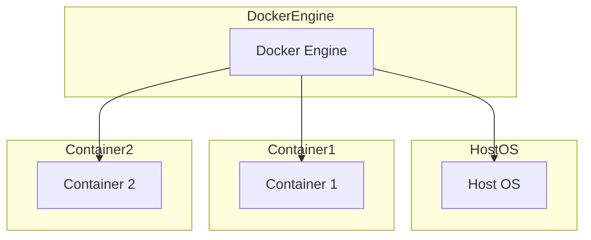
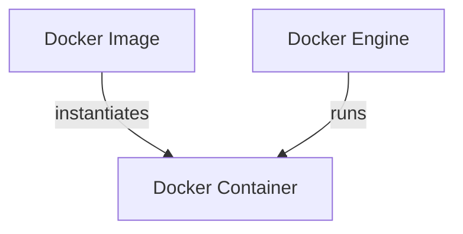
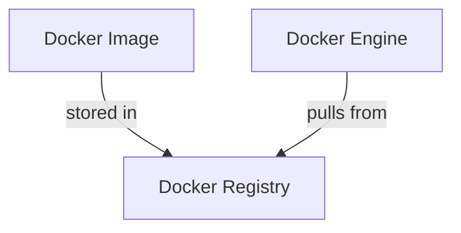
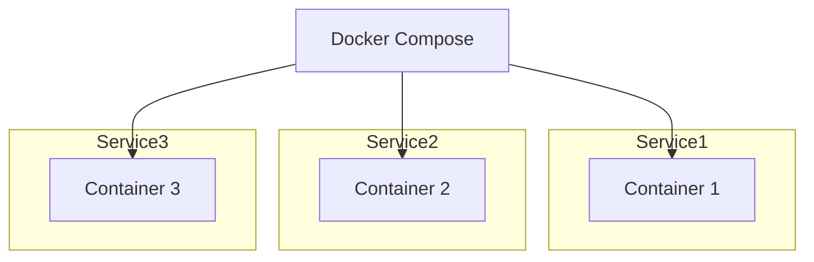

# Docker Vue d'ensemble

### Vue d'ensemble de Docker

Docker est une plateforme qui permet de développer, livrer et exécuter des applications dans des conteneurs. Un conteneur est une unité standard de logiciel qui empaquette le code et toutes ses dépendances pour que l'application s'exécute rapidement et de manière fiable d'un environnement informatique à un autre.

### Composants clés de l'architecture Docker

1. **Docker Engine** : Le moteur Docker est la partie centrale de Docker qui crée et exécute les conteneurs.
2. **Docker Image** : Une image Docker est un modèle léger, autonome et exécutable qui comprend tout ce qui est nécessaire pour exécuter une application.
3. **Docker Container** : Un conteneur Docker est une instance en cours d'exécution d'une image Docker.
4. **Docker Registry** : Un registre Docker est un système de stockage et de distribution d'images Docker.
5. **Docker Compose** : Un outil pour définir et exécuter des applications multi-conteneurs.

### Schémas Mermaid

#### Architecture Docker de Base

#### Docker Image et Container

#### Docker Registry

#### Docker Compose

### Explications

- **Docker Engine** : Composant de base qui crée et exécute les conteneurs.
- **Host OS** : Le système d'exploitation sur lequel Docker Engine fonctionne.
- **Docker Image** : Modèle pour créer des conteneurs, stocké dans un registre Docker.
- **Docker Container** : Instance en cours d'exécution d'une image Docker, gérée par Docker Engine.
- **Docker Registry** : Répertoire où les images Docker sont stockées et peuvent être récupérées.
- **Docker Compose** : Outil pour définir et exécuter des applications composées de plusieurs conteneurs.

### Conclusion

Docker offre une solution puissante pour isoler les applications et leurs dépendances, permettant un déploiement rapide et fiable dans différents environnements. Les schémas Mermaid ci-dessus fournissent une vue d'ensemble visuelle de l'architecture Docker et de ses composants principaux.
