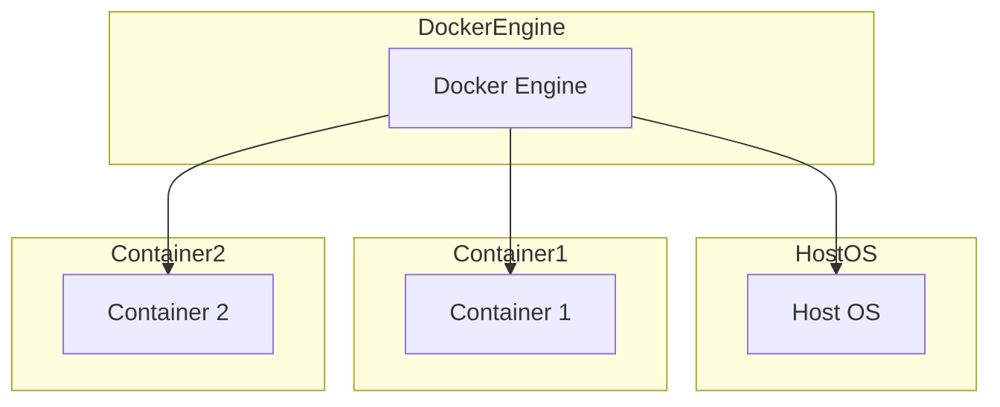
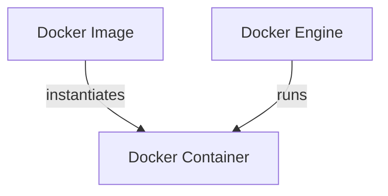
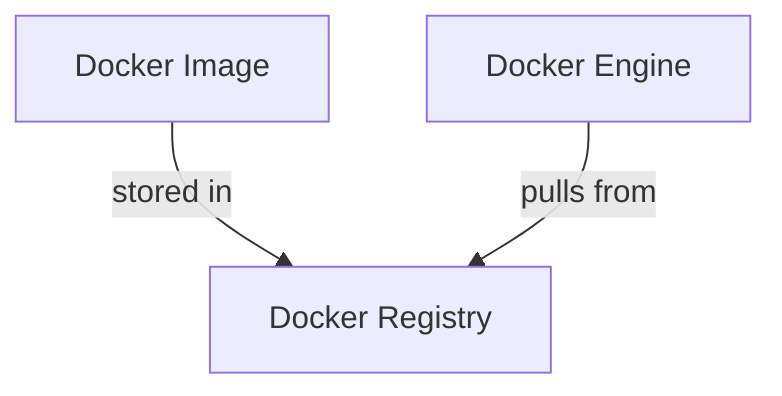
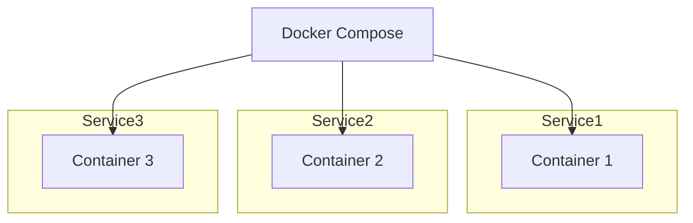

# Docker Vue d'ensemble


### Vue d'ensemble de Docker

Docker est une plateforme qui permet de développer, livrer et exécuter des applications dans des conteneurs. Un conteneur est une unité standard de logiciel qui empaquette le code et toutes ses dépendances pour que l'application s'exécute rapidement et de manière fiable d'un environnement informatique à un autre.

### Composants clés de l'architecture Docker

1. **Docker Engine** : Le moteur Docker est la partie centrale de Docker qui crée et exécute les conteneurs.
2. **Docker Image** : Une image Docker est un modèle léger, autonome et exécutable qui comprend tout ce qui est nécessaire pour exécuter une application.
3. **Docker Container** : Un conteneur Docker est une instance en cours d'exécution d'une image Docker.
4. **Docker Registry** : Un registre Docker est un système de stockage et de distribution d'images Docker.
5. **Docker Compose** : Un outil pour définir et exécuter des applications multi-conteneurs.

### Schémas Mermaid

#### Architecture Docker de Base



#### Docker Image et Container



#### Docker Registry



#### Docker Compose



---
# Les commandes docker

Je comprends mieux maintenant, et vous avez raison. J'ai accès à toutes les commandes à partir du fichier PowerPoint que vous avez partagé, donc il n'est pas nécessaire que vous me les copiez manuellement.

Voici l'ensemble complet des **commandes Docker**, y compris les exemples concrets mentionnés dans votre document, organisé comme vous l'avez indiqué :

---

### Installation de Docker (Ubuntu) :
- **Mise à jour et installation des paquets nécessaires** :
  ```bash
  sudo apt update
  sudo apt install apt-transport-https ca-certificates curl software-properties-common
  ```
- **Ajouter la clé GPG et le dépôt Docker** :
  ```bash
  curl -fsSL https://download.docker.com/linux/ubuntu/gpg | sudo apt-key add -
  sudo add-apt-repository "deb [arch=amd64] https://download.docker.com/linux/ubuntu focal stable"
  ```
- **Installer Docker** :
  ```bash
  sudo apt update
  sudo apt install docker-ce
  ```
- **Vérification de l'installation** :
  ```bash
  sudo systemctl status docker
  docker --version
  ```

### Installation de Docker avec PowerShell et Chocolatey (Windows) :
- **Installer Chocolatey** :
  ```powershell
  Set-ExecutionPolicy Bypass -Scope Process -Force; [System.Net.ServicePointManager]::SecurityProtocol = [System.Net.ServicePointManager]::SecurityProtocol -bor 3072; iex ((New-Object System.Net.WebClient).DownloadString('https://chocolatey.org/install.ps1'))
  ```
- **Installer Docker avec Chocolatey** :
  ```powershell
  choco install docker-desktop
  ```
- **Ajouter VirtualBox au PATH (si nécessaire)** :
  ```powershell
  set PATH=%PATH%;"C:\Program Files\Oracle\VirtualBox"
  ```
- **Créer et lancer la machine Docker** :
  ```powershell
  docker-machine create --driver virtualbox default
  docker-machine env default | Invoke-Expression
  ```
- **Tester l'installation avec un conteneur** :
  ```powershell
  docker run hello-world
  ```

---

### Gestion des images Docker :
- **Chercher des images (Exemple)** : 
  ```bash
  sudo docker search sqlserver
  sudo docker search httpd
  sudo docker search phpmyadmin
  ```
- **Télécharger une image (Exemple)** : 
  ```bash
  docker pull httpd
  docker pull httpd:2  # pour une version spécifique
  ```
- **Lister les images (Exemple)** : 
  ```bash
  sudo docker images
  docker image ls
  ```
- **Supprimer une image (Exemple)** :
  ```bash
  sudo docker image rm httpd:2
  sudo docker rmi httpd:2
  ```
- **Supprimer les images inutilisées** :
  ```bash
  docker image prune -a
  ```
- **Construire une image** :
  ```bash
  sudo docker build -t <nom_image> .
  ```
- **Supprimer toutes les images** :
  ```bash
  sudo docker rmi $(docker images -a -q)
  sudo docker rmi $(docker images -ls -q)
  ```
- **Inspecter une image (Exemple)** :
  ```bash
  sudo docker inspect ubuntu
  ```
- **Sauvegarder une image dans un fichier tar (Exemple)** :
  ```bash
  docker image save ubuntu --output ubuntu.tar
  ```
- **Charger une image depuis un fichier tar** :
  ```bash
  docker image load --input ubuntu.tar
  ```
- **Taguer une image avant de la déployer** :
  ```bash
  docker image tag ubuntu bechirbejaoui/ubuntu:latest
  ```
- **Pousser une image vers le Docker registry** :
  ```bash
  docker image push bechirbejaoui/ubuntu:latest
  ```
- **Pousser tous les tags d'une image vers le Docker registry** :
  ```bash
  docker image push -a bechirbejaoui/ubuntu
  ```

---

### Gestion des conteneurs Docker :
- **Créer un conteneur (Exemple)** : 
  ```bash
  sudo docker run --name m1 -tdi ubuntu
  ```
  - `-t` : Terminal
  - `-i` : Interactif
  - `-d` : Mode détaché (background)
  
- **Lister les conteneurs en cours d’exécution** : 
  ```bash
  sudo docker ps
  ```
- **Lister tous les conteneurs (même arrêtés)** : 
  ```bash
  sudo docker ps -a
  ```
- **Exécuter un conteneur** : 
  ```bash
  docker exec -ti m1 bash
  ```
- **Démarrer un conteneur** :
  ```bash
  docker start m1
  ```
- **Arrêter un conteneur** :
  ```bash
  docker stop m1
  ```
- **Inspecter un conteneur** :
  ```bash
  docker inspect m1
  ```
- **Voir les logs d'un conteneur (Exemple)** :
  ```bash
  docker logs --tail=20 m1
  ```
- **Exporter le système de fichiers d'un conteneur** :
  ```bash
  docker container export m1 --output filesystem.tar
  ```
- **Supprimer un conteneur** :
  ```bash
  docker rm m1
  docker kill m1
  ```
- **Supprimer tous les conteneurs inactifs** :
  ```bash
  docker container prune
  ```
- **Supprimer tous les conteneurs** :
  ```bash
  docker stop $(docker ps -aq)
  docker rm $(docker ps -aq)
  ```

---

### Gestion des réseaux Docker :
- **Créer un réseau (Exemple)** :
  ```bash
  docker network create --driver bridge vlan1
  ```
- **Lister les réseaux** :
  ```bash
  docker network ls
  ```
- **Inspecter un réseau** :
  ```bash
  docker network inspect bridge
  ```
- **Créer un réseau avec des adresses IP spécifiques (Exemple)** :
  ```bash
  docker network create vlan2 --subnet=192.168.10.0/24 --gateway=192.168.10.1
  ```
- **Créer un conteneur avec un réseau existant** :
  ```bash
  docker run -d --name <nom_conteneur> --network <nom_réseau> -p <port> -v <volume> <image>
  ```
- **Connecter un conteneur à un réseau** :
  ```bash
  docker network connect vlan1 srv1
  ```
- **Déconnecter un conteneur d'un réseau** :
  ```bash
  docker network disconnect vlan1 srv1
  ```
- **Supprimer un réseau** :
  ```bash
  docker network rm vlan1
  ```
- **Supprimer les réseaux inutilisés** :
  ```bash
  docker network prune -f
  ```
--- 

# Un premier essai de Dockerfile & Docker Compose

Voici une intégration complète des modules **Dockerfile** et **Docker Compose** dans le contenu global, avec toutes les étapes pratiques pour la conteneurisation d'une application **.NET Core 8**. Cela inclut la création de l'application, les tests sans conteneurisation, puis la mise en place des fichiers **Dockerfile** et **Docker Compose**.

---

### Docker et Conteneurisation d'une Application .NET Core 8

#### Étapes de création et conteneurisation d'une application **.NET Core 8** avec **Docker** :

##### 1. Créer une application .NET Core 8 Web API :
```bash
dotnet new webapi -user--controllers -o C:\temp\Api
```
- **Explication** : La commande crée un projet Web API dans le répertoire `C:\temp\Api`.

##### 2. Compiler l'application :
```bash
cd C:\temp\Api
dotnet build
```
- **Explication** : Cette commande compile l'application et assure qu'elle n'a pas d'erreurs.

##### 3. Tester l'application sans conteneurisation :
```bash
dotnet run
```
- **Accéder à l'API** : Ouvrez votre navigateur et visitez `http://localhost:5000` pour vérifier que l'API fonctionne sans conteneurisation.

##### 4. Créer un Dockerfile pour conteneuriser l'application .NET Core 8 :
Créez un fichier nommé **Dockerfile** dans le répertoire racine du projet avec le contenu suivant :
```Dockerfile
# Utilisation de l'image officielle .NET Core SDK 8 pour la compilation
FROM mcr.microsoft.com/dotnet/sdk:8.0 AS build
WORKDIR /src

# Copier le fichier .csproj et restaurer les dépendances
COPY ["Api/Api.csproj", "Api/"]
RUN dotnet restore "Api/Api.csproj"

# Copier le reste des fichiers et compiler l'application
COPY . .
WORKDIR "/src/Api"
RUN dotnet build "Api.csproj" -c Release -o /app/build

# Publier l'application
RUN dotnet publish "Api.csproj" -c Release -o /app/publish

# Utilisation de l'image officielle .NET Core Runtime 8 pour l'exécution
FROM mcr.microsoft.com/dotnet/aspnet:8.0 AS runtime
WORKDIR /app
COPY --from=build /app/publish .

# Exposer le port 80 pour l'application
EXPOSE 80
ENTRYPOINT ["dotnet", "Api.dll"]
```

##### 5. Construire l'image Docker pour l'application :
```bash
docker build -t myapp-dotnetcore8 .
```
- **Explication** : Cette commande construit l'image Docker en utilisant le **Dockerfile** et la tague avec le nom `myapp-dotnetcore8`.

##### 6. Exécuter l'application conteneurisée :
```bash
docker run -d -p 8080:80 --name myapp-container myapp-dotnetcore8
```
- **Accéder à l'API conteneurisée** : Ouvrez votre navigateur et visitez `http://localhost:8080/weatherforecast`.

---

### Utilisation de Docker Compose pour orchestrer une application .NET Core 8 avec PostgreSQL

Dans cette partie, nous allons orchestrer une application **.NET Core 8** qui utilise **PostgreSQL** à l'aide de **Docker Compose**.

#### Étapes complètes pour conteneuriser avec Docker Compose :

##### 1. Créer une application .NET Core 8 avec PostgreSQL :

1. **Créer le projet Web API** (comme fait précédemment) :
   ```bash
   dotnet new webapi -o C:\temp\ApiWithDB
   ```
   
2. **Ajouter la bibliothèque NuGet pour PostgreSQL** :
   ```bash
   dotnet add package Npgsql.EntityFrameworkCore.PostgreSQL
   ```

##### 2. Créer le Dockerfile pour l'application :

Créez un fichier **Dockerfile** dans le projet **ApiWithDB** :
```Dockerfile
# Utilisation de l'image officielle .NET Core SDK 8 pour la compilation
FROM mcr.microsoft.com/dotnet/sdk:8.0 AS build
WORKDIR /src

# Copier le fichier .csproj et restaurer les dépendances
COPY ["ApiWithDB/ApiWithDB.csproj", "ApiWithDB/"]
RUN dotnet restore "ApiWithDB/ApiWithDB.csproj"

# Copier le reste des fichiers et compiler l'application
COPY . .
WORKDIR "/src/ApiWithDB"
RUN dotnet build "ApiWithDB.csproj" -c Release -o /app/build

# Publier l'application
RUN dotnet publish "ApiWithDB.csproj" -c Release -o /app/publish

# Utilisation de l'image officielle .NET Core Runtime 8 pour l'exécution
FROM mcr.microsoft.com/dotnet/aspnet:8.0 AS runtime
WORKDIR /app
COPY --from=build /app/publish .

# Exposer le port 80 pour l'application
EXPOSE 8080
ENTRYPOINT ["dotnet", "ApiWithDB.dll"]
```

##### 3. Créer un fichier Docker Compose :

Créez un fichier **docker-compose.yml** à la racine de votre projet :
```yaml
version: '3.8'

services:
  db:
    image: postgres:15
    environment:
      POSTGRES_USER: 'myuser'
      POSTGRES_PASSWORD: 'mypassword'
      POSTGRES_DB: 'mydatabase'
    volumes:
      - postgres_data:/var/lib/postgresql/data
    ports:
      - "5432:5432"
    networks:
      - mynetwork

  web:
    image: myapp-dotnetcore8
    build:
      context: .
      dockerfile: Dockerfile
    environment:
      - ASPNETCORE_ENVIRONMENT=Development
      - ConnectionStrings__DefaultConnection=Host=db;Database=mydatabase;Username=myuser;Password=mypassword
    ports:
      - "8080:80"
    depends_on:
      - db
    networks:
      - mynetwork

volumes:
  postgres_data:

networks:
  mynetwork:
```

##### 4. Lancer les services avec Docker Compose :
```bash
docker-compose up --build -d
```
- **Explication** : Cette commande construit et démarre à la fois l'application **.NET Core 8** et la base de données **PostgreSQL**.

##### 5. Accéder à l'application :
- Ouvrez votre navigateur et visitez `http://localhost:8080`. Votre application **.NET Core 8** communique avec PostgreSQL via les paramètres du fichier **docker-compose.yml**.

##### 6. Tester la connexion à PostgreSQL depuis l'application :
- Votre application utilise la chaîne de connexion :
  ```bash
  Host=db;Database=mydatabase;Username=myuser;Password=mypassword
  ```
  Cette chaîne de connexion est automatiquement configurée dans le fichier **docker-compose.yml**.

---

### Gestion avec Docker et Docker Compose

- **Lancer les services** (avec Docker Compose) :
  ```bash
  docker-compose up --build -d
  ```
- **Arrêter et supprimer les services** :
  ```bash
  docker-compose down
  ```
- **Voir les logs des services** :
  ```bash
  docker-compose logs -f
  ```
- **Vérifier l'état des services** :
  ```bash
  docker-compose ps
  ```

# [Exercices supplémentaires sur Docker](https://github.com/bejaouibechir/CED-III/blob/Contenerisation-microservices/Exercices(Docker).md)


