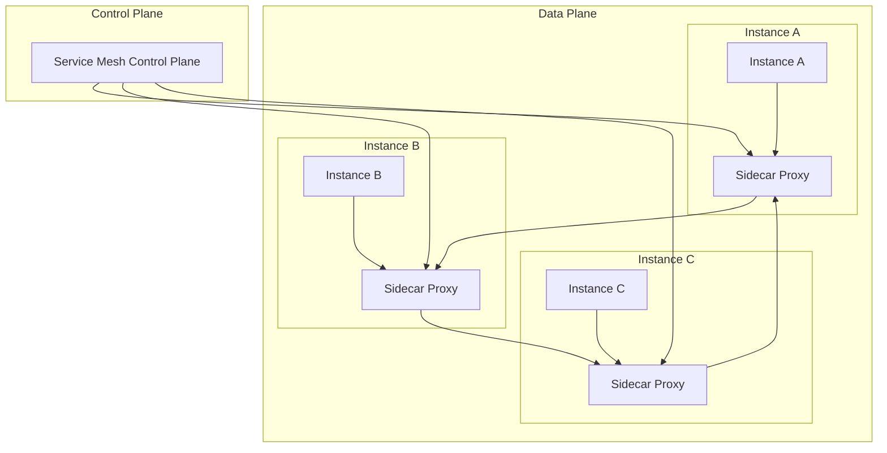
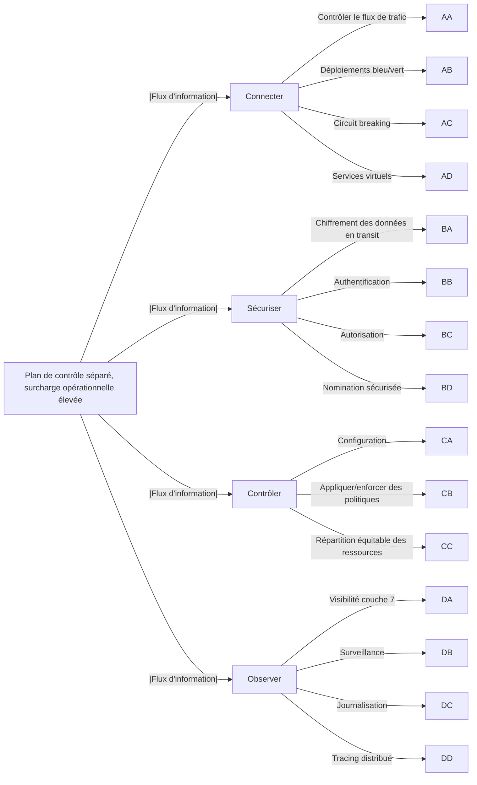
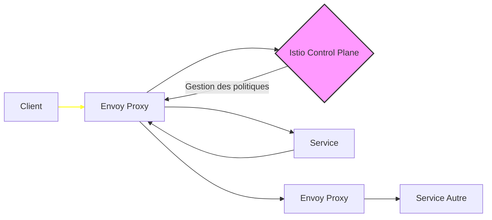
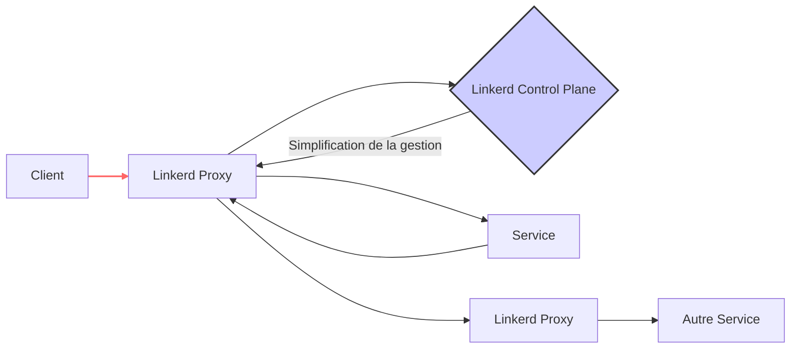
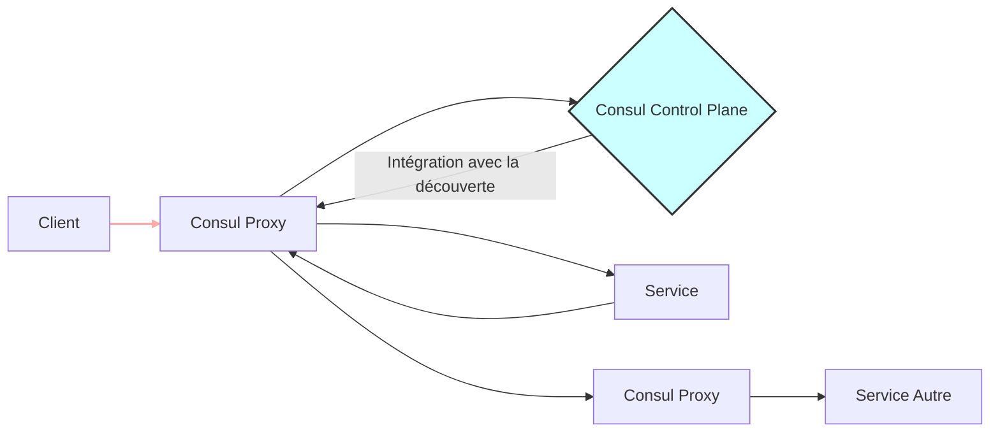

# Définition des Services Mesh

 Il s'agit d'une couche de gestion intégrée directement dans le système, qui prend en charge les tâches telles que
  - la découverte de services
  -  l'équilibrage de charge
  -  le chiffrement
  -  la gestion des échecs
  -  la surveillance des performances.

Le service mesh se compose généralement de deux parties principales :

1. **Control Plane** : Cette partie gère et orchestre la communication entre les services, en configurant les règles, les politiques de sécurité, et en collectant des données télémétriques pour surveiller les performances et la santé des services.

2. **Data Plane** : Comprend des proxies sidecar déployés à côté de chaque instance de service, qui interceptent et dirigent le trafic entre les services. Ces proxies appliquent les règles définies par le control plane, assurant ainsi que le trafic réseau respecte les politiques de l'infrastructure.




### Services Mesh les fonctions




### Services Mesh : Détails, Comparaisons et Améliorations

#### 1. Istio
**Istio** est conçu pour des architectures complexes de microservices, offrant des capacités avancées de gestion de trafic, sécurité, et observabilité. Il utilise **Envoy** comme proxy sidecar.

##### Architecture de Istio


##### Applications pratiques :
- **Gestion des déploiements Canary**: Permet des déploiements progressifs pour tester les nouvelles versions sans perturber le service existant.
- **Authentification et autorisation**: Mise en œuvre de politiques de sécurité pour contrôler et valider la communication entre services.
- **Tracing distribué et métriques**: Facilite la surveillance et le diagnostic des problèmes en production.

##### Cas où Istio est déconseillé :
- **Petits déploiements**: Trop complexe pour des petites applications ou des équipes avec des ressources limitées.
- **Manque d'expertise en gestion de cluster**: Nécessite une compréhension fine de Kubernetes et de ses composants.

##### Control Plane de Istio
Le control plane d'Istio, composé de plusieurs composants comme Pilot, Mixer, et Citadel, permet une gestion fine des configurations et des politiques. Ce système complexe offre des capacités avancées mais demande une certaine expertise technique pour être pleinement exploité.

#### 2. Linkerd
**Linkerd** se distingue par sa légèreté et sa simplicité, ce qui le rend idéal pour des environnements où les ressources sont limitées.

##### Architecture de Linkerd


##### Applications pratiques :
- **Surveillance en temps réel**: Offre des outils intégrés pour surveiller les latences, le débit et les erreurs.
- **Sécurité de transport automatique**: Implémente le chiffrement TLS de bout en bout sans configuration supplémentaire.
- **Équilibrage de charge**: Améliore la performance en distribuant les requêtes de manière efficace entre les instances.

##### Cas où Linkerd est déconseillé :
- **Fonctionnalités avancées limitées**: Moins adapté pour les scénarios nécessitant des règles de routage complexe ou des politiques de sécurité très spécifiques.
- **Grands écosystèmes diversifiés**: Peut être moins flexible dans des environnements hétérogènes ou très personnalisés.

##### Control Plane de Linkerd
Le control plane de Linkerd est conçu pour être léger et facile à gérer, se concentrant sur la performance et l'observabilité sans nécessiter de configurations lourdes ou complexes.

#### 3. Consul Connect
**Consul Connect** offre une intégration parfaite avec les systèmes de découverte de services grâce à Consul, le rendant idéal pour les écosystèmes déjà investis dans cette technologie.

##### Architecture de Consul Connect


##### Applications pratiques :
- **Intégration avec la découverte de services**: Automatise la gestion de la connectivité entre services.
- **Gestion des configurations**: Permet de centraliser et de synchroniser les configurations à travers les services.
- **Chiffrement automatique**: Fournit le TLS pour sécuriser les communications internes.

##### Cas où Consul Connect est déconseillé :
- **Environnements non-Consul**: Moins bénéfique si vous n'utilisez pas déjà Consul pour la découverte de services.
- **Besoins de performances extrêmes**: Peut introduire une latence supplémentaire comparée à des solutions plus légères.

##### Control Plane de Consul Connect
Le control plane de Consul Connect est intégré avec les fonctionnalités de service discovery de Consul, offrant une gestion simplifiée mais moins flexible pour des règles de routage avancées.

### Classement de Popularité
1. **Istio**: Le plus populaire, grâce à ses fonctionnalités avancées et sa communauté active.
2. **Linkerd**: Apprécié pour sa légèreté et facilité d'utilisation, particulièrement dans des environnements moins exigeants.
3. **Consul Connect**: Moins populaire en tant que service mesh pur, mais très intégré dans les écosystèmes utilisant déjà Consul.

### Adaptation à .NET 8.0
**Linkerd** est particulièrement bien adapté pour les environnements .NET 8.0 en raison de sa simplicité et de sa facilité d'intégration, offrant une performance optimale avec peu de surcharge administrative.

### Tableau comparatif

Voici un tableau comparatif des trois Service Mesh les plus utilisés :

### Services Mesh : Comparaison Approfondie et Adaptation

#### Tableau Comparatif des Caractéristiques

| Caractéristiques     | Istio                    | Linkerd                | Consul Connect         |
|----------------------|--------------------------|------------------------|------------------------|
| **Complexité**       | Élevée                   | Faible                 | Modérée                |
| **Proxy Sidecar**    | Envoy                    | Linkerd Proxy          | Consul Proxy           |
| **Gestion des Configurations** | Pilot, Mixer, Citadel  | Control Plane Simplifié| Intégration Consul     |
| **Performance**      | Modérée à élevée         | Élevée                 | Modérée                |
| **Sécurité**         | Avancée (mTLS, AuthN/Z)  | TLS automatique        | TLS avec Consul        |
| **Usage Idéal**      | Grandes architectures    | Simplicité & performance| Écosystèmes Consul    |
| **Adapté pour .NET** | Oui, avec complexité     | Très adapté            | Adapté si usage de Consul |

### Sécurité et Conformité

**Istio** :
- **Sécurité**: Offre une gestion fine des politiques de sécurité avec mTLS pour sécuriser les communications entre services, ce qui aide à répondre aux exigences réglementaires strictes.
- **Conformité**: Istio peut être configuré pour respecter des normes telles que PCI-DSS ou HIPAA grâce à sa gestion détaillée des accès et des politiques de sécurité.

**Linkerd** :
- **Sécurité**: Chiffrement TLS automatique pour toutes les communications, offrant une base solide pour la conformité aux normes de sécurité.
- **Conformité**: Moins de configurations signifie généralement moins de points de défaillance, ce qui est favorable pour maintenir les normes de conformité avec moins de gestion.

**Consul Connect** :
- **Sécurité**: Intègre le chiffrement TLS dans le cadre de son intégration avec le service discovery de Consul.
- **Conformité**: La centralisation des politiques via Consul aide les organisations à maintenir une gouvernance uniforme, facilitant la conformité réglementaire.

### Rétrocompatibilité et Migration

**Istio** :
- **Migration**: Peut être intégré graduellement grâce à son modèle de sidecar, permettant de migrer service par service sans perturbation majeure.
- **Rétrocompatibilité**: Compatible avec de nombreuses infrastructures grâce à sa flexibilité en configuration.

**Linkerd** :
- **Migration**: Sa simplicité en fait un choix idéal pour les entreprises cherchant à adopter un service mesh sans complexité excessive.
- **Rétrocompatibilité**: Très bonne grâce à sa légèreté et son faible impact sur les performances des services existants.

**Consul Connect** :
- **Migration**: L'intégration avec Consul permet une migration fluide pour les systèmes déjà utilisant Consul pour la découverte de services.
- **Rétrocompatibilité**: Bonne dans les environnements Consul, mais peut nécessiter des ajustements dans les configurations pour les environnements non-Consul.

## Questions réponses autour du service Mesh:

Voici des réponses brèves et concises à chacune des questions :

1. **Fonctionnalités clés d'un service mesh :**
   - Gestion du trafic, résilience, observabilité, sécurité, mTLS, équilibrage de charge, détection de pannes, routage dynamique.

2. **Avantages et inconvénients de l'adoption d'un service mesh :**
   - Avantages : Sécurité accrue, meilleure résilience, observabilité, gestion centralisée du trafic.
   - Inconvénients : Complexité ajoutée, surcharge de latence, coûts d'infrastructure.

3. **Impact d'un service mesh sur la latence et les performances :**
   - Augmentation légère de la latence et de la consommation de ressources en raison de la surcharge des proxies sidecar.

4. **Interaction du service mesh avec les protocoles réseau (HTTP/2, gRPC, TCP) :**
   - Support natif de HTTP/2 et gRPC, compatibilité avec TCP, amélioration du routage et de la gestion des connexions.

5. **Gestion de l'équilibrage de charge, détection de pannes, routage dynamique :**
   - Le service mesh implémente ces fonctions via des policies configurables, offrant une gestion fine du trafic.

6. **Meilleures pratiques pour configurer des politiques de sécurité (mTLS) :**
   - Activer le mTLS par défaut, définir des règles strictes de sécurité, utiliser des certificats à courte durée de vie.

7. **Amélioration de la résilience et récupération après incident :**
   - Implémentation de retries, circuit breakers, timeouts, et routage intelligent pour minimiser l'impact des pannes.

8. **Outils d'observabilité dans un service mesh :**
   - Prometheus pour les métriques, Jaeger pour le traçage distribué, Kiali pour la visualisation, ELK stack pour les logs.

9. **Implications pour la gestion des identités et des accès (IAM) :**
   - Intégration avec les systèmes IAM pour gérer l'authentification des services, application centralisée des politiques de sécurité.

10. **Gestion des versions multiples et déploiement progressif :**
    - Utilisation de VirtualServices et DestinationRules pour effectuer des canary releases et des déploiements blue/green.

11. **Coûts d'infrastructure supplémentaires :**
    - Ressources pour les sidecars, surveillance, stockage des logs, gestion et maintenance des outils d'observabilité.

12. **Critères de choix entre différentes implémentations de service mesh :**
    - Écosystème, facilité d'intégration, complexité, performance, support communautaire, coût d'adoption.

13. **Intégration avec les outils DevOps (CI/CD) :**
    - Automatisation des déploiements via des pipelines CI/CD, gestion du service mesh via des scripts et des outils d'orchestration.

14. **Niveau de complexité ajouté par le service mesh :**
    - Complexité accrue en termes de configuration, surveillance, maintenance, et gestion des microservices.

15. **Impact sur la gestion des logs et des métriques :**
    - Centralisation et standardisation des logs, collecte accrue des métriques, meilleure traçabilité des requêtes.


En résumé, un service mesh facilite la gestion des communications entre microservices, tout en offrant des capacités avancées de sécurisation, de surveillance et de gestion du trafic dans une architecture de microservices complexe.


# Exemple  d'impémentation de Linker d
### Tutoriel complet pour utiliser **Linkerd** avec deux applications **WebAPI .NET Core 8** dans un environnement Kubernetes avec **Killer Coda**, incluant 5 scénarios d'utilisation.

---

### 1. **Configuration de l'environnement Kubernetes**
   - Connectez-vous au **Killer Coda Playground**.
   - Vérifiez que **kubectl** et **linkerd** sont disponibles :
     ```bash
     kubectl version
     linkerd version
     ```

---

### 2. **Installation de Linkerd**

## Etapes d'installation de Linkerd

``` bash
    sudo apt-get update
    sudo apt-get install curl
    curl -sL https://run.linkerd.io/install | sh
    export PATH=$PATH:$HOME/.linkerd2/bin
    linkerd version
    linkerd check --pre
    
    
    linkerd install | kubectl apply -f -
    linkerd check

```

   - Installez les **CRDs (Custom Resource Definitions)** de Linkerd :
     ```bash
     linkerd install --crds | kubectl apply -f -
     ```

   - Installez Linkerd sur votre cluster Kubernetes :
     ```bash
     linkerd install | kubectl apply -f -
     ```

   - Vérifiez que l'installation s'est déroulée correctement :
     ```bash
     linkerd check
     ```

---

### 3. **Déploiement des WebAPI .NET Core 8**

   - Créez deux projets WebAPI .NET Core 8 localement ou utilisez des images existantes.
   - Créez les **fichiers de déploiement YAML** pour Kubernetes :
     
     ```yaml
     # webapi1-deployment.yaml
     apiVersion: apps/v1
     kind: Deployment
     metadata:
       name: webapi1
     spec:
       replicas: 2
       selector:
         matchLabels:
           app: webapi1
       template:
         metadata:
           labels:
             app: webapi1
         spec:
           containers:
           - name: webapi1
             image: webapi1:latest
             ports:
             - containerPort: 80
     ```

     ```yaml
     # webapi2-deployment.yaml
     apiVersion: apps/v1
     kind: Deployment
     metadata:
       name: webapi2
     spec:
       replicas: 2
       selector:
         matchLabels:
           app: webapi2
       template:
         metadata:
           labels:
             app: webapi2
         spec:
           containers:
           - name: webapi2
             image: webapi2:latest
             ports:
             - containerPort: 80
     ```

   - Appliquez les déploiements :
     ```bash
     kubectl apply -f webapi1-deployment.yaml
     kubectl apply -f webapi2-deployment.yaml
     ```

   - Vérifiez que les pods sont déployés :
     ```bash
     kubectl get pods
     ```

---

### 4. **Injection de Linkerd dans les WebAPI**

   - Injectez Linkerd dans les déploiements WebAPI :
     ```bash
     kubectl get deploy -o yaml | linkerd inject - | kubectl apply -f -
     ```

   - Vérifiez que les proxys de Linkerd sont bien injectés dans les pods :
     ```bash
     kubectl get pods -o wide
     ```

---

### 5. **Scénarios d'utilisation Linkerd**

---

#### **Scénario 1 : Proxy automatique**

**But** : Vérifier l'injection automatique des proxys Linkerd dans chaque pod.

- Utilisez cette commande pour vérifier les proxys injectés :
  ```bash
  kubectl get pods -o wide
  ```
- Chaque pod devrait maintenant avoir un **sidecar proxy Linkerd** attaché.

---

#### **Scénario 2 : Surveillance du trafic**

**But** : Surveiller les performances des WebAPI comme la latence, le taux de réussite et les requêtes par seconde (RPS).

- Affichez les statistiques des déploiements WebAPI :
  ```bash
  linkerd viz stat deploy
  ```

- Vous verrez des informations comme :
  - **Taux de réussite (%)**
  - **Latence** (P50, P95, P99)
  - **Requêtes par seconde (RPS)**

---

#### **Scénario 3 : Observabilité des requêtes inter-services**

**But** : Visualiser les flux de trafic entre les services WebAPI.

- Simulez une requête depuis WebAPI1 vers WebAPI2 (ou inversement) :
  ```bash
  curl http://webapi1-service/api/values
  ```

- Surveillez le trafic en temps réel entre les services WebAPI avec la commande **tap** :
  ```bash
  linkerd viz tap deploy/webapi1
  ```

---

#### **Scénario 4 : Résilience des services**

**But** : Tester la capacité de Linkerd à gérer des pannes ou des erreurs réseau, et les retries automatiques.

- Simulez une panne sur **WebAPI1** :
  ```bash
  kubectl scale deploy/webapi1 --replicas=0
  ```

- Observez comment Linkerd applique des **retries** sur les requêtes envoyées à WebAPI1 :
  ```bash
  linkerd viz stat deploy/webapi1
  ```

- Redéployez le service pour rétablir son fonctionnement :
  ```bash
  kubectl scale deploy/webapi1 --replicas=2
  ```

---

#### **Scénario 5 : Sécurisation des communications avec TLS**

**But** : Vérifier que Linkerd applique automatiquement TLS entre les communications inter-services.

- Utilisez la commande suivante pour afficher les connexions TLS entre les services WebAPI :
  ```bash
  linkerd viz edges deploy
  ```

- Vous verrez les **connexions sécurisées** entre vos services avec la mention **TLS**.

---

### Conclusion

Ces étapes vous permettent d'explorer les fonctionnalités clés de **Linkerd** (proxy automatique, surveillance du trafic, observabilité, résilience, et sécurisation via TLS) avec vos applications **WebAPI .NET Core 8** dans un environnement **Kubernetes**. 

