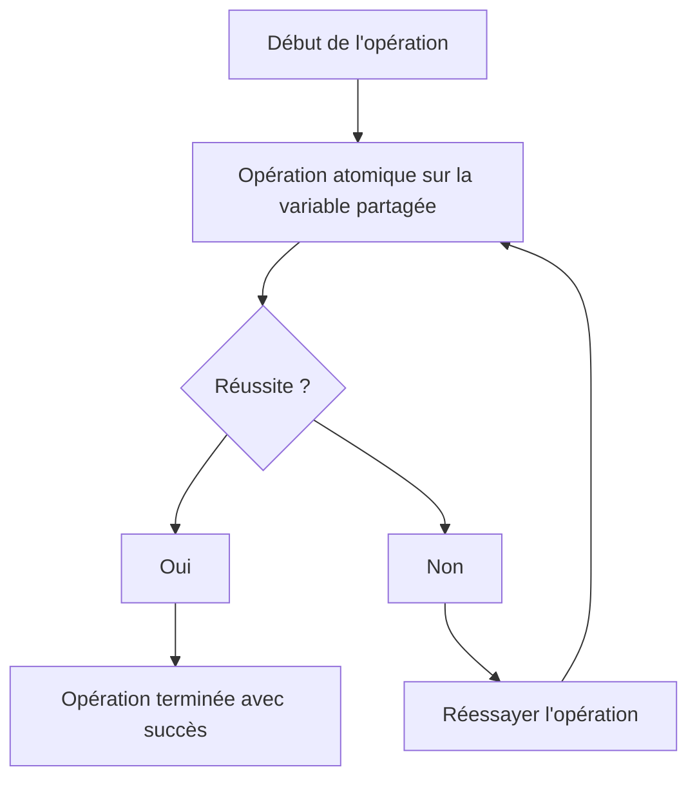
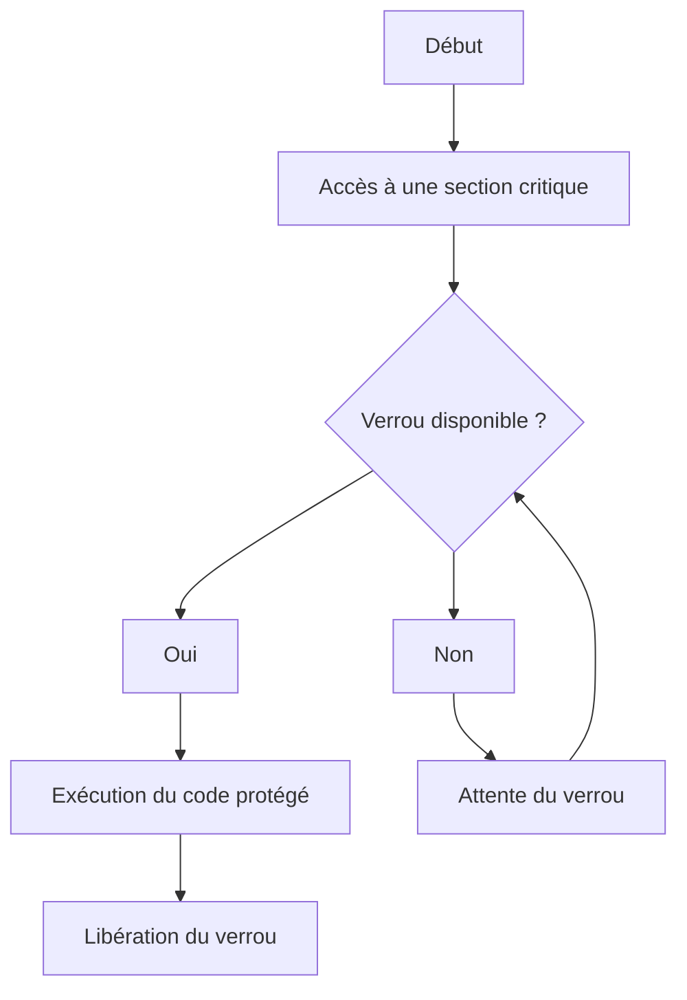
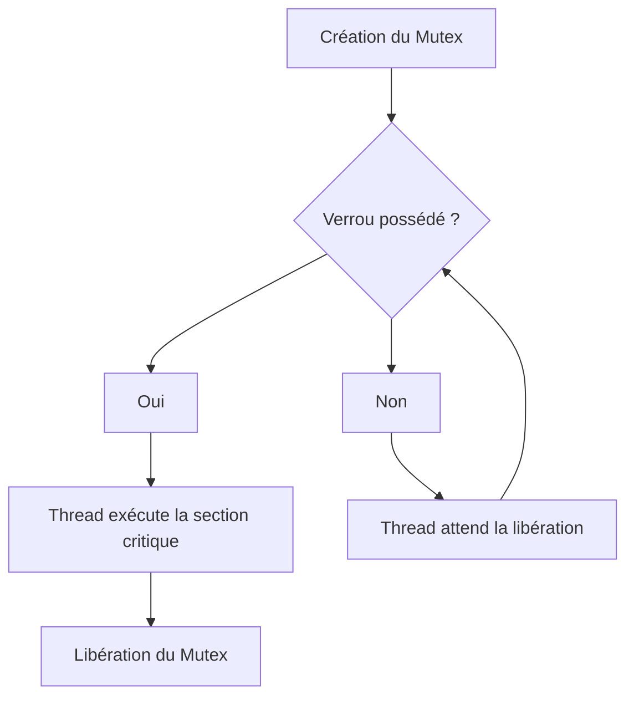
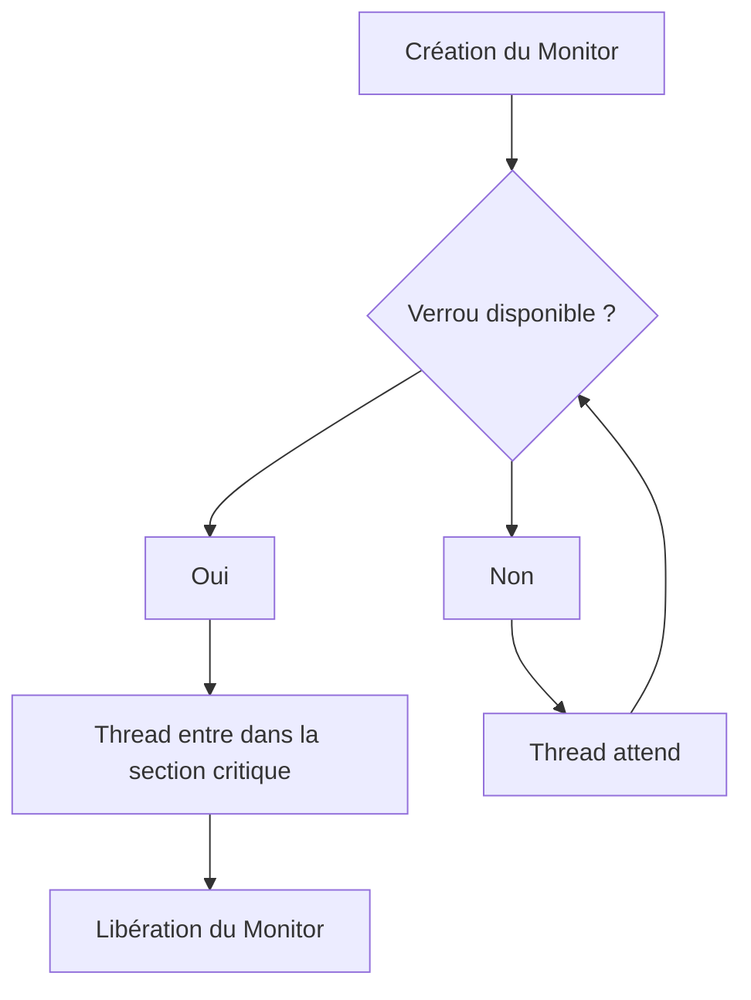
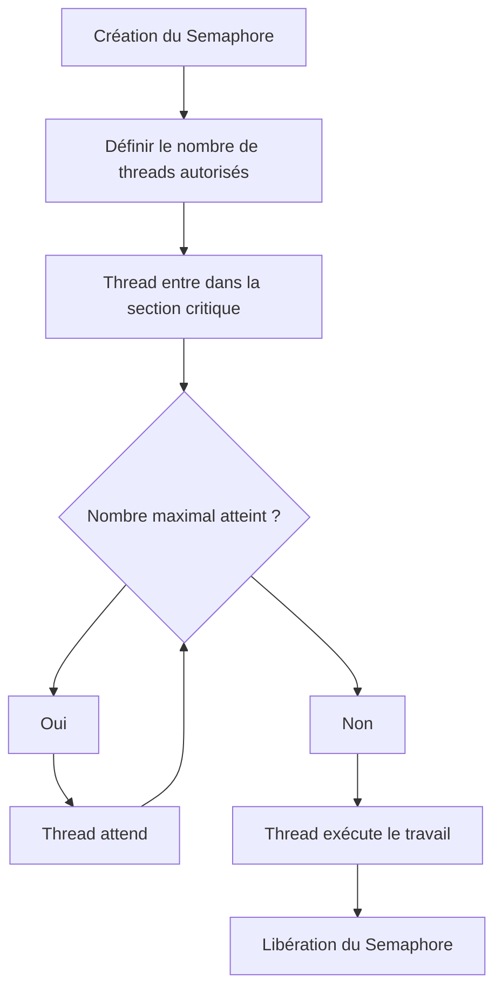
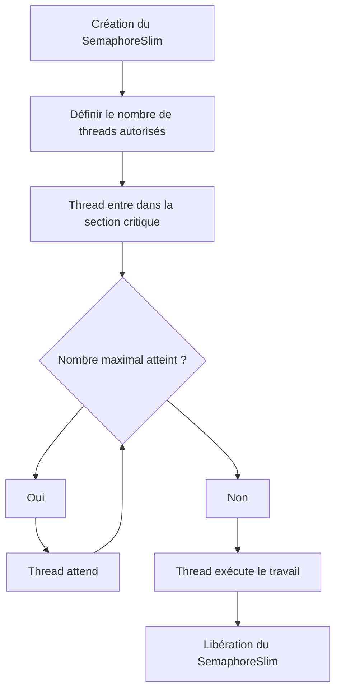

# Les classes Interlocked, Lock, Monitor, Semaphore et SemaphoreSlim

### 1. **Interlocked**

#### 1. Définition
La classe **`Interlocked`** fournit des méthodes atomiques pour `effectuer des opérations sur des variables partagées`. 

Elle est utilisée pour garantir que des opérations telles que `l'incrémentation`, `la décrémentation` ou `l'échange de valeurs` sur `des variables partagées` s'effectuent de manière `atomique`, c'est-à-dire sans être interrompues par d'autres threads. 

Elle est idéale pour les scénarios où vous avez besoin d'une synchronisation fine sans utiliser de verrou explicite.

#### 2. États de `Interlocked`
Bien que `Interlocked` ne fonctionne pas avec des verrous ou des états explicites comme les autres classes, nous pouvons visualiser les opérations atomiques qu'elle garantit.



#### 3. Membres importants (énumération)
- **`Increment(ref int location)`** : Incrémente de manière atomique la variable spécifiée.
- **`Decrement(ref int location)`** : Décrémente de manière atomique la variable spécifiée.
- **`Exchange(ref int location1, int value)`** : Remplace la valeur d'une variable par une nouvelle valeur de manière atomique.
- **`CompareExchange(ref int location1, int value, int comparand)`** : Remplace la valeur de la variable par une nouvelle valeur uniquement si elle est égale à une valeur spécifiée.

#### 4. Membres importants (implémentation simple)
```csharp
int sharedVariable = 0;

// Incrémentation atomique
Interlocked.Increment(ref sharedVariable);

// Décrémentation atomique
Interlocked.Decrement(ref sharedVariable);

// Échange atomique
int oldValue = Interlocked.Exchange(ref sharedVariable, 10);

// Comparaison et échange atomiques
int result = Interlocked.CompareExchange(ref sharedVariable, 20, 10);
```

#### 5. Exemple de synthèse
```csharp
class Program
{
    static int sharedVariable = 0;

    static void Main(string[] args)
    {
        Task[] tasks = new Task[3];

        for (int i = 0; i < 3; i++)
        {
            tasks[i] = Task.Run(() =>
            {
                for (int j = 0; j < 1000; j++)
                {
                    // Incrémenter de manière atomique
                    Interlocked.Increment(ref sharedVariable);
                }
            });
        }

        Task.WaitAll(tasks);
        Console.WriteLine($"Valeur finale de la variable partagée : {sharedVariable}");
    }
}
```

#### 6. Limites de `Interlocked`
- **Limité aux types simples** : `Interlocked` ne fonctionne qu'avec des types de base comme les entiers et les pointeurs, donc elle est moins flexible que les classes comme `Monitor` ou `Mutex` pour la gestion de sections critiques complexes.
- **Pas de sections critiques complexes** : Elle ne protège que les opérations simples, comme l'incrémentation et l'échange de valeurs, mais pas des blocs entiers de code.

---

### 2. **Lock (C# `lock` keyword)**

#### 1. Définition
`lock` est une **instruction simplifiée** pour garantir qu'**un seul thread** à la fois accède à une section critique. En arrière-plan, `lock` repose sur la classe **`Monitor`**.

#### 2. États de `lock`


#### 3. Membres importants (énumération)
- **`lock`** : Encapsule une section de code avec un verrou pour garantir un accès exclusif.

#### 4. Membres importants (implémentation simple)
```csharp
object lockObject = new object();

void Method()
{
    lock (lockObject)
    {
        Console.WriteLine("Exécution dans la section critique.");
    }
}
```

#### 5. Exemple de synthèse
```csharp
class Program
{
    static object lockObject = new object();

    static void Main(string[] args)
    {
        Task[] tasks = new Task[3];

        for (int i = 0; i < 3; i++)
        {
            tasks[i] = Task.Run(() =>
            {
                lock (lockObject)
                {
                    Console.WriteLine($"Tâche {Task.CurrentId} dans la section critique.");
                    Thread.Sleep(1000);
                }
            });
        }

        Task.WaitAll(tasks);
    }
}
```

#### 6. Limites de `lock`
- **Pas de contrôle fin** : Ne permet pas d'attendre avec un timeout ni de relâcher explicitement le verrou.
- **Utilisation limitée aux threads locaux** : Contrairement à `Mutex`, il ne fonctionne pas entre processus différents.

---

### 3. **Mutex**

#### 1. Définition
Un **`Mutex`** est utilisé pour garantir qu'**un seul thread à la fois** accède à une ressource partagée. Il peut également être utilisé pour synchroniser les threads **entre différents processus**.

#### 2. États de `Mutex`


#### 3. Membres importants (énumération)
- **`WaitOne()`** : Attente jusqu'à ce que le mutex soit disponible.
- **`ReleaseMutex()`** : Libération du mutex.
- **`Mutex(bool initiallyOwned)`** : Crée un mutex, avec l'option de le posséder immédiatement.
- **`Mutex(bool initiallyOwned, string name)`** : Crée un mutex nommé.

#### 4. Membres importants (implémentation simple)
```csharp
Mutex mutex = new Mutex();

void Method()
{
    mutex.WaitOne();
    try
    {
        Console.WriteLine("Exécution dans la section critique avec Mutex.");
    }
    finally
    {
        mutex.ReleaseMutex();
    }
}
```

#### 5. Exemple de synthèse
```csharp
class Program
{
    static Mutex mutex = new Mutex();

    static void Main(string[] args)
    {
        Task[] tasks = new Task[3];

        for (int i = 0; i < 3; i++)
        {
            tasks[i] = Task.Run(() =>
            {
                mutex.WaitOne();
                try
                {
                    Console.WriteLine($"Tâche {Task.CurrentId} dans la section critique (Mutex).");
                    Thread.Sleep(1000);
                }
                finally
                {
                    mutex.ReleaseMutex();
                }
            });
        }

        Task.WaitAll(tasks);
    }
}
```

#### 6. Limites de `Mutex`
- **Performance plus lente** que `lock`.
- **Gestion complexe** : Requiert explicitement l'acquisition et la libération du verrou.

---

### 4. **Monitor**

#### 1. Définition
`Monitor` est une classe bas niveau pour synchroniser l'accès à des sections critiques. Il permet un contrôle plus fin que `lock`, offrant des fonctionnalités comme le **timeout**, la **tentative d'acquisition du verrou**, et la possibilité de **mettre en attente** les threads dans une file d'attente.

#### 2. États de `Monitor`


#### 3. Membres importants (énumération)
- **`Enter()`** : Acquiert le verrou.
- **`Exit()`** : Libère le verrou.
- **`TryEnter()`** : Tente d'acquérir le verrou sans bloquer.
- **`Wait()`** : Relâche le verrou et attend un signal via `Pulse`.
- **`Pulse()`** : Réveille un thread en attente.

#### 4. Membres importants (implémentation simple)
```csharp
object lockObject = new object();

void Method()
{
    Monitor.Enter(lockObject);
    try
    {
        Console.WriteLine("Exécution avec Monitor.");
    }
    finally
    {
        Monitor.Exit(lockObject);
    }
}
```

#### 5. Exemple de synthèse
```csharp
class Program
{
    static object lockObject = new object();

    static void Main(string[] args)
   

 {
        Task[] tasks = new Task[3];

        for (int i = 0; i < 3; i++)
        {
            tasks[i] = Task.Run(() =>
            {
                Monitor.Enter(lockObject);
                try
                {
                    Console.WriteLine($"Tâche {Task.CurrentId} dans la section critique (Monitor).");
                    Thread.Sleep(1000);
                }
                finally
                {
                    Monitor.Exit(lockObject);
                }
            });
        }

        Task.WaitAll(tasks);
    }
}
```

#### 6. Limites de `Monitor`
- **Complexité accrue** par rapport à `lock`.
- **Potentiel de blocage** si `Exit` n'est pas appelé correctement.

---

### 5. **Semaphore**

#### 1. Définition
Un **`Semaphore`** limite le nombre de threads pouvant accéder simultanément à une ressource. Il est utile lorsque plusieurs threads peuvent accéder à une ressource en même temps, mais avec une limite définie.

#### 2. États de `Semaphore`


#### 3. Membres importants (énumération)
- **`WaitOne()`** : Diminue le compteur du sémaphore et attend si nécessaire.
- **`Release()`** : Augmente le compteur du sémaphore.
- **`Semaphore(int initialCount, int maximumCount)`** : Crée un sémaphore avec un nombre initial et maximal de threads.

#### 4. Membres importants (implémentation simple)
```csharp
Semaphore semaphore = new Semaphore(2, 2);

void Method()
{
    semaphore.WaitOne();
    try
    {
        Console.WriteLine("Exécution avec Semaphore.");
    }
    finally
    {
        semaphore.Release();
    }
}
```

#### 5. Exemple de synthèse
```csharp
class Program
{
    static Semaphore semaphore = new Semaphore(2, 2);

    static void Main(string[] args)
    {
        Task[] tasks = new Task[5];

        for (int i = 0; i < 5; i++)
        {
            tasks[i] = Task.Run(() =>
            {
                semaphore.WaitOne();
                try
                {
                    Console.WriteLine($"Tâche {Task.CurrentId} accède à la ressource (Semaphore).");
                    Thread.Sleep(1000);
                }
                finally
                {
                    semaphore.Release();
                }
            });
        }

        Task.WaitAll(tasks);
    }
}
```

#### 6. Limites de `Semaphore`
- **Pas adapté pour des tâches très fines**.
- **Pas de gestion de la priorité des threads**.

---

### 6. **SemaphoreSlim**

#### 1. Définition
**`SemaphoreSlim`** est une version allégée de `Semaphore`, plus rapide et optimisée pour les scénarios **uniprocessus**. Il est recommandé pour les opérations locales avec des limitations sur le nombre de threads accédant à une ressource.

#### 2. États de `SemaphoreSlim`


#### 3. Membres importants (énumération)
- **`Wait()`** : Attend pour entrer dans le sémaphore.
- **`WaitAsync()`** : Attend de manière asynchrone.
- **`Release()`** : Libère un emplacement dans le sémaphore.
- **`SemaphoreSlim(int initialCount, int maxCount)`** : Crée un sémaphore avec un nombre de threads autorisés.

#### 4. Membres importants (implémentation simple)
```csharp
SemaphoreSlim semaphoreSlim = new SemaphoreSlim(2, 2);

void Method()
{
    semaphoreSlim.Wait();
    try
    {
        Console.WriteLine("Exécution avec SemaphoreSlim.");
    }
    finally
    {
        semaphoreSlim.Release();
    }
}
```

#### 5. Exemple de synthèse
```csharp
class Program
{
    static SemaphoreSlim semaphoreSlim = new SemaphoreSlim(2, 2);

    static async Task Main(string[] args)
    {
        Task[] tasks = new Task[5];

        for (int i = 0; i < 5; i++)
        {
            tasks[i] = Task.Run(async () =>
            {
                await semaphoreSlim.WaitAsync();
                try
                {
                    Console.WriteLine($"Tâche {Task.CurrentId} exécute avec SemaphoreSlim.");
                    await Task.Delay(1000);
                }
                finally
                {
                    semaphoreSlim.Release();
                }
            });
        }

        await Task.WhenAll(tasks);
    }
}
```

#### 6. Limites de `SemaphoreSlim`
- **Limité à un processus**.
- **Pas de support inter-processus**.

---

### Conclusion générale

En partant de la classe la plus simple (**`Interlocked`**) à la plus complexe (**`SemaphoreSlim`**), chaque mécanisme de synchronisation offre différents niveaux de contrôle :

1. **`Interlocked`** : Pour des opérations atomiques simples sur des types primitifs.
2. **`lock`** : Simplifie la synchronisation sur des sections critiques pour les environnements uniprocessus.
3. **`Mutex`** : Permet la synchronisation entre processus.
4. **`Monitor`** : Offre plus de flexibilité que `lock` pour la gestion des threads en attente.
5. **`Semaphore`** : Limite le nombre de threads pouvant accéder à une ressource.
6. **`SemaphoreSlim`** : Version légère de `Semaphore`, optimisée pour les scénarios locaux.
