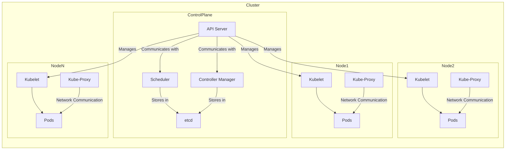

# Kubernetes (Vue d'ensemble) 
---
# Installation de Kubernetes (Docker Desktop)


---
## Schema illustratif de l'architecture Kubernetes

Voici un schéma Mermaid qui représente les composants principaux de Kubernetes :



### Explications du Schéma :

- **Control Plane** : Composants du plan de contrôle de Kubernetes :
  - **API Server** : Expose l'API Kubernetes.
  - **Scheduler** : Planifie les pods sur les nœuds.
  - **Controller Manager** : Gère les contrôleurs de Kubernetes.
  - **etcd** : Stockage clé-valeur distribué pour la configuration.

- **Nodes (Nœuds)** : Composants des nœuds de travail :
  - **Kubelet** : Agent qui s'assure que les conteneurs sont en cours d'exécution dans un pod.
  - **Kube-Proxy** : Gère le routage des services.
  - **Pods** : Unités d'exécution des applications, contenant un ou plusieurs conteneurs.

- **Communication** :
  - Le **API Server** communique avec les **Kubelets** sur les nœuds pour gérer les pods.
  - Le **Scheduler** et le **Controller Manager** utilisent **etcd** pour stocker et récupérer l'état des ressources.
  - Le **Kube-Proxy** assure la communication réseau entre les pods.
---

# Les Techniques de Déploiement des objets k8s avec Kubernetes

## Introduction à Kubernetes
Kubernetes (K8s) est un système open source permettant de gérer des applications conteneurisées sur plusieurs hôtes. Il fournit des mécanismes pour le déploiement, la maintenance et la mise à l'échelle des applications.

Lien pour la documentation officielle : [Kubernetes Documentation](https://kubernetes.io/docs/home/)

---

# Le tour des Objets K8s 


# Création des namespaces

Il existe deux façons courantes de créer un nouveau namespace dans Kubernetes : en ligne de commande (sans manifest) ou à l'aide d'un fichier manifest YAML.

### 1. **Créer un namespace sans manifest (via `kubectl`)**

Pour créer un namespace directement à partir de la ligne de commande sans utiliser de manifest, tu peux utiliser la commande suivante :

```bash
kubectl create namespace <nom_du_namespace>
```

Par exemple, pour créer un namespace nommé `dev` :

```bash
kubectl create namespace dev
```

### 2. **Créer un namespace avec un manifest YAML**

Tu peux également créer un namespace en utilisant un fichier manifest YAML. Voici un exemple de manifest YAML pour un namespace :

```yaml
apiVersion: v1
kind: Namespace
metadata:
  name: dev
```

Enregistrez ce contenu dans un fichier, par exemple `namespace-dev.yaml`, puis appliquez-le avec `kubectl` :

```bash
kubectl apply -f namespace-dev.yaml
```

Cela créera un namespace nommé `dev` comme spécifié dans le fichier YAML.

### Vérification du namespace
Pour vérifier que le namespace a bien été créé, tu peux utiliser la commande suivante :

```bash
kubectl get namespaces
```
``` bash
kubectl get ns
```

### Affichage de l'espace nom courant
Pour afficher le namespace courant
```bash
kubectl config get-contexts
```

### Changer de namespace par défaut dans kubectl

Définir le namespace par défaut pour le contexte courant avec cette commande :

``` bash
     kubectl config set-context --current --namespace=<nom_du_namespace>
```
Cela modifie le contexte actuel pour utiliser le namespace spécifié. Par exemple, pour passer au namespace dev :

``` bash
   kubectl config set-context --current --namespace=dev
```


### Manifest YAML pour la création de Pods
```yaml
apiVersion: v1
kind: Pod
metadata:
  name: nginx
spec:
  containers:
  - name: nginx
    image: nginx:latest
    ports:
    - containerPort: 80
```
Commandes associées :
- Créer le Pod :
    ```bash
    kubectl apply -f https://k8s.io/examples/pods/simple-pod.yaml
    ```
- Créer le Pod directement depuis l'image
   ```bash
    kubectl run <nom-pod> --image=<image docker>
    ```  
- Chercher les informations sur le Pod :
    ```bash
    kubectl get pods
    kubectl describe pod <nom_du_Pod>
    ```
- Consulter la journalisation sur le pod
``` bash
   kubectl logs <nom_du_Pod>
```
- Entrer dans le bash du pod
``` bash
  kubectl exec -ti  <nom_du_Pod> -- /bin/bash
```
- Tester le Pod s'il s'agit d'un service 
``` bash
     kubectl port-forward nginx-pod 8081:80
```

- Editer le manifest du Pod
  ``` bash
     kubectl edit pod <nom-pod>
   ```
- Annoter un Pod
  ``` bash
     kubectl annotate pod nginx-pod key1=value1 key2=value2
  ```
> **Annotation des Pods**: Les annotations permettent d'attacher des métadonnées supplémentaires qui ne sont pas destinées à être interprétées par Kubernetes, utilisées par des outils ou des scripts externes
> exemple kubectl label pod nginx-pod  context=dev

- Supprimer le Pod :
    ```bash
    kubectl delete pod <nom_du_Pod>
    ```

---

### Déploiement
Un Deployment représente un groupe de Pods répliqués. Exemple de manifeste pour un déploiement Nginx :
```yaml
apiVersion: apps/v1
kind: Deployment
metadata:
  name: nginx-dep
  labels:
    app: nginx
spec:
  replicas: 3
  selector:
    matchLabels:
      app: nginx
  template:
    metadata:
      labels:
        app: nginx
    spec:
      containers:
      - name: nginx
        image: nginx:1.14.2
        ports:
        - containerPort: 80
```
Commandes associées :
- Créer le Deployment :
    ```bash
    kubectl apply -f https://k8s.io/examples/controllers/nginx-deployment.yaml
    ```
- Augmenter le nombre de réplicas :
    ```bash
    kubectl scale deployment nginx-dep --replicas=3
    ```

---

### Service
Les services permettent la communication entre Pods ou entre un Pod et l’extérieur du cluster. Voici un exemple de service type **ClusterIP** :
```yaml
apiVersion: v1
kind: Service
metadata:
  name: myapp-service
spec:
  type: ClusterIP
  selector:
    app: nginx
  ports:
    - port: 5000
      targetPort: 80
```

Exposer un déploiement avec un service NodePort :
```bash
kubectl expose deployment nginx-deployment --name myapp-service --type NodePort --port 5000 --target-port 80
```

---

### Ingress
L'Ingress permet de gérer le routage du trafic vers des services dans un cluster Kubernetes. Exemple d’un Ingress avec plusieurs règles :
```yaml
apiVersion: networking.k8s.io/v1
kind: Ingress
metadata:
  name: multiapp-ingress
spec:
  rules:
  - host: myapp.io
    http:
      paths:
      - path: /
        pathType: Prefix
        backend:
          service:
            name: app1
            port:
              number: 80
      - path: /app2
        pathType: Prefix
        backend:
          service:
            name: app2
            port:
              number: 80
```

---

### Persistent Volume (PV) et Persistent Volume Claim (PVC)
Ces objets permettent de persister les données utilisées par les Pods. Exemple de PV :
```yaml
apiVersion: v1
kind: PersistentVolume
metadata:
  name: pv-storage
spec:
  capacity:
    storage: 2Gi
  volumeMode: Filesystem
  accessModes:
    - ReadWriteOnce
  hostPath:
    path: /tmp/data
```

Exemple de PVC :
```yaml
apiVersion: v1
kind: PersistentVolumeClaim
metadata:
  name: pvc-storage
spec:
  resources:
    requests:
      storage: 1Gi
  volumeMode: Filesystem
  accessModes:
    - ReadWriteOnce
```
