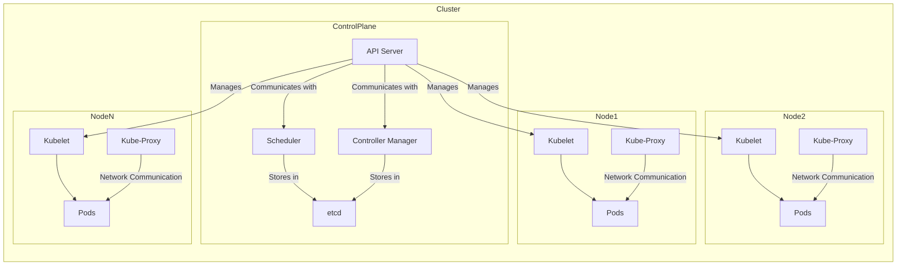

# Kubernetes (Vue d'ensemble) 
---
# Installation de Kubernetes (Docker Desktop)


---
## Schema illustratif de l'architecture Kubernetes

Voici un schéma Mermaid qui représente les composants principaux de Kubernetes :



### Explications du Schéma :

- **Control Plane** : Composants du plan de contrôle de Kubernetes :
  - **API Server** : Expose l'API Kubernetes.
  - **Scheduler** : Planifie les pods sur les nœuds.
  - **Controller Manager** : Gère les contrôleurs de Kubernetes.
  - **etcd** : Stockage clé-valeur distribué pour la configuration.

- **Nodes (Nœuds)** : Composants des nœuds de travail :
  - **Kubelet** : Agent qui s'assure que les conteneurs sont en cours d'exécution dans un pod.
  - **Kube-Proxy** : Gère le routage des services.
  - **Pods** : Unités d'exécution des applications, contenant un ou plusieurs conteneurs.

- **Communication** :
  - Le **API Server** communique avec les **Kubelets** sur les nœuds pour gérer les pods.
  - Le **Scheduler** et le **Controller Manager** utilisent **etcd** pour stocker et récupérer l'état des ressources.
  - Le **Kube-Proxy** assure la communication réseau entre les pods.
---
# Etapes post installation 

Une fois Kubernetes activé dans Docker Desktop, vous pouvez configurer le **Kubernetes Dashboard** et l'**Ingress Controller** en suivant les étapes ci-dessous.

### 1. **Activer le Kubernetes Dashboard**

Kubernetes Dashboard est une interface utilisateur web qui permet de gérer vos clusters Kubernetes. Pour l'activer, suivez ces étapes :

#### Étape 1 : Déployer le Dashboard
Exécutez la commande suivante pour installer le Dashboard via `kubectl` :

```bash
kubectl apply -f https://raw.githubusercontent.com/kubernetes/dashboard/v2.7.0/aio/deploy/recommended.yaml
```

Cela va déployer le Kubernetes Dashboard et ses composants nécessaires dans le namespace `kubernetes-dashboard`.

#### Étape 2 : Créer un compte utilisateur pour accéder au Dashboard
Pour accéder au Dashboard, vous devez créer un compte utilisateur avec les autorisations nécessaires.

Créez un fichier YAML nommé `admin-user.yaml` contenant la configuration suivante :

```yaml
apiVersion: v1
kind: ServiceAccount
metadata:
  name: admin-user
  namespace: kubernetes-dashboard
---
apiVersion: rbac.authorization.k8s.io/v1
kind: ClusterRoleBinding
metadata:
  name: admin-user
roleRef:
  apiGroup: rbac.authorization.k8s.io
  kind: ClusterRole
  name: cluster-admin
subjects:
- kind: ServiceAccount
  name: admin-user
  namespace: kubernetes-dashboard
```

Appliquez ce fichier :

```bash
kubectl apply -f admin-user.yaml
```

#### Étape 3 : Obtenir le token d'accès
Une fois le compte utilisateur créé, obtenez un jeton d'accès avec la commande suivante :

```bash
kubectl -n kubernetes-dashboard create token admin-user
```

#### Étape 4 : Accéder au Kubernetes Dashboard
Pour accéder au Dashboard localement, vous devez exposer le service via un proxy. Exécutez cette commande pour lancer le proxy :

```bash
kubectl proxy
```

Le Kubernetes Dashboard sera disponible à l'adresse suivante :

```
http://localhost:8001/api/v1/namespaces/kubernetes-dashboard/services/https:kubernetes-dashboard:/proxy/
```

Utilisez le token généré à l'étape précédente pour vous authentifier.

### 2. **Configurer l'Ingress Controller**

L'Ingress Controller permet d'exposer des services Kubernetes à l'extérieur du cluster en utilisant des ressources Ingress.

#### Étape 1 : Installer l'Ingress NGINX Controller
Pour installer le NGINX Ingress Controller, exécutez les commandes suivantes :

```bash
kubectl apply -f https://raw.githubusercontent.com/kubernetes/ingress-nginx/main/deploy/static/provider/cloud/deploy.yaml
```

Cela déploiera l'Ingress NGINX Controller dans le namespace `ingress-nginx`.

#### Étape 2 : Vérifier le déploiement de l'Ingress Controller
Vérifiez que le contrôleur NGINX est bien déployé et en cours d'exécution :

```bash
kubectl get pods -n ingress-nginx
```

Vous devriez voir des pods `ingress-nginx-controller` en cours d'exécution.

#### Étape 3 : Créer une ressource Ingress
Une fois le contrôleur déployé, vous pouvez créer des ressources Ingress pour exposer vos services. Voici un exemple simple de fichier YAML pour un service Ingress :

```yaml
apiVersion: networking.k8s.io/v1
kind: Ingress
metadata:
  name: example-ingress
  namespace: default
  annotations:
    nginx.ingress.kubernetes.io/rewrite-target: /
spec:
  rules:
  - host: example.local
    http:
      paths:
      - path: /
        pathType: Prefix
        backend:
          service:
            name: example-service
            port:
              number: 80
```

Appliquez ce fichier :

```bash
kubectl apply -f ingress-example.yaml
```

Cela crée une ressource Ingress qui expose le service `example-service` sur le domaine `example.local`.

### Étape 4 : Mise à jour du fichier `/etc/hosts` (facultatif)
Pour tester l'accès à votre service via l'Ingress, vous devrez peut-être mettre à jour votre fichier `hosts` local avec l'adresse IP du contrôleur Ingress. Vous pouvez trouver l'adresse IP externe de l'Ingress NGINX en exécutant :

```bash
kubectl get svc -n ingress-nginx
```

Ajoutez ensuite une entrée dans votre fichier `/etc/hosts` (ou `C:\Windows\System32\drivers\etc\hosts` sous Windows) :

```
<ingress-controller-ip> example.local
```

Cela vous permettra d'accéder à votre service via `http://example.local`.

---

# Les Techniques de Déploiement des objets k8s avec Kubernetes

## Introduction à Kubernetes
Kubernetes (K8s) est un système open source permettant de gérer des applications conteneurisées sur plusieurs hôtes. Il fournit des mécanismes pour le déploiement, la maintenance et la mise à l'échelle des applications.

Lien pour la documentation officielle : [Kubernetes Documentation](https://kubernetes.io/docs/home/)

---

## Installation de Minikube

### Installation Minikube sur Linux :
1. **Installer Docker**.
2. Exécuter les commandes suivantes :
    ```bash
    curl -LO https://storage.googleapis.com/minikube/releases/latest/minikube-linux-amd64
    sudo install minikube-linux-amd64 /usr/local/bin/minikube
    sudo usermod -aG docker $USER && newgrp docker
    sudo minikube start --driver=docker
    ```
3. **Vérification de l'installation** :
    ```bash
    minikube version
    ```

4. **Installer Kubectl** :
    ```bash
    curl -LO https://storage.googleapis.com/kubernetes-release/release/`curl -s https://storage.googleapis.com/kubernetes-release/release/stable.txt`/bin/linux/amd64/kubectl
    chmod +x kubectl
    sudo mv kubectl /usr/local/bin/
    ```

---

# Le tour des Objets K8s 

### Manifest YAML pour la création de Pods
```yaml
apiVersion: v1
kind: Pod
metadata:
  name: nginx
spec:
  containers:
  - name: nginx
    image: nginx:latest
    ports:
    - containerPort: 80
```
Commandes associées :
- Créer le Pod :
    ```bash
    kubectl apply -f https://k8s.io/examples/pods/simple-pod.yaml
    ```
- Chercher les informations sur le Pod :
    ```bash
    kubectl get pods
    kubectl describe pod <nom_du_Pod>
    ```
- Supprimer le Pod :
    ```bash
    kubectl delete pod <nom_du_Pod>
    ```

---

### Déploiement
Un Deployment représente un groupe de Pods répliqués. Exemple de manifeste pour un déploiement Nginx :
```yaml
apiVersion: apps/v1
kind: Deployment
metadata:
  name: nginx-dep
  labels:
    app: nginx
spec:
  replicas: 3
  selector:
    matchLabels:
      app: nginx
  template:
    metadata:
      labels:
        app: nginx
    spec:
      containers:
      - name: nginx
        image: nginx:1.14.2
        ports:
        - containerPort: 80
```
Commandes associées :
- Créer le Deployment :
    ```bash
    kubectl apply -f https://k8s.io/examples/controllers/nginx-deployment.yaml
    ```
- Augmenter le nombre de réplicas :
    ```bash
    kubectl scale deployment nginx-dep --replicas=3
    ```

---

### Service
Les services permettent la communication entre Pods ou entre un Pod et l’extérieur du cluster. Voici un exemple de service type **ClusterIP** :
```yaml
apiVersion: v1
kind: Service
metadata:
  name: myapp-service
spec:
  type: ClusterIP
  selector:
    app: nginx
  ports:
    - port: 5000
      targetPort: 80
```

Exposer un déploiement avec un service NodePort :
```bash
kubectl expose deployment nginx-deployment --name myapp-service --type NodePort --port 5000 --target-port 80
```

---

### Ingress
L'Ingress permet de gérer le routage du trafic vers des services dans un cluster Kubernetes. Exemple d’un Ingress avec plusieurs règles :
```yaml
apiVersion: networking.k8s.io/v1
kind: Ingress
metadata:
  name: multiapp-ingress
spec:
  rules:
  - host: myapp.io
    http:
      paths:
      - path: /
        pathType: Prefix
        backend:
          service:
            name: app1
            port:
              number: 80
      - path: /app2
        pathType: Prefix
        backend:
          service:
            name: app2
            port:
              number: 80
```

---

### Persistent Volume (PV) et Persistent Volume Claim (PVC)
Ces objets permettent de persister les données utilisées par les Pods. Exemple de PV :
```yaml
apiVersion: v1
kind: PersistentVolume
metadata:
  name: pv-storage
spec:
  capacity:
    storage: 2Gi
  volumeMode: Filesystem
  accessModes:
    - ReadWriteOnce
  hostPath:
    path: /tmp/data
```

Exemple de PVC :
```yaml
apiVersion: v1
kind: PersistentVolumeClaim
metadata:
  name: pvc-storage
spec:
  resources:
    requests:
      storage: 1Gi
  volumeMode: Filesystem
  accessModes:
    - ReadWriteOnce
```
