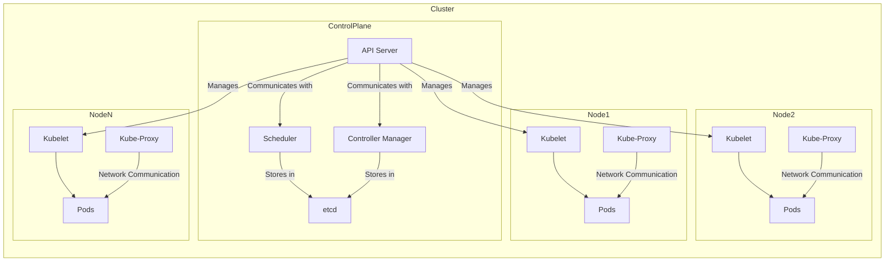

# Kubernetes (Vue d'ensemble) 
---
# Installation de Kubernetes (Docker Desktop)


---
## Schema illustratif de l'architecture Kubernetes

Voici un schéma Mermaid qui représente les composants principaux de Kubernetes :



### Explications du Schéma :

- **Control Plane** : Composants du plan de contrôle de Kubernetes :
  - **API Server** : Expose l'API Kubernetes.
  - **Scheduler** : Planifie les pods sur les nœuds.
  - **Controller Manager** : Gère les contrôleurs de Kubernetes.
  - **etcd** : Stockage clé-valeur distribué pour la configuration.

- **Nodes (Nœuds)** : Composants des nœuds de travail :
  - **Kubelet** : Agent qui s'assure que les conteneurs sont en cours d'exécution dans un pod.
  - **Kube-Proxy** : Gère le routage des services.
  - **Pods** : Unités d'exécution des applications, contenant un ou plusieurs conteneurs.

- **Communication** :
  - Le **API Server** communique avec les **Kubelets** sur les nœuds pour gérer les pods.
  - Le **Scheduler** et le **Controller Manager** utilisent **etcd** pour stocker et récupérer l'état des ressources.
  - Le **Kube-Proxy** assure la communication réseau entre les pods.
---

# Les Techniques de Déploiement des objets k8s avec Kubernetes

## Introduction à Kubernetes
Kubernetes (K8s) est un système open source permettant de gérer des applications conteneurisées sur plusieurs hôtes. Il fournit des mécanismes pour le déploiement, la maintenance et la mise à l'échelle des applications.

Lien pour la documentation officielle : [Kubernetes Documentation](https://kubernetes.io/docs/home/)

---

# Le tour des Objets K8s 
---

## 1.Les namespaces

Il existe deux façons courantes de créer un nouveau namespace dans Kubernetes : en ligne de commande (sans manifest) ou à l'aide d'un fichier manifest YAML.

### Créer un namespace sans manifest (via `kubectl`)

Pour créer un namespace directement à partir de la ligne de commande sans utiliser de manifest, tu peux utiliser la commande suivante :

```bash
kubectl create namespace <nom_du_namespace>
```

Par exemple, pour créer un namespace nommé `dev` :

```bash
kubectl create namespace dev
```

### Créer un namespace avec un manifest YAML

Tu peux également créer un namespace en utilisant un fichier manifest YAML. Voici un exemple de manifest YAML pour un namespace :

```yaml
apiVersion: v1
kind: Namespace
metadata:
  name: dev
```

Enregistrez ce contenu dans un fichier, par exemple `namespace-dev.yaml`, puis appliquez-le avec `kubectl` :

```bash
kubectl apply -f namespace-dev.yaml
```

Cela créera un namespace nommé `dev` comme spécifié dans le fichier YAML.

### Vérifier les namespaces
Pour vérifier que le namespace a bien été créé, tu peux utiliser la commande suivante :

```bash
kubectl get namespaces
```
``` bash
kubectl get ns
```

### Afficher l'espace nom courant
Pour afficher le namespace courant
```bash
kubectl config get-contexts
```

### Changer de namespace par défaut dans kubectl

Définir le namespace par défaut pour le contexte courant avec cette commande :

``` bash
     kubectl config set-context --current --namespace=<nom_du_namespace>
```
Cela modifie le contexte actuel pour utiliser le namespace spécifié. Par exemple, pour passer au namespace dev :

``` bash
   kubectl config set-context --current --namespace=dev
```

---
## 2. Les Pods

### Manifest YAML pour la création de Pods

1. Créer le Pod :
    ```bash
    kubectl apply -f https://k8s.io/examples/pods/simple-pod.yaml
    ```
 Le fichier associé à la création du POD   

```yaml
apiVersion: v1
kind: Pod
metadata:
  name: nginx
spec:
  containers:
  - name: nginx
    image: nginx:latest
    ports:
    - containerPort: 80
```

2. Créer le Pod directement depuis l'image
   ```bash
    kubectl run <nom-pod> --image=<image docker>
    ```  
3. Chercher les informations sur le Pod :
    ```bash
    kubectl get pods
    kubectl describe pod <nom_du_Pod>
    ```
4. Consulter la journalisation sur le pod
``` bash
   kubectl logs <nom_du_Pod>
```
5. Entrer dans le bash du pod
``` bash
  kubectl exec -ti  <nom_du_Pod> -- /bin/bash
```
6. Tester le Pod s'il s'agit d'un service 
``` bash
     kubectl port-forward nginx-pod 8081:80
```

7. Editer le manifest du Pod
  ``` bash
     kubectl edit pod <nom-pod>
   ```
8. Annoter un Pod
  ``` bash
     kubectl annotate pod nginx-pod key1=value1 key2=value2
  ```
> **Annotation des Pods**: Les annotations permettent d'attacher des métadonnées supplémentaires qui ne sont pas destinées à être interprétées par Kubernetes, utilisées par des outils ou des scripts externes
> exemple kubectl label pod nginx-pod  context=dev

9. Supprimer le Pod :
    ```bash
    kubectl delete pod <nom_du_Pod>
    ```

---

## 3.Les Déploiements
Un Deployment représente un groupe de Pods répliqués. Exemple de manifeste pour un déploiement Nginx :

- Créer le Deployment :
    ```bash
    kubectl apply -f https://k8s.io/examples/controllers/nginx-deployment.yaml
    ```
Le fichier associé à la création
```yaml
apiVersion: apps/v1
kind: Deployment
metadata:
  name: nginx-dep
  labels:
    app: nginx
spec:
  replicas: 3
  selector:
    matchLabels:
      app: nginx
  template:
    metadata:
      labels:
        app: nginx
    spec:
      containers:
      - name: nginx
        image: nginx:1.14.2
        ports:
        - containerPort: 80
```
``` bash
  kubectl create deployment <deployment-name> --image=<image-name>
```

- Décrire un déploiment
``` bash
    kubectl describe deployment <deployment_name>
```

- Editer un déploiment
``` bash
  kubectl edit deployment <deployment_name> 
```
- Augmenter le nombre de réplicas :
    ```bash
    kubectl scale deployment nginx-dep --replicas=3
    ```
- Créer un déploiment directement depuis une image

- Mettre à jour l'image d'un déploiment
``` bash
kubectl set image <nom-deploiment> <nom-conteneur>=<nom-nouvelle-image>
```
- Supprimer un déploiment
``` bash
 kubectl delete deployment <deployment_name>
```
La commande suivante :

```bash
kubectl rollout status deployment mysql-deployment
```

permet de **suivre l'état du déploiement** d'une application dans Kubernetes. Elle donne des informations en temps réel sur la progression d'un déploiement, notamment lors de la mise à jour d'une image ou d'une modification des spécifications du déploiement. 

Dans cet exemple, le déploiement `mysql-deployment` est vérifié.

### Que fait cette commande ?
Elle surveille et affiche l'état de la progression d'un déploiement en cours pour s'assurer que les nouvelles répliques de pods sont créées et mises à jour avec succès. Si tout se passe bien, elle indiquera que le déploiement est terminé avec succès. En cas de problème, elle pourrait également fournir des messages d'erreur ou de diagnostic utiles pour comprendre ce qui ne va pas.

### Exemple de sortie possible :
- Si tout se déroule comme prévu, vous pourriez voir un message comme :

  ```bash
  deployment "mysql-deployment" successfully rolled out
  ```

- Si le déploiement est encore en cours, la sortie pourrait indiquer que Kubernetes est en train de mettre à jour les pods :

  ```bash
  Waiting for deployment "mysql-deployment" rollout to finish: 2 out of 3 new replicas have been updated...
  ```
-Inspecter un deployment avec un rollout:

``` bash
kubectl rollout status deployment mysql-deployment
```

> ### Quand l'utiliser ?
> Vous utiliserez cette commande principalement dans les cas suivants :
> 1. **Après une mise à jour de l'image** : pour vérifier si les nouvelles versions des conteneurs ont été déployées avec succès.
> 2. **Lors de la modification des spécifications du déploiement** (changement de nombre de répliques, variables d'environnement, etc.) : pour vérifier si les changements ont été appliqués correctement.
> 3. **Pour surveiller l'état d'un déploiement bloqué** : s'il y a un problème avec le déploiement (comme des pods qui échouent à démarrer), la commande peut fournir des indices sur la raison du blocage.
> ### Rollback en cas d'échec :
> Si le déploiement ne se déroule pas correctement, vous pouvez utiliser la commande suivante pour revenir à la version précédente :

```bash
kubectl rollout undo deployment mysql-deployment
``` 

Cela rétablira le déploiement à un état antérieur stable.

---

## 4.Les Services
Les services permettent la communication entre Pods ou entre un Pod et l’extérieur du cluster. Voici un exemple de service type **ClusterIP** :

- Explorer les services:
  ``` bash
    kubectl get services
  ```
  ``` bash
    kubectl get svc
  ```
-Décrire un service: 
``` bash
 kubectl describe service  <nom-service>
```
``` bash
 kubectl describe svc  <nom-service>
```

- Créer un service:

``` bash
   kubectl apply -f /chemin/manifest.yaml
```
Le fichier qui accompagne la commande
```yaml
apiVersion: v1
kind: Service
metadata:
  name: myapp-service
spec:
  type: ClusterIP
  selector:
    app: nginx
  ports:
    - port: 5000
      targetPort: 80
```

Exposer un déploiement avec un service NodePort :
```bash
kubectl expose deployment nginx-deployment --name myapp-service --type NodePort --port 5000 --target-port 80
```

- Exposer un déploiement avec un service `NodePort`

    - **Créer un déploiement `nginx` :**
      Si vous n'avez pas encore de déploiement `nginx`, vous pouvez en créer un avec cette commande :

       ```bash
       kubectl create deployment nginx-deployment --image=nginx
       ```
    - **Exposer le déploiement avec un service `NodePort` :**

       Utilisez la commande suivante pour exposer le déploiement via un service de type `NodePort` :
    
       ```bash
       kubectl expose deployment nginx-deployment --name=nginx-service --port=80 --target-port=80 --type=NodePort
       ```

       Cette commande expose le port 80 du conteneur `nginx` à un port aléatoire compris entre 30000 et 32767 sur le nœud Kubernetes.
---

## 5. Persistent Volume (PV) et Persistent Volume Claim (PVC)
Ces objets permettent de persister les données utilisées par les Pods. Exemple de PV :

- Créer un PersistentVolume (PV) ou PersistentVolumeClaim (PVC)
    ```bash
    kubectl apply -f <pv-or-pvc-file>.yaml
    ```

```yaml
apiVersion: v1
kind: PersistentVolume
metadata:
  name: pv-storage
spec:
  capacity:
    storage: 2Gi
  volumeMode: Filesystem
  accessModes:
    - ReadWriteOnce
  hostPath:
    path: /tmp/data
```

Exemple de PVC :
```yaml
apiVersion: v1
kind: PersistentVolumeClaim
metadata:
  name: pvc-storage
spec:
  resources:
    requests:
      storage: 1Gi
  volumeMode: Filesystem
  accessModes:
    - ReadWriteOnce
```
    
- Lister les PersistentVolumes (PV)
    ```bash
    kubectl get pv
    ```
- Lister les PersistentVolumeClaims (PVC)
    ```bash
    kubectl get pvc
    ```
 - Voir les détails d'un PV ou PVC
    ```bash
        kubectl describe pv <pv-name>
        kubectl describe pvc <pvc-name>
    ```

 - Supprimer un PV ou PVC
    ```bash
    kubectl delete pv <pv-name>
    kubectl delete pvc <pvc-name>
    ```

 - Vérifier l'état de l'attachement du PVC à un pod
    ```bash
    kubectl get pvc -o wide
    ```
- Modifier un PV ou PVC
    ```bash
    kubectl edit pv <pv-name>
    kubectl edit pvc <pvc-name>
    ```
---

##  Exemple PV PVC en Action [Cliquez ici](https://github.com/bejaouibechir/CED-III/blob/Contenerisation-microservices/Exemple%20PV%20PVC.md) 


### Ingress
L'Ingress permet de gérer le routage du trafic vers des services dans un cluster Kubernetes. Exemple d’un Ingress avec plusieurs règles :
```yaml
apiVersion: networking.k8s.io/v1
kind: Ingress
metadata:
  name: multiapp-ingress
spec:
  rules:
  - host: myapp.io
    http:
      paths:
      - path: /
        pathType: Prefix
        backend:
          service:
            name: app1
            port:
              number: 80
      - path: /app2
        pathType: Prefix
        backend:
          service:
            name: app2
            port:
              number: 80
```

