# Kubernetes (Vue d'ensemble) 

# Etapes post installation 

Une fois Kubernetes activé dans Docker Desktop, vous pouvez configurer le **Kubernetes Dashboard** et l'**Ingress Controller** en suivant les étapes ci-dessous.

### 1. **Activer le Kubernetes Dashboard**

Kubernetes Dashboard est une interface utilisateur web qui permet de gérer vos clusters Kubernetes. Pour l'activer, suivez ces étapes :

#### Étape 1 : Déployer le Dashboard
Exécutez la commande suivante pour installer le Dashboard via `kubectl` :

```bash
kubectl apply -f https://raw.githubusercontent.com/kubernetes/dashboard/v2.7.0/aio/deploy/recommended.yaml
```

Cela va déployer le Kubernetes Dashboard et ses composants nécessaires dans le namespace `kubernetes-dashboard`.

#### Étape 2 : Créer un compte utilisateur pour accéder au Dashboard
Pour accéder au Dashboard, vous devez créer un compte utilisateur avec les autorisations nécessaires.

Créez un fichier YAML nommé `admin-user.yaml` contenant la configuration suivante :

```yaml
apiVersion: v1
kind: ServiceAccount
metadata:
  name: admin-user
  namespace: kubernetes-dashboard
---
apiVersion: rbac.authorization.k8s.io/v1
kind: ClusterRoleBinding
metadata:
  name: admin-user
roleRef:
  apiGroup: rbac.authorization.k8s.io
  kind: ClusterRole
  name: cluster-admin
subjects:
- kind: ServiceAccount
  name: admin-user
  namespace: kubernetes-dashboard
```

Appliquez ce fichier :

```bash
kubectl apply -f admin-user.yaml
```

#### Étape 3 : Obtenir le token d'accès
Une fois le compte utilisateur créé, obtenez un jeton d'accès avec la commande suivante :

```bash
kubectl -n kubernetes-dashboard create token admin-user
```

#### Étape 4 : Accéder au Kubernetes Dashboard
Pour accéder au Dashboard localement, vous devez exposer le service via un proxy. Exécutez cette commande pour lancer le proxy :

```bash
kubectl proxy
```

Le Kubernetes Dashboard sera disponible à l'adresse suivante :

```
http://localhost:8001/api/v1/namespaces/kubernetes-dashboard/services/https:kubernetes-dashboard:/proxy/
```

Utilisez le token généré à l'étape précédente pour vous authentifier.

### 2. **Configurer l'Ingress Controller**

L'Ingress Controller permet d'exposer des services Kubernetes à l'extérieur du cluster en utilisant des ressources Ingress.

#### Étape 1 : Installer l'Ingress NGINX Controller
Pour installer le NGINX Ingress Controller, exécutez les commandes suivantes :

```bash
kubectl apply -f https://raw.githubusercontent.com/kubernetes/ingress-nginx/main/deploy/static/provider/cloud/deploy.yaml
```

Cela déploiera l'Ingress NGINX Controller dans le namespace `ingress-nginx`.

#### Étape 2 : Vérifier le déploiement de l'Ingress Controller
Vérifiez que le contrôleur NGINX est bien déployé et en cours d'exécution :

```bash
kubectl get pods -n ingress-nginx
```

Vous devriez voir des pods `ingress-nginx-controller` en cours d'exécution.

#### Étape 3 : Créer une ressource Ingress
Une fois le contrôleur déployé, vous pouvez créer des ressources Ingress pour exposer vos services. Voici un exemple simple de fichier YAML pour un service Ingress :

```yaml
apiVersion: networking.k8s.io/v1
kind: Ingress
metadata:
  name: example-ingress
  namespace: default
  annotations:
    nginx.ingress.kubernetes.io/rewrite-target: /
spec:
  rules:
  - host: example.local
    http:
      paths:
      - path: /
        pathType: Prefix
        backend:
          service:
            name: example-service
            port:
              number: 80
```

Appliquez ce fichier :

```bash
kubectl apply -f ingress-example.yaml
```

Cela crée une ressource Ingress qui expose le service `example-service` sur le domaine `example.local`.

### Étape 4 : Mise à jour du fichier `/etc/hosts` (facultatif)
Pour tester l'accès à votre service via l'Ingress, vous devrez peut-être mettre à jour votre fichier `hosts` local avec l'adresse IP du contrôleur Ingress. Vous pouvez trouver l'adresse IP externe de l'Ingress NGINX en exécutant :

```bash
kubectl get svc -n ingress-nginx
```

Ajoutez ensuite une entrée dans votre fichier `/etc/hosts` (ou `C:\Windows\System32\drivers\etc\hosts` sous Windows) :

```
<ingress-controller-ip> example.local
```

Cela vous permettra d'accéder à votre service via `http://example.local`.

### Conclusion
Vous avez maintenant configuré le **Kubernetes Dashboard** et le **NGINX Ingress Controller**. Vous pouvez gérer vos ressources Kubernetes via l'interface Dashboard et utiliser Ingress pour exposer des services externes. N'hésitez pas à me poser des questions si vous avez besoin de précisions !

## Schema illustratif de l'architecture Kubernetes

Voici un schéma Mermaid qui représente les composants principaux de Kubernetes :

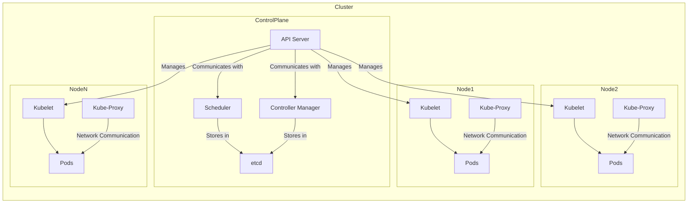

### Explications du Schéma :

- **Control Plane** : Composants du plan de contrôle de Kubernetes :
  - **API Server** : Expose l'API Kubernetes.
  - **Scheduler** : Planifie les pods sur les nœuds.
  - **Controller Manager** : Gère les contrôleurs de Kubernetes.
  - **etcd** : Stockage clé-valeur distribué pour la configuration.

- **Nodes (Nœuds)** : Composants des nœuds de travail :
  - **Kubelet** : Agent qui s'assure que les conteneurs sont en cours d'exécution dans un pod.
  - **Kube-Proxy** : Gère le routage des services.
  - **Pods** : Unités d'exécution des applications, contenant un ou plusieurs conteneurs.

- **Communication** :
  - Le **API Server** communique avec les **Kubelets** sur les nœuds pour gérer les pods.
  - Le **Scheduler** et le **Controller Manager** utilisent **etcd** pour stocker et récupérer l'état des ressources.
  - Le **Kube-Proxy** assure la communication réseau entre les pods.

## La liste des objets K8s utilisés pour créer un système orchestré

Voici une vue d'ensemble des principaux objets Kubernetes, accompagnés de schémas Mermaid pour illustrer chaque objet ainsi que deux méthodes pour les créer : via un fichier manifest et directement avec la commande `kubectl`.

### 1. **Pod**

Un Pod est l'unité de base dans Kubernetes qui regroupe un ou plusieurs conteneurs.

#### Schéma 

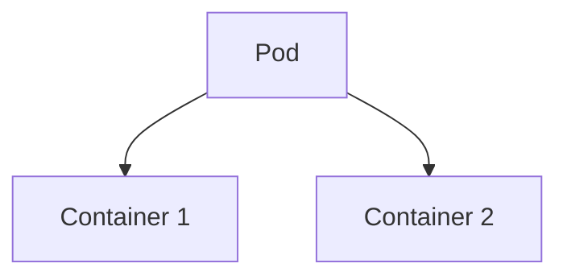

#### Création avec un fichier manifest

**`pod.yaml`**
```yaml
apiVersion: v1
kind: Pod
metadata:
  name: my-pod
spec:
  containers:
  - name: my-container
    image: my-image
```

#### Création avec `kubectl`

```bash
kubectl run my-pod --image=my-image
```

### 2. **Service**

Un Service expose un ensemble de Pods comme un service réseau.

#### Schéma Mermaid

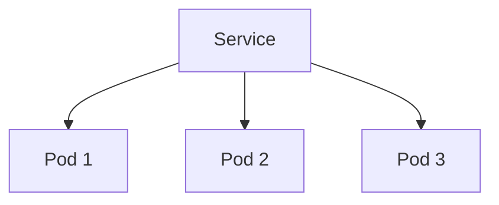

#### Création avec un fichier manifest

**`service.yaml`**
```yaml
apiVersion: v1
kind: Service
metadata:
  name: my-service
spec:
  selector:
    app: my-app
  ports:
    - protocol: TCP
      port: 80
      targetPort: 8080
```

#### Création avec `kubectl`

```bash
kubectl expose pod my-pod --port=80 --target-port=8080 --name=my-service
```

### 3. **Deployment**

Un Deployment gère le déploiement et la mise à jour des Pods et de leurs réplicas.

#### Schéma Mermaid

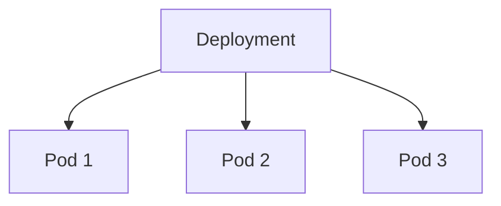

#### Création avec un fichier manifest

**`deployment.yaml`**
```yaml
apiVersion: apps/v1
kind: Deployment
metadata:
  name: my-deployment
spec:
  replicas: 3
  selector:
    matchLabels:
      app: my-app
  template:
    metadata:
      labels:
        app: my-app
    spec:
      containers:
      - name: my-container
        image: my-image
```

#### Création avec `kubectl`

```bash
kubectl create deployment my-deployment --image=my-image --replicas=3
```

### 4. **ReplicaSet**

Un ReplicaSet garantit que le nombre spécifié de réplicas d'un Pod est en cours d'exécution.

#### Schéma Mermaid

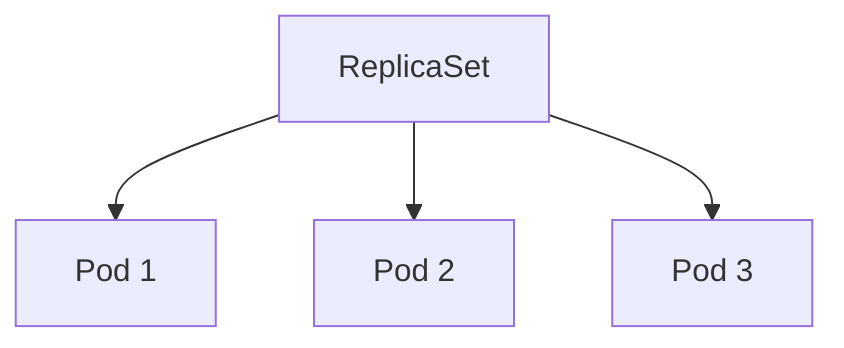

#### Création avec un fichier manifest

**`replicaset.yaml`**
```yaml
apiVersion: apps/v1
kind: ReplicaSet
metadata:
  name: my-replicaset
spec:
  replicas: 3
  selector:
    matchLabels:
      app: my-app
  template:
    metadata:
      labels:
        app: my-app
    spec:
      containers:
      - name: my-container
        image: my-image
```

#### Création avec `kubectl`

```bash
kubectl create replicaset my-replicaset --image=my-image --replicas=3
```

### 5. **StatefulSet**

Un StatefulSet gère les déploiements de Pods avec des identités stables et un stockage persistant.

#### Schéma Mermaid

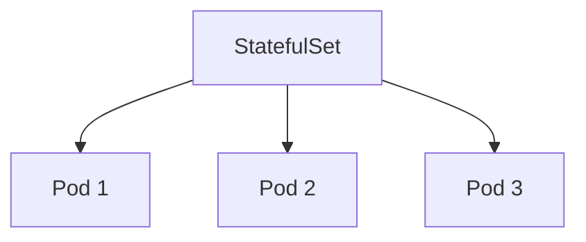

#### Création avec un fichier manifest

**`statefulset.yaml`**
```yaml
apiVersion: apps/v1
kind: StatefulSet
metadata:
  name: my-statefulset
spec:
  serviceName: "my-service"
  replicas: 3
  selector:
    matchLabels:
      app: my-app
  template:
    metadata:
      labels:
        app: my-app
    spec:
      containers:
      - name: my-container
        image: my-image
  volumeClaimTemplates:
  - metadata:
      name: my-persistent-storage
    spec:
      accessModes: ["ReadWriteOnce"]
      resources:
        requests:
          storage: 1Gi
```

#### Création avec `kubectl`

```bash
kubectl create statefulset my-statefulset --image=my-image --replicas=3
```

### 6. **DaemonSet**

Un DaemonSet assure que chaque nœud exécute une copie d'un Pod.

#### Schéma Mermaid

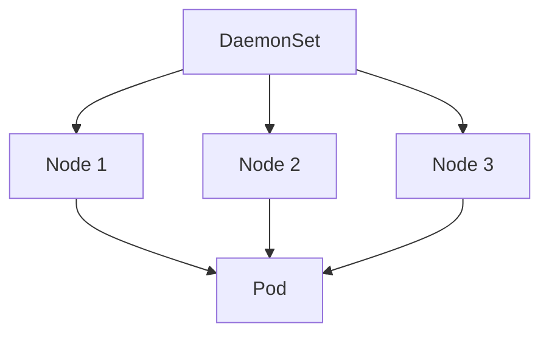

#### Création avec un fichier manifest

**`daemonset.yaml`**
```yaml
apiVersion: apps/v1
kind: DaemonSet
metadata:
  name: my-daemonset
spec:
  selector:
    matchLabels:
      name: my-daemonset
  template:
    metadata:
      labels:
        name: my-daemonset
    spec:
      containers:
      - name: my-container
        image: my-image
```

#### Création avec `kubectl`

```bash
kubectl create daemonset my-daemonset --image=my-image
```

### 7. **Job**

Un Job exécute un ou plusieurs Pods jusqu'à ce qu'ils complètent leur tâche.

#### Schéma Mermaid

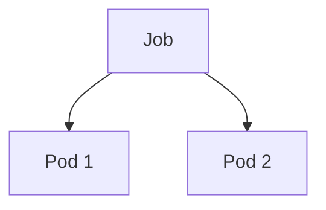

#### Création avec un fichier manifest

**`job.yaml`**
```yaml
apiVersion: batch/v1
kind: Job
metadata:
  name: my-job
spec:
  template:
    spec:
      containers:
      - name: my-container
        image: my-image
      restartPolicy: Never
```

#### Création avec `kubectl`

```bash
kubectl create job my-job --image=my-image
```

### 8. **CronJob**

Un CronJob exécute des Jobs périodiquement selon une planification.

#### Schéma Mermaid

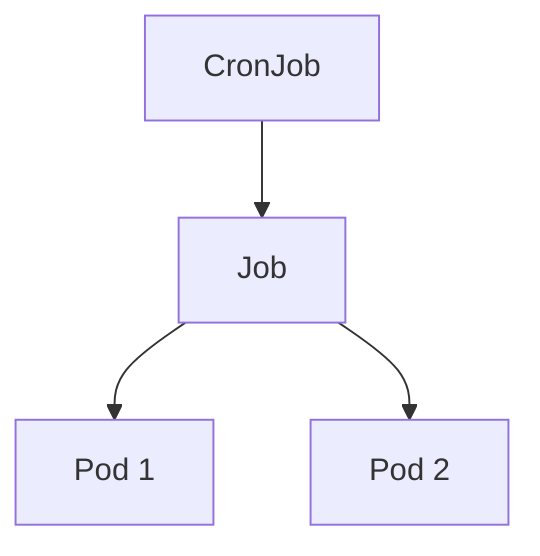

#### Création avec un fichier manifest

**`cronjob.yaml`**
```yaml
apiVersion: batch/v1
kind: CronJob
metadata:
  name: my-cronjob
spec:
  schedule: "*/5 * * * *"
  jobTemplate:
    spec:
      template:
        spec:
          containers:
          - name: my-container
            image: my-image
          restartPolicy: OnFailure
```

#### Création avec `kubectl`

```bash
kubectl create cronjob my-cronjob --image=my-image --schedule="*/5 * * * *"
```

### 9. **ConfigMap**

Un ConfigMap stocke des données de configuration non sensibles utilisées par les Pods.

#### Schéma Mermaid

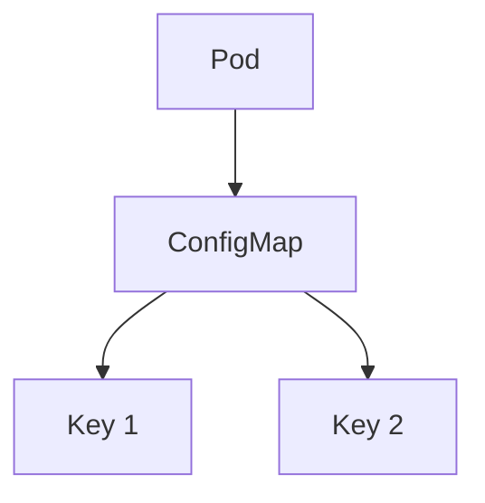

#### Création avec un fichier manifest

**`configmap.yaml`**
```yaml
apiVersion: v1
kind: ConfigMap
metadata:
  name: my-configmap
data:
  key1: value1
  key2: value2
```

#### Création avec `kubectl`

```bash
kubectl create configmap my-configmap --from-literal=key1=value1 --from-literal=key2=value2
```

### 10. **Secret**

Un Secret stocke des données sensibles comme les mots de passe et les clés d'API.

#### Schéma Mermaid

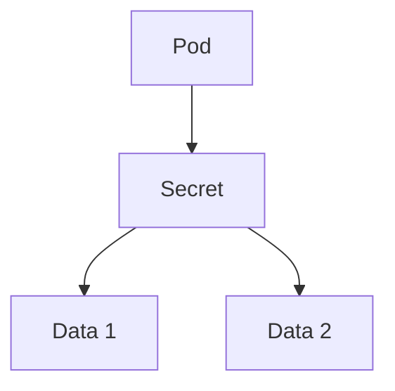

#### Création avec un fichier manifest

**`secret.yaml`**
```yaml
apiVersion: v1
kind: Secret
metadata:
  name: my-secret
type: Opaque
data:
  key1: base64encodedvalue1
  key2: base64encoded

value2
```

#### Création avec `kubectl`

```bash
kubectl create secret generic my-secret --from-literal=key1=value1 --from-literal=key2=value2
```

### 11. **Namespace**

Un Namespace est un espace de noms logique dans un cluster Kubernetes, utilisé pour isoler les ressources.

#### Schéma Mermaid

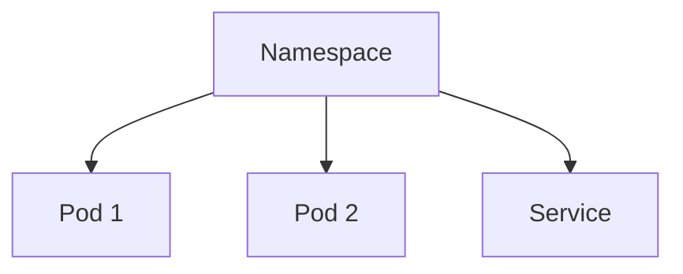

#### Création avec un fichier manifest

**`namespace.yaml`**
```yaml
apiVersion: v1
kind: Namespace
metadata:
  name: my-namespace
```

#### Création avec `kubectl`

```bash
kubectl create namespace my-namespace
```

### 12. **Ingress**

Un Ingress gère l'accès externe aux services dans un cluster Kubernetes.

#### Schéma Mermaid

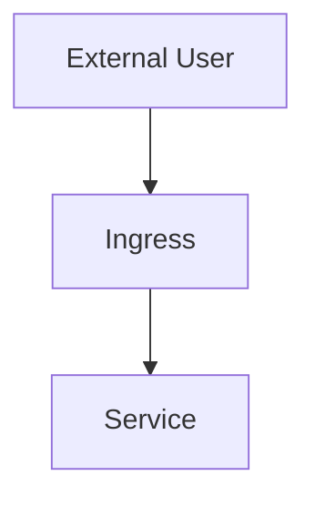

#### Création avec un fichier manifest

**`ingress.yaml`**
```yaml
apiVersion: networking.k8s.io/v1
kind: Ingress
metadata:
  name: my-ingress
spec:
  rules:
  - host: my-app.example.com
    http:
      paths:
      - path: /
        pathType: Prefix
        backend:
          service:
            name: my-service
            port:
              number: 80
```

#### Création avec `kubectl`

```bash
kubectl create ingress my-ingress --rule="host=my-app.example.com,path=/,serviceName=my-service,servicePort=80"
```

### 13. **NetworkPolicy**

Un NetworkPolicy contrôle le trafic réseau vers et depuis les Pods.

#### Schéma Mermaid

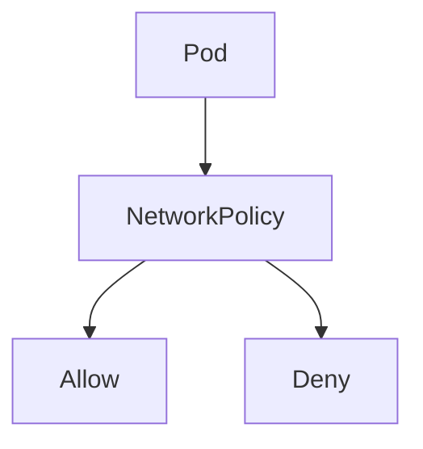

#### Création avec un fichier manifest

**`networkpolicy.yaml`**
```yaml
apiVersion: networking.k8s.io/v1
kind: NetworkPolicy
metadata:
  name: my-networkpolicy
spec:
  podSelector:
    matchLabels:
      app: my-app
  policyTypes:
  - Ingress
  - Egress
  ingress:
  - from:
    - podSelector:
        matchLabels:
          app: other-app
  egress:
  - to:
    - podSelector:
        matchLabels:
          app: other-app
```

#### Création avec `kubectl`

```bash
kubectl create networkpolicy my-networkpolicy --pod-selector=app=my-app --ingress-from=podSelector=app=other-app --egress-to=podSelector=app=other-app
```

Ces exemples couvrent les principaux objets Kubernetes et montrent comment les créer à la fois avec des fichiers manifest et directement via la ligne de commande `kubectl`.
