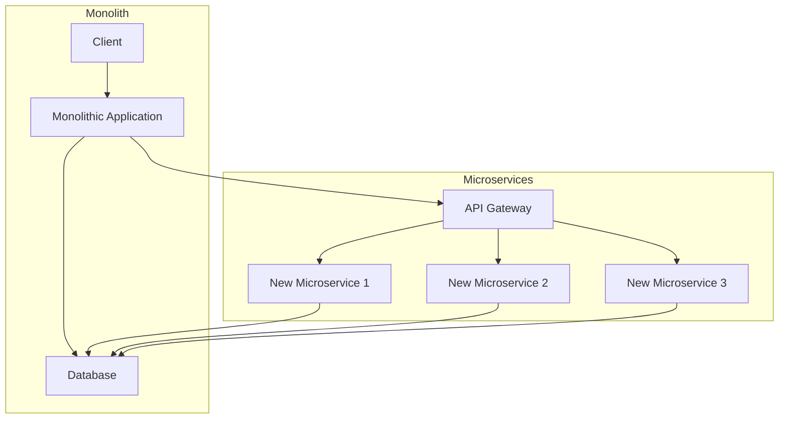
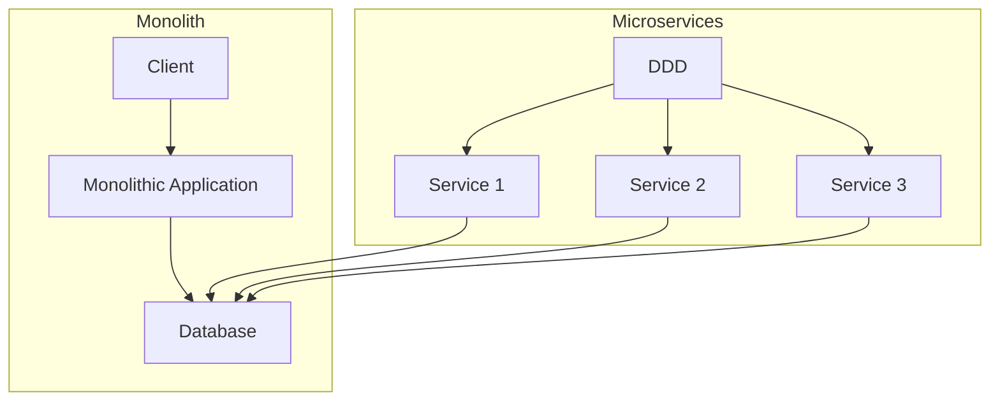
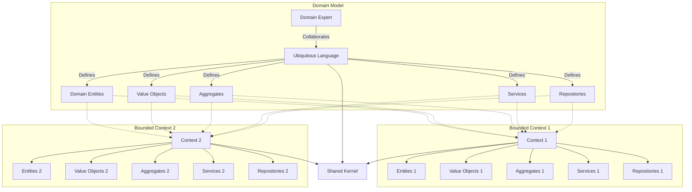
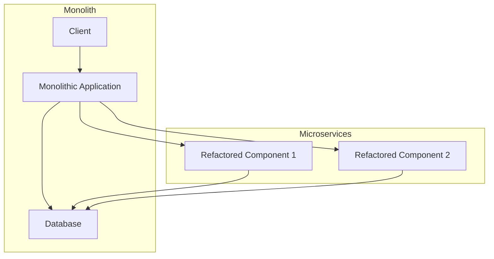
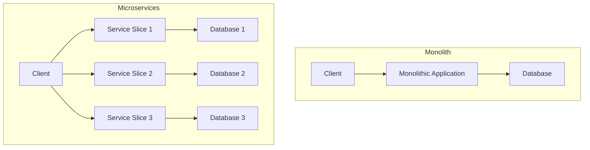
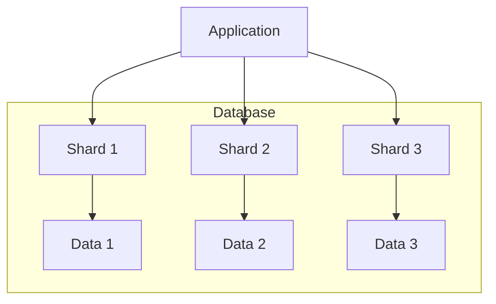
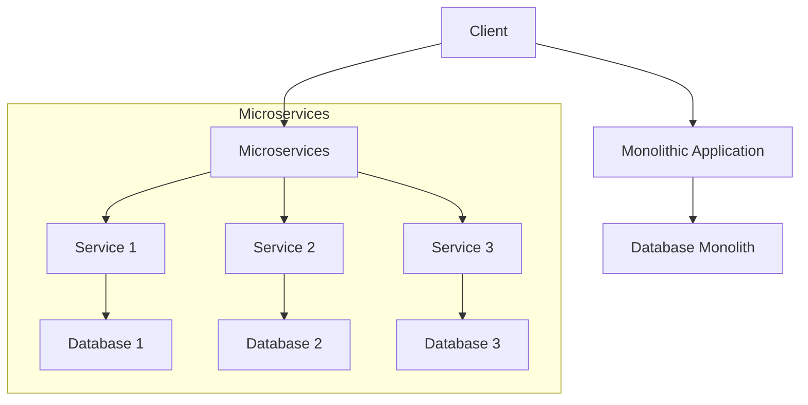
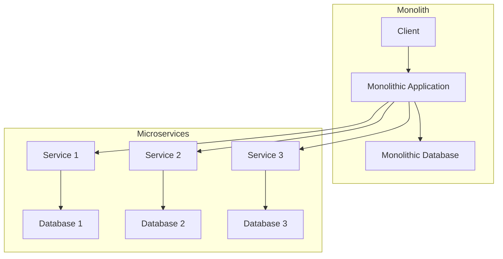
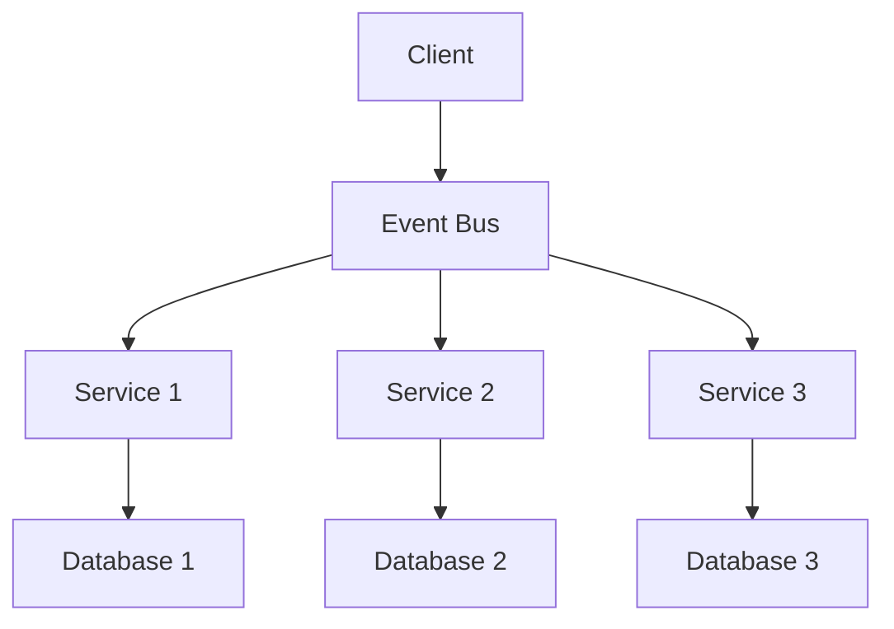
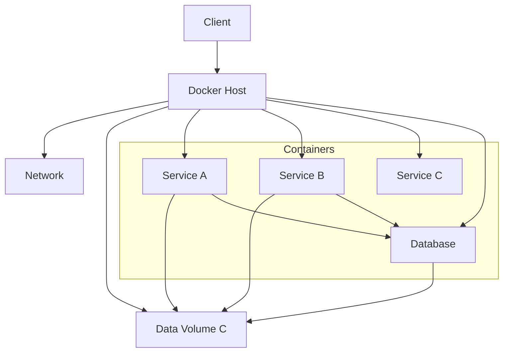

## Techniques de Migration vers les Architectures Microservices

### 1. **Strangling the Monolith**
Cette technique consiste à créer progressivement de nouveaux microservices pour remplacer les fonctionnalités du monolithe. Les nouvelles fonctionnalités sont développées en tant que microservices, tandis que les anciennes sont lentement migrées. Au fil du temps, le monolithe est "étranglé" par les nouveaux microservices jusqu'à ce qu'il soit complètement remplacé.

### 2. **Domain-Driven Design (DDD)**
Utiliser DDD pour identifier les différents domaines fonctionnels (bounded contexts) de l'application monolithique. Ces domaines peuvent être transformés en microservices indépendants. Cette technique aide à s'assurer que chaque microservice a une responsabilité claire et bien définie.

### 3. **Incremental Refactoring**
Commencer par refactoriser des parties du monolithe en composants modulaires. Ces composants modulaires peuvent ensuite être transformés en microservices indépendants. Cette technique permet de réduire les risques en apportant des modifications progressives et contrôlées.

### 4. **Vertical Slice**
Cette approche consiste à identifier et à extraire des fonctionnalités spécifiques (slices) du monolithe et à les transformer en microservices. Chaque vertical slice représente une fonctionnalité complète, y compris l'interface utilisateur, la logique métier et l'accès aux données.

#### 4.1 Database Sharding (Fragementation de la base de données)

Le **database sharding (fragmentation de base de données)** est une technique de partitionnement des données qui consiste à diviser une base de données de grande taille en plusieurs bases de données plus petites, appelées "shards" ou "fragments". Chaque fragment contient une partie des données, et les fragments peuvent être distribués sur différents serveurs. 

### Objectifs Principaux :
- **Scalabilité** : Améliorer la capacité de la base de données à gérer de grandes quantités de données et des charges de travail élevées.
- **Performance** : Réduire la charge sur chaque serveur en répartissant les données et les requêtes, ce qui peut améliorer les temps de réponse.
- **Gestion de la charge** : Permettre une distribution équilibrée des requêtes pour éviter les goulets d'étranglement.

### Illustration avec un Schéma :

Cette technique est particulièrement utile pour les applications qui nécessitent une haute disponibilité et une grande capacité de traitement des données.

### 5. **Parallel Run**
Exécuter les microservices et le monolithe en parallèle pendant une période de transition. Les fonctionnalités sont migrées une par une, et les microservices sont testés en production aux côtés du monolithe. Cette technique permet de valider le bon fonctionnement des microservices avant de désactiver les parties correspondantes du monolithe.

### 6. **Decoupling Database**
La séparation des bases de données est souvent l'un des aspects les plus difficiles de la migration vers les microservices. Les stratégies incluent la réplication des données, la segmentation des bases de données (sharding), et l'utilisation de la synchronisation des événements pour maintenir la cohérence des données entre le monolithe et les microservices.

### 7. **Service-Oriented Architecture (SOA) Transition**
Si votre application utilise déjà une architecture SOA, vous pouvez convertir les services SOA existants en microservices. Cela implique souvent de rendre les services plus autonomes et de réduire les dépendances entre eux.

### 8. **Event-Driven Architecture**
Adopter une architecture basée sur les événements peut faciliter la migration vers les microservices. Les microservices communiquent entre eux via des événements, ce qui permet de découpler les services et de les rendre plus résilients et évolutifs.

### 9. **Containerization**
Utiliser des conteneurs (par exemple, Docker) pour empaqueter et déployer les microservices. La containerisation facilite la gestion des dépendances et assure une isolation entre les services, ce qui simplifie le déploiement et la scalabilité.

Ces diagrammes illustrent les différentes techniques de migration vers une architecture microservices. Vous pouvez les personnaliser et les adapter en fonction de votre contexte et de vos besoins spécifiques.

### Quand la Migration vers les Microservices est-elle Nécessaire ?

1. **Scalabilité** :
   - **Besoins croissants** : Lorsque l'application doit gérer un volume croissant de trafic et de transactions.
   - **Scalabilité indépendante** : Pour permettre de mettre à l'échelle indépendamment différentes parties de l'application.

2. **Déploiement Rapide et Fréquent** :
   - **Déploiement continu** : Pour les équipes qui souhaitent déployer des fonctionnalités rapidement et fréquemment.
   - **Isoler les changements** : Pour minimiser les risques et les impacts des déploiements en isolant les changements dans des services distincts.

3. **Flexibilité Technologique** :
   - **Technologies variées** : Pour adopter différentes technologies et langages de programmation adaptés à chaque service.
   - **Innovation rapide** : Pour permettre une innovation rapide et l'adoption de nouvelles technologies sans affecter l'ensemble de l'application.

4. **Résilience** :
   - **Isolation des pannes** : Pour améliorer la résilience en isolant les pannes afin qu'un problème dans un service n'affecte pas les autres.
   - **Reprise après sinistre** : Pour améliorer la reprise après sinistre et la tolérance aux pannes.

5. **Maintenance et Évolutivité du Code** :
   - **Refactoring et évolution** : Pour faciliter le refactoring et l'évolution du code sans perturber l'ensemble du système.
   - **Propriétés du code** : Pour permettre à des équipes distinctes de posséder et de gérer indépendamment différents services.

### Quand la Migration vers les Microservices peut-elle être Désavantageuse ?

1. **Complexité Accrue** :
   - **Complexité de gestion** : La gestion de nombreux services indépendants peut ajouter une complexité significative.
   - **Orchestration et coordination** : La nécessité de gérer l'orchestration et la coordination entre les services peut être compliquée.

2. **Surcharge Opérationnelle** :
   - **Infrastructure** : Les exigences en matière d'infrastructure et de déploiement sont plus élevées.
   - **Monitoring et logging** : Besoin accru de solutions de monitoring, de logging et de traçabilité pour gérer les services distribués.

3. **Communication et Latence** :
   - **Communication inter-services** : Les appels réseau entre services peuvent introduire de la latence et des problèmes de performance.
   - **Complexité des transactions** : La gestion des transactions distribuées peut être complexe et sujette aux erreurs.

4. **Compétences Techniques** :
   - **Nouveaux paradigmes** : Les équipes doivent posséder les compétences nécessaires pour concevoir, développer et maintenir des systèmes de microservices.
   - **Formation** : Nécessité de former les équipes aux nouveaux outils et technologies.

5. **Coûts de Développement** :
   - **Temps et ressources** : La migration peut être coûteuse en termes de temps et de ressources.
   - **Refactoring** : Le refactoring et la réécriture du code peuvent entraîner des coûts significatifs.

### Conclusion

La migration vers une architecture microservices est avantageuse dans des scénarios nécessitant une scalabilité, une flexibilité technologique, une résilience accrue et des déploiements rapides. Cependant, elle peut être désavantageuse en raison de la complexité accrue, des coûts opérationnels et de développement, ainsi que des compétences techniques requises. Une évaluation approfondie des besoins et des capacités de l'équipe est essentielle avant de décider de migrer d'une architecture monolithique vers des microservices.
