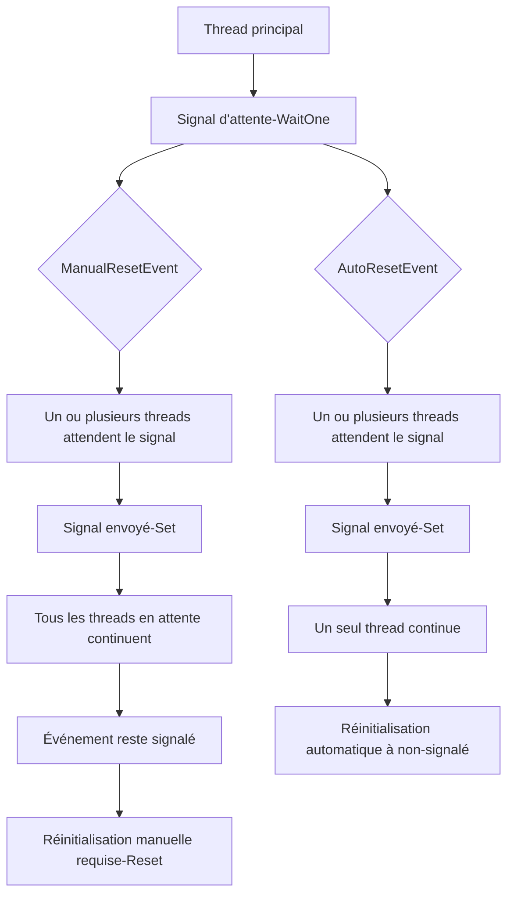
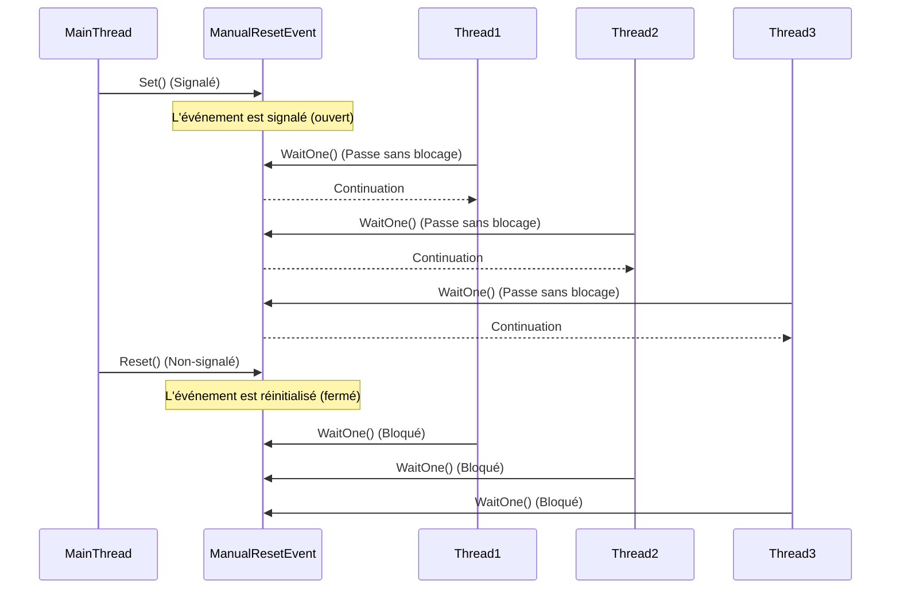
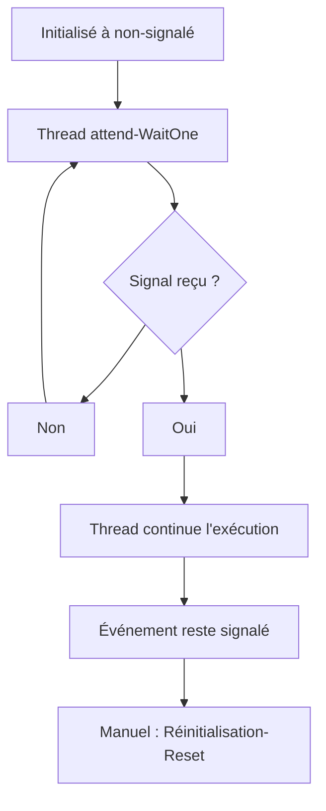
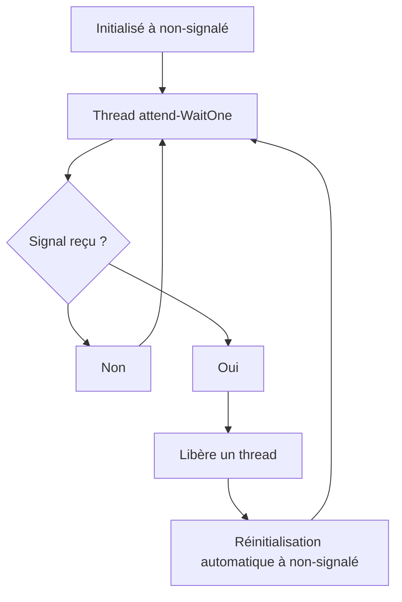
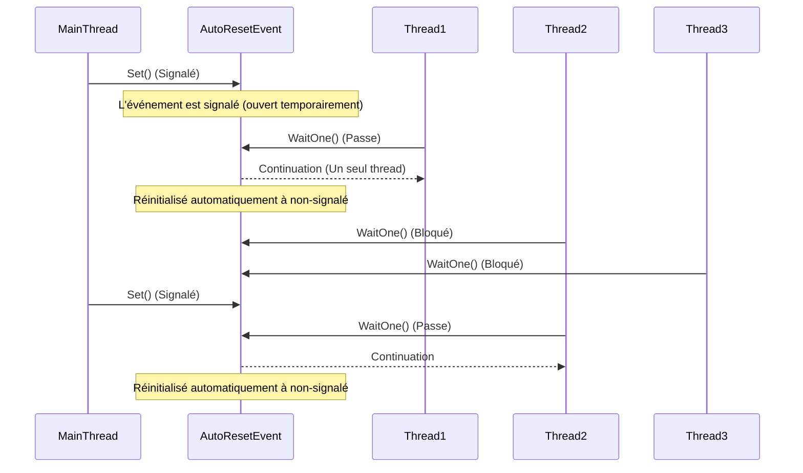

# ManualResetEvent vs AutoResetEvent

Nous allons maintenant présenter les classes **`ManualResetEvent`** et **`AutoResetEvent`**, qui sont des mécanismes de synchronisation utilisés pour signaler à un ou plusieurs threads d'attendre jusqu'à ce qu'un autre thread émette un signal. 

Ces classes sont utiles pour gérer la coordination entre threads.



### 1. **ManualResetEvent**

#### 1. Définition
Un **ManualResetEvent** est un mécanisme de synchronisation qui reste ouvert (signalé) une fois qu'il a été activé avec **`Set()`** jusqu'à ce qu'il soit explicitement réinitialisé avec **`Reset()`**. Il est souvent utilisé pour permettre à plusieurs threads d'attendre un signal via **`WaitOne()`**, et lorsqu'il est déclenché avec **`Set()`**, tous les threads en attente peuvent continuer.

Dans le contexte de **ManualResetEvent**, cela veut dire que, une fois que le signal est envoyé via **Set()**, l'événement passe à l'état **"ouvert" (ou signalé)**, et tous **les threads qui appellent WaitOne()** peuvent passer sans être bloqués. 

Cet état "ouvert" persiste tant que vous ne le réinitialisez pas manuellement via **Reset()**.

C'est comme si vous ouvriez une porte, tant que personne ne la ferme `(via Reset())`, tous ceux qui arrivent peuvent passer `(tous les threads peuvent continuer)`.

Il est important de montrer clairement la séquence d'événements avant et après l'appel à **`Reset()`** pour illustrer comment **`ManualResetEvent`** reste ouvert (signalé) jusqu'à ce qu'il soit réinitialisé. Voici un diagramme de séquence plus détaillé qui montre la situation avant et après l'appel à **`Reset()`** :



### Explication du diagramme :

1. **Le thread principal** appelle **`Set()`** sur **`ManualResetEvent`**, le mettant dans l'état **signalé** (ouvert).
   - Tous les threads qui appellent **`WaitOne()`** (ici **Thread1, Thread2**, et **Thread3**) **passent sans être bloqués**.
   
2. Les threads continuent leur exécution après avoir reçu le signal de **ManualResetEvent**.

3. **Le thread principal** appelle ensuite **`Reset()`**, réinitialisant l'événement à l'état **non-signalé** (fermé).
   - Après la réinitialisation, tout nouveau thread qui appelle **`WaitOne()`** (comme **Thread1, Thread2**, ou **Thread3**) sera **bloqué** et attendra jusqu'à ce que l'événement soit à nouveau signalé avec un nouvel appel à **`Set()`**.

Le diagramme ci-dessus montre clairement les transitions entre les états **signalé** et **non-signalé**, ainsi que le comportement des threads avant et après l'appel à **`Reset()`**.

#### 2. États de `ManualResetEvent`


- Initialisé à un état **non-signalé** (les threads doivent attendre).
- Lorsqu'il est **signalé**, tous les threads en attente continuent leur exécution.
- Il reste en état **signalé** jusqu'à ce qu'il soit explicitement **réinitialisé**.

#### 3. Membres importants (énumération)
- **`WaitOne()`** : Met le thread en attente jusqu'à ce que l'événement soit signalé.
- **`Set()`** : Signale l'événement, permettant à tous les threads en attente de continuer.
- **`Reset()`** : Réinitialise l'événement à non-signalé, forçant les threads à attendre à nouveau.
- **`ManualResetEvent(bool initialState)`** : Initialise l'événement avec l'état signalé ou non.

#### 4. Membres importants (implémentation simple)
```csharp
ManualResetEvent manualEvent = new ManualResetEvent(false);

void WorkerMethod()
{
    Console.WriteLine("En attente du signal...");
    manualEvent.WaitOne();  // Attendre le signal
    Console.WriteLine("Signal reçu, continuation de l'exécution.");
}
```

#### 5. Exemple de synthèse
```csharp
class Program
{
    static ManualResetEvent manualEvent = new ManualResetEvent(false);

    static void Main(string[] args)
    {
        Task[] tasks = new Task[3];

        // Démarrage de plusieurs threads qui attendent un signal
        for (int i = 0; i < 3; i++)
        {
            tasks[i] = Task.Run(() =>
            {
                Console.WriteLine($"Tâche {Task.CurrentId} en attente du signal.");
                manualEvent.WaitOne();
                Console.WriteLine($"Tâche {Task.CurrentId} reprend après le signal.");
            });
        }

        // Simuler une tâche principale qui attend avant de signaler
        Thread.Sleep(2000);
        Console.WriteLine("Signal envoyé, toutes les tâches vont reprendre.");
        manualEvent.Set();  // Signal

        Task.WaitAll(tasks);
    }
}
```

#### 6. Limites de `ManualResetEvent`
- **Manuel** : Vous devez explicitement appeler **`Reset()`** pour renvoyer l'événement à l'état non-signalé. Cela peut conduire à des erreurs si vous oubliez de le réinitialiser.
- **Tous les threads sont libérés en même temps** : Si plusieurs threads attendent sur un `ManualResetEvent`, tous seront libérés lorsque l'événement sera signalé.

---

### 2. **AutoResetEvent**

#### 1. Définition
Un **`AutoResetEvent`** est similaire à un `ManualResetEvent`, mais avec une différence clé : il **se réinitialise automatiquement** à l'état non-signalé après avoir libéré un thread. Cela signifie qu'il ne libère qu'**un seul thread** à la fois.

#### 2. États de `AutoResetEvent`


- Initialisé à un état **non-signalé**, les threads attendent.
- Lorsqu'il est **signalé**, **un seul thread** continue son exécution.
- Il est automatiquement réinitialisé à **non-signalé** après avoir libéré un thread.

Voici un diagramme de séquence pour **`AutoResetEvent`**, qui montre comment il fonctionne en libérant **un seul thread à la fois** et se réinitialise automatiquement après chaque libération.



### Explication du diagramme :

1. **Le thread principal** appelle **`Set()`** sur **`AutoResetEvent`**, signalant l'événement temporairement.
   - **Thread1** attend sur **`WaitOne()`** et **passe** lorsque le signal est reçu.
   - **AutoResetEvent** se réinitialise automatiquement à **non-signalé** après que **Thread1** a été libéré.

2. **Thread2** et **Thread3** sont **bloqués** car **`AutoResetEvent`** s'est réinitialisé automatiquement.

3. **Le thread principal** appelle **`Set()`** à nouveau.
   - Cette fois, **Thread2** reçoit le signal et continue son exécution.
   - **AutoResetEvent** se réinitialise à nouveau automatiquement à **non-signalé**, et **Thread3** reste bloqué jusqu'à un prochain signal.

### Différences avec `ManualResetEvent` :
- Contrairement à **`ManualResetEvent`**, **`AutoResetEvent`** ne libère qu'**un seul thread à la fois**. 
- L'événement se **réinitialise automatiquement** à **non-signalé** après avoir libéré un thread, contrairement à **`ManualResetEvent`**, qui reste ouvert jusqu'à réinitialisation manuelle.

Ce schéma illustre le fonctionnement d'**`AutoResetEvent`**, où chaque appel à **`Set()`** libère un seul thread, et l'événement retourne automatiquement à un état bloquant après chaque libération.

#### 3. Membres importants (énumération)
- **`WaitOne()`** : Met le thread en attente jusqu'à ce que l'événement soit signalé.
- **`Set()`** : Signale l'événement, permettant à un seul thread en attente de continuer.
- **`AutoResetEvent(bool initialState)`** : Initialise l'événement avec l'état signalé ou non.

#### 4. Membres importants (implémentation simple)
```csharp
AutoResetEvent autoEvent = new AutoResetEvent(false);

void WorkerMethod()
{
    Console.WriteLine("En attente du signal...");
    autoEvent.WaitOne();  // Attendre le signal
    Console.WriteLine("Signal reçu, continuation de l'exécution.");
}
```

#### 5. Exemple de synthèse
```csharp
class Program
{
    static AutoResetEvent autoEvent = new AutoResetEvent(false);

    static void Main(string[] args)
    {
        Task[] tasks = new Task[3];

        // Démarrage de plusieurs threads qui attendent un signal
        for (int i = 0; i < 3; i++)
        {
            tasks[i] = Task.Run(() =>
            {
                Console.WriteLine($"Tâche {Task.CurrentId} en attente du signal.");
                autoEvent.WaitOne();
                Console.WriteLine($"Tâche {Task.CurrentId} reprend après le signal.");
            });
        }

        // Simuler une tâche principale qui envoie plusieurs signaux
        for (int i = 0; i < 3; i++)
        {
            Thread.Sleep(1000);
            Console.WriteLine("Signal envoyé, une tâche va reprendre.");
            autoEvent.Set();  // Signal
        }

        Task.WaitAll(tasks);
    }
}
```

#### 6. Limites de `AutoResetEvent`
- **Libère un seul thread à la fois** : Contrairement à `ManualResetEvent`, seulement **un thread** est libéré par appel à **`Set()`**.
- **Moins de contrôle** : Si vous avez besoin de libérer plusieurs threads en même temps, il est préférable d'utiliser `ManualResetEvent`.

---

### Comparaison rapide entre `ManualResetEvent` et `AutoResetEvent`

| Fonctionnalité                   | **`ManualResetEvent`**               | **`AutoResetEvent`**                |
|-----------------------------------|--------------------------------------|-------------------------------------|
| **Signalisation**                 | Libère tous les threads en attente   | Libère un seul thread en attente    |
| **Réinitialisation**              | Manuelle avec `Reset()`              | Automatique après la libération     |
| **Scénarios d'utilisation**       | Libération simultanée de plusieurs threads | Libération d'un thread à la fois    |
| **Utilisation typique**           | Coordination de plusieurs threads    | Synchronisation fine entre deux threads |

---

### Conclusion

**`ManualResetEvent`** et **`AutoResetEvent`** sont des mécanismes de synchronisation utiles pour contrôler les signaux entre threads :

- Utilisez **`ManualResetEvent`** si vous avez besoin de libérer **plusieurs threads** simultanément et que vous souhaitez un contrôle manuel sur la réinitialisation de l'événement.
- Utilisez **`AutoResetEvent`** lorsque vous avez besoin de libérer **un thread à la fois** et que vous préférez une réinitialisation automatique après chaque signal.

Ces mécanismes offrent des solutions pratiques pour coordonner le travail entre plusieurs threads, bien que **`ManualResetEvent`** offre plus de contrôle manuel, tandis que **`AutoResetEvent`** est plus automatisé pour des scénarios simples de synchronisation.
