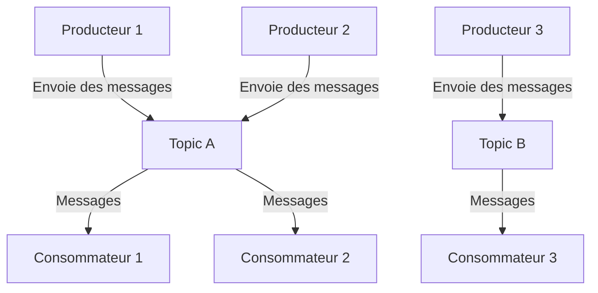
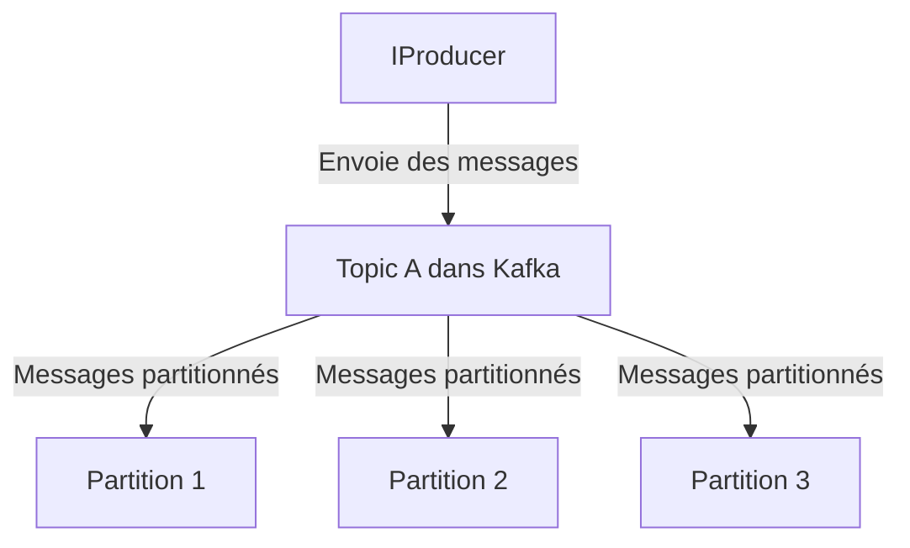
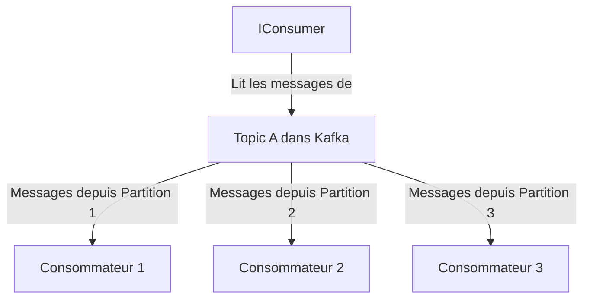
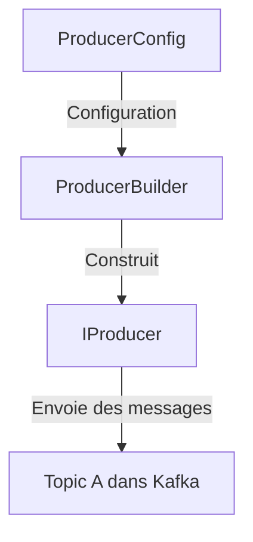
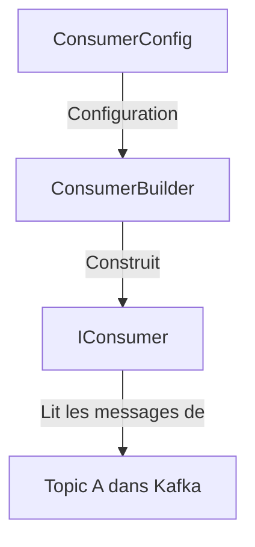

# Communication interservice  avec Kafka

### Introduction à Kafka

*Apache Kafka* est une plateforme de streaming distribuée qui est utilisée pour construire des applications de streaming de données en temps réel et des pipelines.
#### Fonctionnalités Principales de Kafka
- **Haute performance**: Kafka est capable de gérer des volumes très élevés de messages tout en garantissant une faible latence.
- **Scalabilité**: Kafka peut être étendu facilement en ajoutant plus de serveurs sans interruption de service.
- **Durabilité et Fiabilité**: Kafka stocke les messages sur le disque et les réplique au sein du cluster pour prévenir la perte de données.
- **Tolérance aux pannes**: Kafka est résilient aux pannes de serveurs grâce à la réplication des données entre différents nœuds.
- **Flexibilité des Consommateurs**: Les consommateurs peuvent lire les messages à tout moment et revenir à un point précis des messages.

### Schéma Mermaid de Kafka


### Pourquoi avons-nous besoin de ZooKeeper avec Kafka?

ZooKeeper est un service centralisé pour maintenir les informations de configuration, nommer, fournir une synchronisation distribuée, et fournir des services de groupe. Dans le contexte de Kafka, ZooKeeper est utilisé pour gérer et coordonner les brokers Kafka.

#### Fonctionnalités de ZooKeeper
- **Gestion de Configuration**: Stockage des métadonnées de configuration pour les clusters et les clients.
- **Synchronisation**: Aide à la synchronisation des données et des états entre les nœuds du cluster Kafka.
- **Élection du leader**: ZooKeeper peut gérer l'élection automatique des leaders pour les partitions Kafka, qui est essentielle pour la réplication des données.
- **Enregistrement de Service**: ZooKeeper peut servir de registre pour les services et les nœuds dans le cluster.

  

### Introduction aux Interfaces `IProducer` et `IConsumer` de Kafka

Dans le cadre de Kafka, deux interfaces clés sont souvent utilisées pour gérer la communication entre les microservices : `IProducer` et `IConsumer`. Ces interfaces font partie de la bibliothèque **Confluent.Kafka** qui permet l'intégration de Kafka dans des applications .NET. Elles sont essentielles pour l'envoi et la réception de messages dans Kafka.

#### 1. `IProducer<TKey, TValue>`

L'interface `IProducer<TKey, TValue>` est utilisée pour produire (envoyer) des messages vers un ou plusieurs sujets Kafka. 

- **TKey** : Type de la clé du message. Les messages peuvent être envoyés avec une clé qui permet de partitionner les données dans Kafka. La clé est utilisée pour déterminer la partition du sujet où le message sera envoyé. La clé peut être de n'importe quel type, mais est souvent de type `string` ou `null` si aucune clé n'est nécessaire.
  
- **TValue** : Type de la valeur du message. Il s'agit des données réelles que vous souhaitez envoyer. Le type peut être `string`, `byte[]`, ou n'importe quel type sérialisable.

**Exemple de producteur avec `IProducer<Null, string>`** :
- Ici, `Null` est utilisé pour la clé (le message n'a pas de clé spécifique).
- `string` est utilisé pour la valeur (le contenu du message est une chaîne de caractères).

```csharp
var config = new ProducerConfig { BootstrapServers = "localhost:9092" };
using (var producer = new ProducerBuilder<Null, string>(config).Build())
{
    var result = await producer.ProduceAsync("topic-name", new Message<Null, string> { Value = "Hello Kafka!" });
}
```

#### 2. `IConsumer<TKey, TValue>`

L'interface `IConsumer<TKey, TValue>` est utilisée pour consommer (recevoir) des messages depuis un ou plusieurs sujets Kafka.

- **TKey** : Type de la clé du message reçu. Si les messages envoyés ont une clé, cette clé peut être utilisée pour identifier ou filtrer les messages au moment de la consommation.
  
- **TValue** : Type de la valeur du message reçu. Il s'agit des données réelles que vous recevez.

**Exemple de consommateur avec `IConsumer<Null, string>`** :
- `Null` est utilisé pour la clé (le message reçu n'a pas de clé spécifique).
- `string` est utilisé pour la valeur (le contenu du message est une chaîne de caractères).

```csharp
var config = new ConsumerConfig
{
    GroupId = "consumer-group",
    BootstrapServers = "localhost:9092",
    AutoOffsetReset = AutoOffsetReset.Earliest
};
using (var consumer = new ConsumerBuilder<Null, string>(config).Build())
{
    consumer.Subscribe("topic-name");
    var consumeResult = consumer.Consume();
    Console.WriteLine($"Received message: {consumeResult.Message.Value}");
}
```

### Explication du code qui va être utilisé dans ce projet

Pour visualiser le fonctionnement des interfaces `IProducer` et `IConsumer`, voici deux figures expliquant leur interaction avec Kafka.

#### 1. Diagramme de `IProducer`



#### 2. Diagramme de `IConsumer`



Les interfaces *IProducer* et *IConsumer* sont des outils puissants dans l'écosystème Kafka pour gérer les messages entre les microservices. Elles offrent une flexibilité via les types génériques `TKey` et `TValue`, permettant de personnaliser la manière dont les messages sont envoyés et reçus. Les diagrammes Mermaid illustrent clairement comment ces interfaces interagissent avec les sujets et partitions de Kafka, facilitant ainsi la compréhension de leur fonctionnement.

### Explication des Classes ProducerConfig / ProducerBuilder et ConsumerConfig / ConsumerBuilder

Dans Kafka, les classes **ProducerConfig** et **ConsumerConfig** sont utilisées pour configurer les producteurs et consommateurs respectivement. Les classes **ProducerBuilder** et **ConsumerBuilder** sont utilisées pour construire des instances de producteurs et de consommateurs avec les configurations spécifiées. Voici une explication détaillée de ces classes, accompagnée de diagrammes Mermaid pour clarifier leur fonctionnement.

#### 1. ProducerConfig

*ProducerConfig* est une classe utilisée pour configurer un producteur Kafka. Elle contient diverses propriétés qui déterminent le comportement du producteur.

**Membres de Classe Fréquemment Utilisés** :

- **BootstrapServers** : Adresse(s) du ou des serveurs Kafka à utiliser pour la connexion. Exemple : `"localhost:9092"`.
- 
- **Acks** : Niveau d'acquittement souhaité du côté des producteurs. Les options incluent :
  
  - **0 :** Le producteur n'attend aucun acquittement.
  - 
  - **1 :** Le producteur attend l'acquittement du leader de partition.
  - 
  - **all :** Le producteur attend l'acquittement de tous les réplicas de partition.
  - 
- **CompressionType** : Type de compression à utiliser pour les messages. Les options incluent `"gzip"`, `"snappy"`, `"lz4"`, etc.
- 
- **Retries** : Nombre de tentatives de réessai en cas d'échec de l'envoi.

#### 2. `ProducerBuilder<TKey, TValue>`

**ProducerBuilder<TKey, TValue>** est utilisée pour créer une instance de producteur Kafka avec une configuration spécifiée.

- **TKey** : Le type de la clé du message.
- 
- **TValue** : Le type de la valeur du message.

**Exemple de Code** :

```csharp
var config = new ProducerConfig { BootstrapServers = "localhost:9092" };
using (var producer = new ProducerBuilder<Null, string>(config).Build())
{
    var result = await producer.ProduceAsync("topic-name", new Message<Null, string> { Value = "Hello Kafka!" });
}
```




#### 3. `ConsumerConfig`

**ConsumerConfig** est une classe utilisée pour configurer un consommateur Kafka. Elle détermine le comportement du consommateur lorsqu'il lit des messages depuis un sujet Kafka.

**Membres de Classe Fréquemment Utilisés** :

- **BootstrapServers** : Adresse(s) du ou des serveurs Kafka à utiliser pour la connexion.

- **GroupId** : Identifiant du groupe de consommateurs auquel ce consommateur appartient. Cela permet la répartition de la charge des messages parmi les consommateurs du même groupe.

- **AutoOffsetReset** : Définit la position de lecture des messages lorsque l'offset est invalide ou non trouvé. Les options incluent :

  - `Earliest` : Commence à lire à partir du premier message.
    
  - `Latest` : Commence à lire à partir du dernier message produit.

- **EnableAutoCommit** : Indique si les offsets doivent être automatiquement commis après la lecture des messages.

#### 4. `ConsumerBuilder<TKey, TValue>`

`ConsumerBuilder<TKey, TValue>` est utilisée pour créer une instance de consommateur Kafka avec une configuration spécifiée.

- **TKey** : Le type de la clé du message.
- 
- **TValue** : Le type de la valeur du message.

**Exemple de Code** :

```csharp
var config = new ConsumerConfig
{
    GroupId = "consumer-group",
    BootstrapServers = "localhost:9092",
    AutoOffsetReset = AutoOffsetReset.Earliest
};
using (var consumer = new ConsumerBuilder<Null, string>(config).Build())
{
    consumer.Subscribe("topic-name");
    var consumeResult = consumer.Consume();
    Console.WriteLine($"Received message: {consumeResult.Message.Value}");
}
```



### Conclusion

Les classes `ProducerConfig` / `ProducerBuilder` et `ConsumerConfig` / `ConsumerBuilder` sont des éléments essentiels pour configurer et créer des producteurs et consommateurs Kafka dans une application .NET. Elles permettent de spécifier divers paramètres comme les serveurs Kafka, les stratégies de compression, et les modes de gestion des offsets. Les diagrammes Mermaid offrent une vue claire de la manière dont ces classes interagissent pour produire et consommer des messages dans Kafka.


# Exemple Pratique

Voici une version détaillée du tutoriel pour implémenter **un système de communication inter-microservices** à l'aide de **Kafka** et **ZooKeeper**, en utilisant *Docker* pour les versions conteneurisées de Kafka et ZooKeeper, et Postman pour tester la communication entre les services.

### Étape 1 : Configuration de Docker pour Kafka et ZooKeeper

1. **Créez un fichier `docker-compose.yml`** dans un répertoire approprié pour déployer Kafka et ZooKeeper :

```yaml
version: '3.8'
services:
  zookeeper:
    image: confluentinc/cp-zookeeper:latest
    environment:
      ZOOKEEPER_CLIENT_PORT: 2181
      ZOOKEEPER_TICK_TIME: 2000

  kafka:
    image: confluentinc/cp-kafka:latest
    depends_on:
      - zookeeper
    ports:
      - "9092:9092"
    environment:
      KAFKA_BROKER_ID: 1
      KAFKA_ZOOKEEPER_CONNECT: zookeeper:2181
      KAFKA_ADVERTISED_LISTENERS: LISTENER_DOCKER_INTERNAL://kafka:29092,LISTENER_DOCKER_EXTERNAL://${DOCKER_HOST_IP:-127.0.0.1}:9092
      KAFKA_LISTENER_SECURITY_PROTOCOL_MAP: LISTENER_DOCKER_INTERNAL:PLAINTEXT,LISTENER_DOCKER_EXTERNAL:PLAINTEXT
      KAFKA_INTER_BROKER_LISTENER_NAME: LISTENER_DOCKER_INTERNAL
      KAFKA_OFFSETS_TOPIC_REPLICATION_FACTOR: 1
```

2. **Démarrez Kafka et ZooKeeper** en exécutant la commande suivante dans le dossier où se trouve `docker-compose.yml` :
```bash
docker-compose up -d
```

### Étape 2 : Création des Microservices

#### Service A : Producteur Kafka

1. **Créez un projet ASP.NET Core Web API** pour ServiceA :

```bash
dotnet new webapi -n ServiceA
cd ServiceA
```

2. **Ajoutez le package NuGet pour Kafka** :

```bash
dotnet add package Confluent.Kafka
```

3. **Modifiez le fichier `ServiceA.csproj`** pour inclure la dépendance Kafka :

```xml
<Project Sdk="Microsoft.NET.Sdk.Web">

  <PropertyGroup>
    <TargetFramework>net8.0</TargetFramework>
    <Nullable>enable</Nullable>
    <ImplicitUsings>enable</ImplicitUsings>
  </PropertyGroup>

  <ItemGroup>
    <PackageReference Include="Confluent.Kafka" Version="2.0.0" />
  </ItemGroup>

</Project>
```

4. **Ajoutez un contrôleur pour gérer les requêtes** :

Créez un contrôleur `MessagesController.cs` dans le répertoire `Controllers` :

```csharp
using Confluent.Kafka;
using Microsoft.AspNetCore.Mvc;
using System.Threading.Tasks;

namespace ServiceA.Controllers
{
    [ApiController]
    [Route("api/[controller]")]
    public class MessagesController : ControllerBase
    {
        private readonly IProducer<Null, string> _producer;

        public MessagesController()
        {
            var config = new ProducerConfig { BootstrapServers = "localhost:9092" };
            _producer = new ProducerBuilder<Null, string>(config).Build();
        }

        [HttpPost]
        public async Task<IActionResult> SendMessage([FromBody] string message)
        {
            var result = await _producer.ProduceAsync("message-topic", new Message<Null, string> { Value = message });
            return Ok($"Message '{message}' sent to {result.TopicPartitionOffset}");
        }
    }
}
```

5. **Configurez `launchSettings.json`** pour spécifier les paramètres d'exécution :

```json
{
  "profiles": {
    "ServiceA": {
      "commandName": "Project",
      "dotnetRunMessages": true,
      "launchBrowser": false,
      "applicationUrl": "https://localhost:7101;http://localhost:5101",
      "environmentVariables": {
        "ASPNETCORE_ENVIRONMENT": "Development"
      }
    }
  }
}
```

#### Service B : Consommateur Kafka

1. **Créez un projet ASP.NET Core Web API** pour ServiceB :

```bash
dotnet new webapi -n ServiceB
cd ServiceB
```

2. **Ajoutez le package NuGet pour Kafka** :

```bash
dotnet add package Confluent.Kafka
```

3. **Modifiez le fichier `ServiceB.csproj`** pour inclure la dépendance Kafka :

```xml
<Project Sdk="Microsoft.NET.Sdk.Web">

  <PropertyGroup>
    <TargetFramework>net8.0</TargetFramework>
    <Nullable>enable</Nullable>
    <ImplicitUsings>enable</ImplicitUsings>
  </PropertyGroup>

  <ItemGroup>
    <PackageReference Include="Confluent.Kafka" Version="2.0.0" />
  </ItemGroup>

</Project>
```

4. **Ajoutez un contrôleur pour consommer les messages** :

Créez un contrôleur `MessagesController.cs` dans le répertoire `Controllers` :

```csharp
using Confluent.Kafka;
using Microsoft.AspNetCore.Mvc;
using System;
using System.Threading;
using System.Threading.Tasks;

namespace ServiceB.Controllers
{
    [ApiController]
    [Route("api/[controller]")]
    public class MessagesController : ControllerBase
    {
        private readonly IConsumer<Null, string> _consumer;

        public MessagesController()
        {
            var config = new ConsumerConfig
            {
                GroupId = "message-group",
                BootstrapServers = "localhost:9092",
                AutoOffsetReset = AutoOffsetReset.Earliest
            };
            _consumer = new ConsumerBuilder<Null, string>(config).Build();
            _consumer.Subscribe("message-topic");
        }

        [HttpGet]
        public IActionResult ConsumeMessage()
        {
            var consumeResult = _consumer.Consume();
            return Ok($"Received message: {consumeResult.Message.Value}");
        }
    }
}
```

5. **Configurez `launchSettings.json`** pour ServiceB :

```json
{
  "profiles": {
    "ServiceB": {
      "commandName": "Project",
      "dotnetRunMessages": true,
      "launchBrowser": false,
      "applicationUrl": "https://localhost:7102;http://localhost:5102",
      "environmentVariables": {
        "ASPNETCORE_ENVIRONMENT": "Development"
      }
    }
  }
}
```

### Étape 3 : Exécution des Microservices

1. **Lancez `ServiceA`** en utilisant la commande suivante dans le répertoire du projet :

```bash
dotnet run
```

ServiceA sera maintenant en cours d'exécution et prêt à envoyer des messages à Kafka.

2. **Lancez `ServiceB`** en utilisant la commande suivante dans le répertoire du projet :

```bash
dotnet run
```

ServiceB sera maintenant en cours d'exécution et prêt à consommer des messages depuis Kafka.

### Étape 4 : Test de la Communication avec Postman

#### Test avec Postman

1. **Envoyez un message depuis ServiceA** :
   - Ouvrez Postman.
   - Créez une nouvelle requête `POST`.
   - Dans le champ `URL`, entrez `http://localhost:5101/api/messages`.
   - Sous l'onglet `Body`, sélectionnez `raw` et `JSON` comme type.
   - Entrez le message dans le corps de la requête, par exemple : `"Hello, Kafka!"`.
   - Cliquez sur `Send`.

   Vous devriez recevoir une réponse indiquant que le message a été envoyé à Kafka.

2. **Consommez le message dans ServiceB** :
   - Créez une nouvelle requête `GET`.
   - Dans le champ `URL`, entrez `http://localhost:5102/api/messages`.
   - Cliquez sur `Send`.

   Vous devriez recevoir une réponse contenant le message que vous avez envoyé depuis ServiceA.

### Conclusion

Ce tutoriel détaillé montre comment mettre en place un système de communication inter-microservices en utilisant Kafka et ZooKeeper avec Docker, et comment tester cette communication avec Postman. Le tutoriel couvre la configuration de Docker, la création de deux services .NET, et l'utilisation de Postman pour vérifier que les messages sont correctement envoyés et reçus via Kafka.
