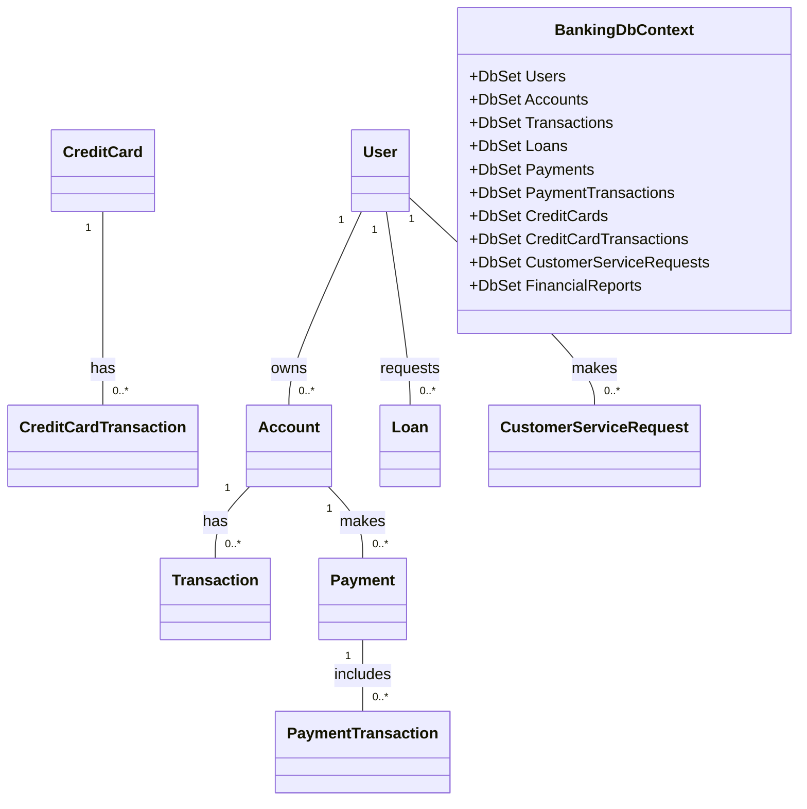
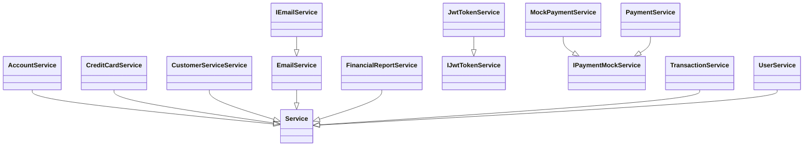
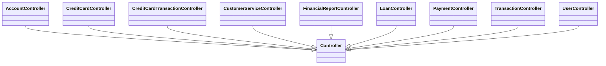

# L'état des lieux (Description de l'applcation monolitique)

Pour décrire en détail l'application monolithique Web API en .NET 8.0, nous allons utiliser les informations que vous avez fournies. Nous allons diviser la description en trois parties principales :

1. **Modèles de données**
2. **Services**
3. **Contrôleurs**

Chaque partie sera accompagnée de diagrammes Mermaid pour illustrer les relations et les composants. 

---

## 1. Modèle de Données

### Diagramme de Modèle

### Présentation du model:

- **User** : Représente un utilisateur avec des comptes, des prêts, et des demandes de service client.
- **Account** : Représente un compte bancaire avec des transactions et des paiements.
- **Transaction** : Représente les transactions effectuées sur un compte.
- **Payment** : Représente un paiement effectué avec des transactions associées.
- **CreditCard** : Représente une carte de crédit avec des transactions associées.
- **CreditCardTransaction** : Représente une transaction de carte de crédit.
- **Loan** : Représente un prêt demandé par un utilisateur.
- **CustomerServiceRequest** : Représente une demande de service client.
- **FinancialReport** : Représente un rapport financier généré par le système.

## 2. Présentation des services

### Diagramme de Services

- **AccountService:** Effectue des opérations CRUD des comptes
- **CreditCardService:** Effectue des opérations CRUD des cartes de crédit
- **CustomerServiceService:** envoie une requête client via **SubmitRequest**
- **EmailService:** envoie un email à travers **SendEmailAsync** 
- **FinancialReportService:** genère un rapport PDF via **GenerateReport**
- **LoanService:** lance l'octoit d'un emprunt et permet d'avoir des informations sur l'emprunt 
- **PaymentService:** lance une opération de payment via **ProcessPayment**
- **TransactionService:** permet de lancer trois opérations **Deposit**, **Withdraw**  et **Transfer**
- **UserService:**  Services métier qui encapsulent la logique de traitement pour leurs entités respectives.
- **IEmailService:**  Interface pour les services d'envoi d'e-mails.
- **IJwtTokenService:**  Interface pour le service de gestion des tokens JWT.
- **IPaymentMockService:** Interface pour les services de paiement fictifs.
- **JwtTokenService:** Implémentation de `IJwtTokenService` pour la gestion des tokens JWT.
- **MockPaymentService:** Implémentation de `IPaymentMockService` pour les paiements fictifs.

## 3. Présentation des contrôleurs

### Diagramme de Contrôleurs

- **AccountController:** Gère les opérations CRUD des comptes
- **CreditCardController:** Gère les opérations CRUD des cartes de crédit
- **CreditCardTransactionController:** Il permet deux opérations **Chagre** et **Refund**
- **CustomerServiceController:**: Il permet d'envoyer une requête client via **SubmitRequest**
- **FinancialReportController:**: Il permet de générer un rapport PDF qui contient les totaux des comptes, des transactions et des balances
- **LoanController:**: Il permet de lancer une demande d'emprunt à travers **ApplyForLoan** et de repayer à travers **RepayLoan** et d'avoir des détails d'emprunt **GetLoanDetails** sur la base de son id
- **PaymentController:**: Il permet de lancer un processus de paiment **ProcessPayment**
- **TransactionController:**: Il permet de lancer trois opérations **Deposit**, **Withdraw**  et **Transfer**
- **UserController:** Il permet trois opérations **Register**, **Login** et **GetUser**
---

Ces diagrammes et explications offrent une vue d'ensemble de l'architecture de l'application, mettant en évidence les relations entre les différents composants et services. Vous pouvez utiliser ces diagrammes pour mieux comprendre et communiquer la structure de l'application lors de la conception ou des discussions avec d'autres développeurs.
