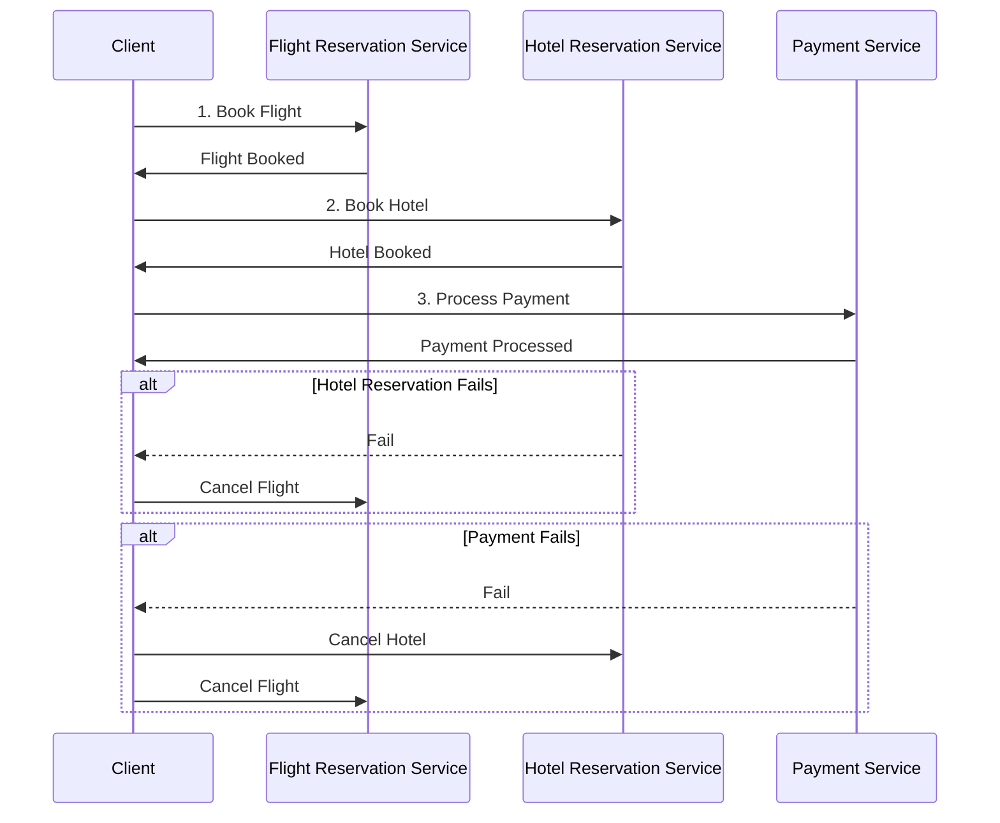

# Présentation du **Pattern Saga**

Le **Pattern Saga** est un modèle utilisé dans les architectures de microservices pour **gérer les transactions distribuées**.

Dans une architecture microservices, une opération qui traverse plusieurs services doit souvent maintenir une cohérence, même lorsque les services échouent.

Le **Pattern Saga** garantit que chaque étape de la transaction distribuée soit bien coordonnée, en s'assurant que les opérations sont compensées en cas d'échec.


### Concepts clés du Pattern Saga :
- **Chorégraphie** : Chaque service réagit à l’événement d’un autre service sans nécessiter de coordination centralisée. Cela est souvent réalisé à l'aide de systèmes de **messagerie** ou d'événements.
- **Orchestration** : Un orchestrateur central prend en charge la coordination des étapes de la transaction, en appelant chaque service dans un ordre spécifique.
- **Compensation** : Si une étape échoue, des actions compensatoires sont exécutées pour annuler les actions précédemment réussies.

## 2. Scénario du Pattern Saga (Diagrama de séquence)

Nous allons implémenter un exemple simple de **réservation de voyage** avec trois services distincts :
1. **Service de Réservation de Vols**
2. **Service de Réservation d'Hôtels**
3. **Service de Paiement**

Dans ce scénario, si une étape échoue, la saga doit annuler toutes les étapes précédentes pour garantir la cohérence des données. Par exemple, si la réservation de l'hôtel échoue après la réservation du vol, le vol sera annulé.



## 3. Implémentation d'une démo du Pattern Saga

### Objectif :
Nous allons implémenter une saga dans une architecture microservices en utilisant un orchestrateur centralisé qui gère la réservation d'un voyage (vol, hôtel et paiement).

## Étape 1 : Structure du projet

```
SagaTravelDemo/
│
├── Services/
│   ├── FlightService/
│   │   └── FlightService.cs
│   ├── HotelService/
│   │   └── HotelService.cs
│   ├── PaymentService/
│   │   └── PaymentService.cs
├── SagaOrchestrator/
│   └── TravelSagaOrchestrator.cs
├── Controllers/
│   └── TravelController.cs
├── Program.cs
└── appsettings.json
```

## Étape 2 : Implémentation du **FlightService**

**Services/FlightService/FlightService.cs** :
```csharp
public class FlightService
{
    public bool BookFlight()
    {
        Console.WriteLine("Flight booked successfully.");
        return true; // Simulation de la réservation réussie
    }

    public bool CancelFlight()
    {
        Console.WriteLine("Flight reservation cancelled.");
        return true; // Simulation de l'annulation
    }
}
```

## Étape 3 : Implémentation du **HotelService**

**Services/HotelService/HotelService.cs** :
```csharp
public class HotelService
{
    public bool BookHotel()
    {
        // Simule un échec
        Console.WriteLine("Hotel booking failed.");
        return false;
    }

    public bool CancelHotel()
    {
        Console.WriteLine("Hotel reservation cancelled.");
        return true;
    }
}
```

## Étape 4 : Implémentation du **PaymentService**

**Services/PaymentService/PaymentService.cs** :
```csharp
public class PaymentService
{
    public bool ProcessPayment()
    {
        Console.WriteLine("Payment processed successfully.");
        return true;
    }

    public bool RefundPayment()
    {
        Console.WriteLine("Payment refunded.");
        return true;
    }
}
```

## Étape 5 : Implémentation de l'Orchestrateur de la Saga

**SagaOrchestrator/TravelSagaOrchestrator.cs** :
```csharp
public class TravelSagaOrchestrator
{
    private readonly FlightService _flightService;
    private readonly HotelService _hotelService;
    private readonly PaymentService _paymentService;

    public TravelSagaOrchestrator(FlightService flightService, HotelService hotelService, PaymentService paymentService)
    {
        _flightService = flightService;
        _hotelService = hotelService;
        _paymentService = paymentService;
    }

    public bool BookTravel()
    {
        // 1. Réserver le vol
        if (!_flightService.BookFlight())
        {
            return false;
        }

        // 2. Réserver l'hôtel
        if (!_hotelService.BookHotel())
        {
            // Si la réservation de l'hôtel échoue, annuler le vol
            _flightService.CancelFlight();
            return false;
        }

        // 3. Traiter le paiement
        if (!_paymentService.ProcessPayment())
        {
            // Si le paiement échoue, annuler l'hôtel et le vol
            _hotelService.CancelHotel();
            _flightService.CancelFlight();
            return false;
        }

        Console.WriteLine("Travel booking completed successfully.");
        return true;
    }
}
```

## Étape 6 : Créer un contrôleur pour déclencher la saga

**Controllers/TravelController.cs** :
```csharp
[ApiController]
[Route("[controller]")]
public class TravelController : ControllerBase
{
    private readonly TravelSagaOrchestrator _orchestrator;

    public TravelController(TravelSagaOrchestrator orchestrator)
    {
        _orchestrator = orchestrator;
    }

    [HttpPost("book")]
    public IActionResult BookTravel()
    {
        var result = _orchestrator.BookTravel();
        if (result)
        {
            return Ok("Travel booking completed successfully.");
        }
        else
        {
            return StatusCode(500, "Travel booking failed.");
        }
    }
}
```

## Étape 7 : Configuration dans `Program.cs`

**Program.cs** :
```csharp
var builder = WebApplication.CreateBuilder(args);

builder.Services.AddScoped<FlightService>();
builder.Services.AddScoped<HotelService>();
builder.Services.AddScoped<PaymentService>();
builder.Services.AddScoped<TravelSagaOrchestrator>();
  
var app = builder.Build();

app.UseHttpsRedirection();
app.MapControllers();
app.Run();
```

## Étape 8 : Test de la saga

1. Lancer l'application **ASP.NET Core**.
2. Utilisez **Postman** ou un navigateur pour envoyer une requête **POST** à l'URL `/travel/book`.
3. Le contrôleur tentera de réserver le vol, l'hôtel, et d'effectuer le paiement.
4. Si une étape échoue (par exemple, dans notre démo, l'hôtel échoue toujours), la saga déclenche des actions compensatoires (annulation du vol) pour assurer la cohérence.

---

# Scenari de test

Quelques scénarii pour tester votre implémentation du **Pattern Saga** avec **Postman**. 

### 1. Scénario de Réussite

Dans ce scénario, toutes les étapes (réservation de vol, réservation d'hôtel et traitement du paiement) fonctionnent correctement.

#### Étapes :

1. **Modifier le service HotelService pour réussir la réservation** :
    - Changez la méthode `BookHotel` pour qu'elle retourne `true`, simulant une réservation réussie.
  
```csharp
public class HotelService
{
    public bool BookHotel()
    {
        Console.WriteLine("Hotel booked successfully.");
        return true;  // Simule une réservation réussie
    }

    public bool CancelHotel()
    {
        Console.WriteLine("Hotel reservation cancelled.");
        return true;
    }
}
```

2. **Envoyer une requête POST dans Postman** :
   - **URL** : `http://localhost:5000/travel/book`
   - **Méthode** : POST
   - **Body** : Aucune donnée n'est requise, car il s'agit d'une simple transaction d'appel sans payload.

3. **Résultat attendu** :
   - **Code HTTP 200 OK**
   - **Message** : `Travel booking completed successfully.`
   - Toutes les étapes ont été exécutées correctement :
     - Le vol est réservé.
     - L'hôtel est réservé.
     - Le paiement est traité.

#### Exemple de réponse Postman :
```json
{
  "message": "Travel booking completed successfully."
}
```

### 2. Scénario d'Échec : Problème avec la réservation de l'hôtel

Dans ce scénario, la réservation de l'hôtel échoue, et la saga annule la réservation du vol.

#### Étapes :

1. **Garder le service HotelService avec un échec** :
    - Gardez `BookHotel()` comme suit :
  
```csharp
public class HotelService
{
    public bool BookHotel()
    {
        Console.WriteLine("Hotel booking failed.");
        return false;  // Simule un échec de réservation
    }

    public bool CancelHotel()
    {
        Console.WriteLine("Hotel reservation cancelled.");
        return true;
    }
}
```

2. **Envoyer une requête POST dans Postman** :
   - **URL** : `http://localhost:5000/travel/book`
   - **Méthode** : POST

3. **Résultat attendu** :
   - **Code HTTP 500 Internal Server Error**
   - **Message** : `Travel booking failed.`
   - La saga détecte que la réservation de l'hôtel a échoué, puis annule la réservation du vol.
   - Le paiement n'est pas tenté car la réservation de l'hôtel a échoué.

#### Exemple de réponse Postman :
```json
{
  "message": "Travel booking failed."
}
```

#### Log attendu dans la console :
```
Flight booked successfully.
Hotel booking failed.
Flight reservation cancelled.
```

### 3. Scénario d'Échec : Échec du paiement

Dans ce scénario, le vol et l'hôtel sont réservés correctement, mais le paiement échoue. La saga annule la réservation de l'hôtel et du vol.

#### Étapes :

1. **Modifier le service PaymentService pour échouer** :
    - Changez la méthode `ProcessPayment` pour simuler un échec du paiement.
  
```csharp
public class PaymentService
{
    public bool ProcessPayment()
    {
        Console.WriteLine("Payment processing failed.");
        return false;  // Simule un échec du paiement
    }

    public bool RefundPayment()
    {
        Console.WriteLine("Payment refunded.");
        return true;
    }
}
```

2. **Envoyer une requête POST dans Postman** :
   - **URL** : `http://localhost:5000/travel/book`
   - **Méthode** : POST

3. **Résultat attendu** :
   - **Code HTTP 500 Internal Server Error**
   - **Message** : `Travel booking failed.`
   - Le vol et l'hôtel sont réservés avec succès, mais lorsque la saga tente de traiter le paiement, cela échoue.
   - La saga annule la réservation de l'hôtel et du vol en raison de l'échec du paiement.

#### Exemple de réponse Postman :
```json
{
  "message": "Travel booking failed."
}
```

#### Log attendu dans la console :
```
Flight booked successfully.
Hotel booked successfully.
Payment processing failed.
Hotel reservation cancelled.
Flight reservation cancelled.
```

### 4. Scénario d'Échec : Vol annulé avant réservation d'hôtel

Dans ce scénario, le vol échoue dès le début, ce qui empêche toute autre étape d'être effectuée.

#### Étapes :

1. **Modifier le service FlightService pour échouer** :
    - Changez la méthode `BookFlight` pour simuler un échec de réservation de vol.
  
```csharp
public class FlightService
{
    public bool BookFlight()
    {
        Console.WriteLine("Flight booking failed.");
        return false;  // Simule un échec de réservation de vol
    }

    public bool CancelFlight()
    {
        Console.WriteLine("Flight reservation cancelled.");
        return true;
    }
}
```

2. **Envoyer une requête POST dans Postman** :
   - **URL** : `http://localhost:5000/travel/book`
   - **Méthode** : POST

3. **Résultat attendu** :
   - **Code HTTP 500 Internal Server Error**
   - **Message** : `Travel booking failed.`
   - Aucune réservation n'a été faite pour l'hôtel ni pour le paiement, car l'étape initiale de réservation du vol a échoué.

#### Exemple de réponse Postman :
```json
{
  "message": "Travel booking failed."
}
```

#### Log attendu dans la console :
```
Flight booking failed.
```

### Conclusion

Avec ces différents scénarios de réussite et d'échec, vous pouvez tester le comportement du **Pattern Saga** avec Postman et voir comment la saga gère les actions compensatoires pour assurer la cohérence des transactions. Cette approche montre la résilience du **Pattern Saga** en action et comment il permet de traiter les transactions distribuées tout en maintenant la cohérence des données dans des environnements microservices.
