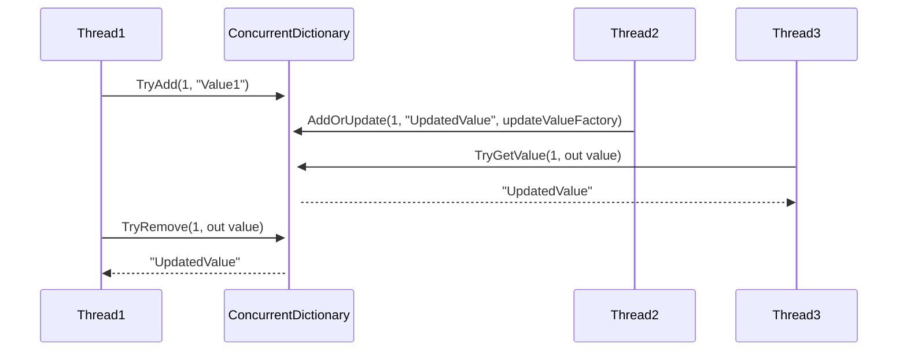
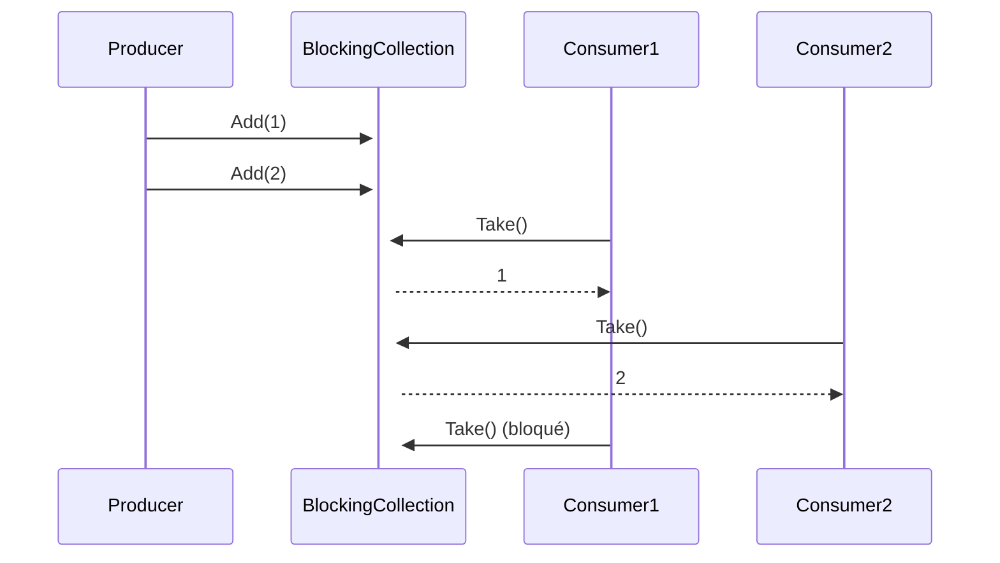
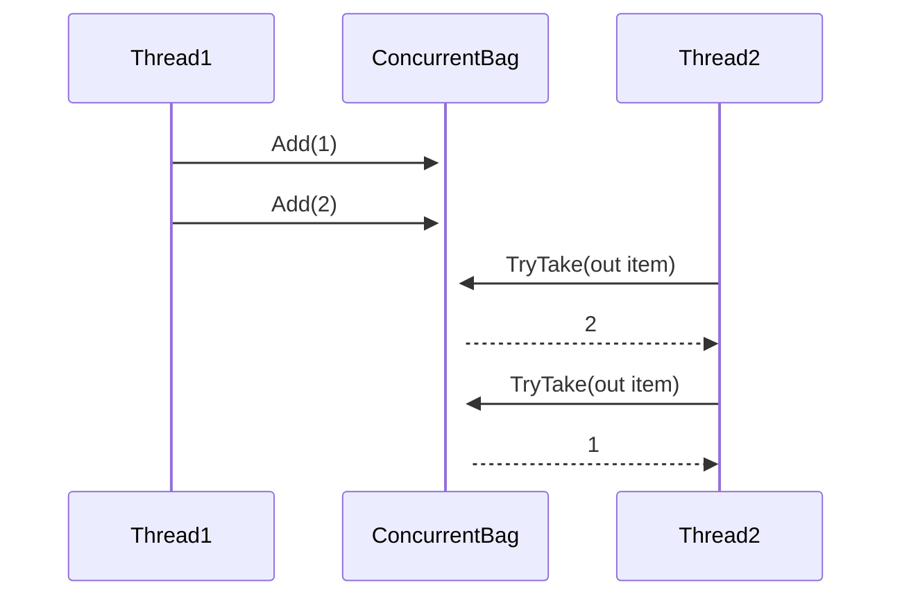
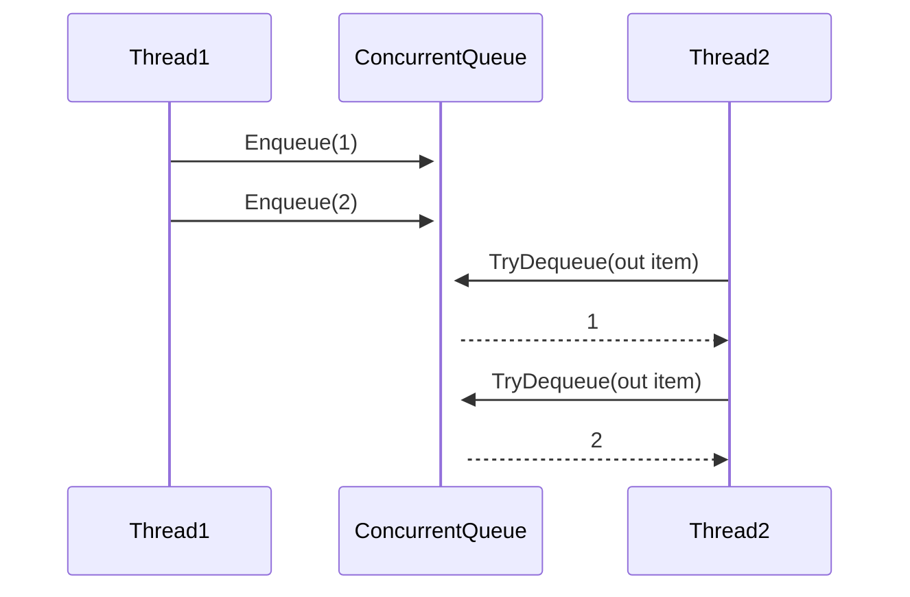

# Les collections concurencielles

## 1. **ConcurrentDictionary**

#### 1. Définition
**`ConcurrentDictionary<TKey, TValue>`** est une collection thread-safe qui permet de **stocker des paires clé-valeur** de manière concurrente. 

Elle permet à `plusieurs threads d'ajouter, modifier ou supprimer des éléments simultanément` sans avoir besoin de verrous explicites.

#### 2. États de `ConcurrentDictionary`



- **Thread1** ajoute une paire clé-valeur (1, "Value1") via **`TryAdd()`**.
- **Thread2** met à jour la valeur de la clé `1` avec **`AddOrUpdate()`**.
- **Thread3** lit la valeur associée à la clé `1` avec **`TryGetValue()`**.
- **Thread1** retire la paire clé-valeur avec **`TryRemove()`**.

#### 3. Membres importants (énumération)
- **`TryAdd(TKey key, TValue value)`** : Ajoute une paire clé-valeur si la clé n'existe pas déjà.
- **`TryRemove(TKey key, out TValue value)`** : Supprime la paire clé-valeur associée à la clé spécifiée.
- **`TryGetValue(TKey key, out TValue value)`** : Récupère la valeur associée à la clé spécifiée, si elle existe.
- **`GetOrAdd(TKey key, TValue value)`** : Récupère la valeur associée à la clé ou l'ajoute si la clé n'existe pas.
- **`AddOrUpdate(TKey key, TValue addValue, Func<TKey, TValue, TValue> updateValueFactory)`** : Ajoute la clé si elle n'existe pas, ou met à jour la valeur si la clé existe déjà.

#### 4. Membres importants (implémentation simple)

```csharp
ConcurrentDictionary<int, string> dictionary = new ConcurrentDictionary<int, string>();

// Ajouter un élément
dictionary.TryAdd(1, "Valeur 1");

// Récupérer une valeur
if (dictionary.TryGetValue(1, out string value))
{
    Console.WriteLine($"Clé 1 : {value}");
}

// Mettre à jour ou ajouter une nouvelle valeur
dictionary.AddOrUpdate(1, "Nouvelle Valeur 1", (key, oldValue) => "Valeur mise à jour");
```

#### 5. Exemple de synthèse

```csharp
class Program
{
    static ConcurrentDictionary<int, string> dictionary = new ConcurrentDictionary<int, string>();

    static void Main(string[] args)
    {
        Task[] tasks = new Task[3];

        // Tâches concurrentes pour ajouter ou mettre à jour des éléments
        for (int i = 0; i < 3; i++)
        {
            tasks[i] = Task.Run(() =>
            {
                for (int j = 0; j < 5; j++)
                {
                    dictionary.AddOrUpdate(j, $"Valeur {j}", (key, oldValue) => $"Valeur mise à jour {j}");
                    Console.WriteLine($"Clé {j}, Valeur : {dictionary[j]}");
                }
            });
        }

        Task.WaitAll(tasks);
    }
}
```

#### 6. Limites de `ConcurrentDictionary`
- **Pas de gestion d'ordre d'insertion** : Contrairement à certaines collections, il ne garantit pas d'ordre particulier pour les opérations.
- **Peut devenir inefficace pour de très grands ensembles de données** si de nombreuses modifications sont effectuées simultanément.

---

## 2. **BlockingCollection**

#### 1. Définition
**`BlockingCollection<T>`** est une collection thread-safe utilisée pour **gérer un producteur-consommateur**. Elle peut être configurée avec une taille maximale, bloquant les threads producteurs lorsqu'elle est pleine et les threads consommateurs lorsqu'elle est vide.

#### 2. États de `BlockingCollection`



- **Producer** ajoute des éléments dans la collection via **`Add()`**.
- **Consumer1** et **Consumer2** récupèrent des éléments via **`Take()`**.
- Une fois la collection vide, **Consumer1** reste bloqué jusqu'à ce qu'un nouvel élément soit ajouté.

#### 3. Membres importants (énumération)
- **`Add(T item)`** : Ajoute un élément dans la collection, bloque si la collection est pleine.
- **`Take()`** : Retire et retourne l'élément en tête de la collection, bloque si la collection est vide.
- **`CompleteAdding()`** : Marque la collection comme étant terminée pour l'ajout de nouveaux éléments.
- **`IsAddingCompleted`** : Vérifie si la collection a été marquée comme terminée pour l'ajout.
- **`TryAdd(T item, int millisecondsTimeout)`** : Tente d'ajouter un élément dans la collection avec un délai d'attente.
- **`TryTake(out T item, int millisecondsTimeout)`** : Tente de retirer un élément de la collection avec un délai d'attente.

#### 4. Membres importants (implémentation simple)

```csharp
BlockingCollection<int> collection = new BlockingCollection<int>(5);

// Ajouter des éléments
collection.Add(1);
collection.Add(2);

// Récupérer un élément
int item = collection.Take();
Console.WriteLine($"Élément retiré : {item}");
```

#### 5. Exemple de synthèse

```csharp
class Program
{
    static BlockingCollection<int> collection = new BlockingCollection<int>(3);

    static void Main(string[] args)
    {
        Task producer = Task.Run(() =>
        {
            for (int i = 0; i < 10; i++)
            {
                collection.Add(i);
                Console.WriteLine($"Produit : {i}");
                Thread.Sleep(500);  // Simuler un délai de production
            }
            collection.CompleteAdding();
        });

        Task consumer = Task.Run(() =>
        {
            while (!collection.IsAddingCompleted || collection.Count > 0)
            {
                if (collection.TryTake(out int item, 1000))
                {
                    Console.WriteLine($"Consommé : {item}");
                }
            }
        });

        Task.WaitAll(producer, consumer);
    }
}
```

#### 6. Limites de `BlockingCollection`
- **Peut devenir inefficace** pour les scénarios de production/consommation très complexes ou à grande échelle.
- **Ne supporte pas directement les indexations ou les recherches avancées** comme le fait un dictionnaire ou une liste.

---

## 3. **ConcurrentBag**

#### 1. Définition
**`ConcurrentBag<T>`** est une collection thread-safe qui fonctionne comme un **sac**, où les éléments peuvent être ajoutés et retirés de manière désordonnée. Elle est optimisée pour des scénarios où de nombreux threads **ajoutent** et **retirent des éléments** sans nécessiter d'ordre particulier.

#### 2. États de `ConcurrentBag`



- **Thread1** ajoute des éléments au **ConcurrentBag** via **`Add()`**.
- **Thread2** retire des éléments via **`TryTake()`**, sans garantie d'ordre.

#### 3. Membres importants (énumération)
- **`Add(T item)`** : Ajoute un élément dans le sac.
- **`TryTake(out T item)`** : Tente de retirer un élément du sac, retourne `false` si vide.
- **`TryPeek(out T item)`** : Tente de récupérer un élément sans le retirer.
- **`IsEmpty`** : Indique si la collection est vide.

#### 4. Membres importants (implémentation simple)

```csharp
Concurrent

Bag<int> bag = new ConcurrentBag<int>();

// Ajouter des éléments
bag.Add(1);
bag.Add(2);

// Retirer un élément
if (bag.TryTake(out int item))
{
    Console.WriteLine($"Élément retiré : {item}");
}
```

#### 5. Exemple de synthèse

```csharp
class Program
{
    static ConcurrentBag<int> bag = new ConcurrentBag<int>();

    static void Main(string[] args)
    {
        Task[] tasks = new Task[5];

        // Tâches concurrentes pour ajouter et retirer des éléments
        for (int i = 0; i < 5; i++)
        {
            tasks[i] = Task.Run(() =>
            {
                for (int j = 0; j < 3; j++)
                {
                    bag.Add(j);
                    Console.WriteLine($"Ajouté {j}");
                }

                if (bag.TryTake(out int item))
                {
                    Console.WriteLine($"Retiré {item}");
                }
            });
        }

        Task.WaitAll(tasks);
    }
}
```

#### 6. Limites de `ConcurrentBag`
- **Pas d'ordre garanti** : Les éléments sont ajoutés et retirés dans un ordre non déterministe.
- **Moins efficace pour les collections qui nécessitent un accès en lecture** fréquente, car elle est optimisée pour l'ajout rapide.

---

## 4. **ConcurrentQueue**

#### 1. Définition
**`ConcurrentQueue<T>`** est une collection thread-safe qui implémente une file d'attente (FIFO). Elle est optimisée pour des scénarios où plusieurs threads **ajoutent des éléments à la fin** et **retirent des éléments au début**, garantissant l'ordre d'insertion.

#### 2. États de `ConcurrentQueue`



- **Thread1** ajoute des éléments dans la queue via **`Enqueue()`**.
- **Thread2** retire des éléments dans l'ordre FIFO via **`TryDequeue()`**.

#### 3. Membres importants (énumération)
- **`Enqueue(T item)`** : Ajoute un élément à la fin de la file d'attente.
- **`TryDequeue(out T item)`** : Tente de retirer un élément du début de la file, retourne `false` si vide.
- **`TryPeek(out T item)`** : Tente de récupérer un élément sans le retirer.
- **`IsEmpty`** : Indique si la file est vide.

#### 4. Membres importants (implémentation simple)

```csharp
ConcurrentQueue<int> queue = new ConcurrentQueue<int>();

// Ajouter un élément
queue.Enqueue(1);

// Retirer un élément
if (queue.TryDequeue(out int item))
{
    Console.WriteLine($"Élément retiré : {item}");
}
```

#### 5. Exemple de synthèse

```csharp
class Program
{
    static ConcurrentQueue<int> queue = new ConcurrentQueue<int>();

    static void Main(string[] args)
    {
        Task[] tasks = new Task[3];

        // Ajout et retrait concurrent des éléments dans la file
        for (int i = 0; i < 3; i++)
        {
            tasks[i] = Task.Run(() =>
            {
                for (int j = 0; j < 5; j++)
                {
                    queue.Enqueue(j);
                    Console.WriteLine($"Enfile : {j}");
                }

                if (queue.TryDequeue(out int item))
                {
                    Console.WriteLine($"Défile : {item}");
                }
            });
        }

        Task.WaitAll(tasks);
    }
}
```

#### 6. Limites de `ConcurrentQueue`
- **Optimisé pour FIFO** : Ne convient pas si vous avez besoin d'un accès aléatoire aux éléments.
- **Pas d'indexation** : Contrairement à des collections comme les listes, vous ne pouvez pas accéder à un élément directement par index.

---

### Conclusion

Chacune de ces **collections concurrentielles** est conçue pour un usage spécifique dans des scénarios multithread :
1. **`ConcurrentDictionary`** : Idéal pour la gestion des paires clé-valeur avec accès concurrent.
2. **`BlockingCollection`** : Parfait pour les scénarios de production-consommation avec blocage.
3. **`ConcurrentBag`** : Pour des ajouts et retraits d'éléments sans ordre spécifique.
4. **`ConcurrentQueue`** : Optimisée pour les opérations FIFO avec accès sécurisé par plusieurs threads.

Chaque classe est accompagnée de son **diagramme de séquences**, ce qui permet de mieux comprendre leur comportement dans un contexte concurrent.
