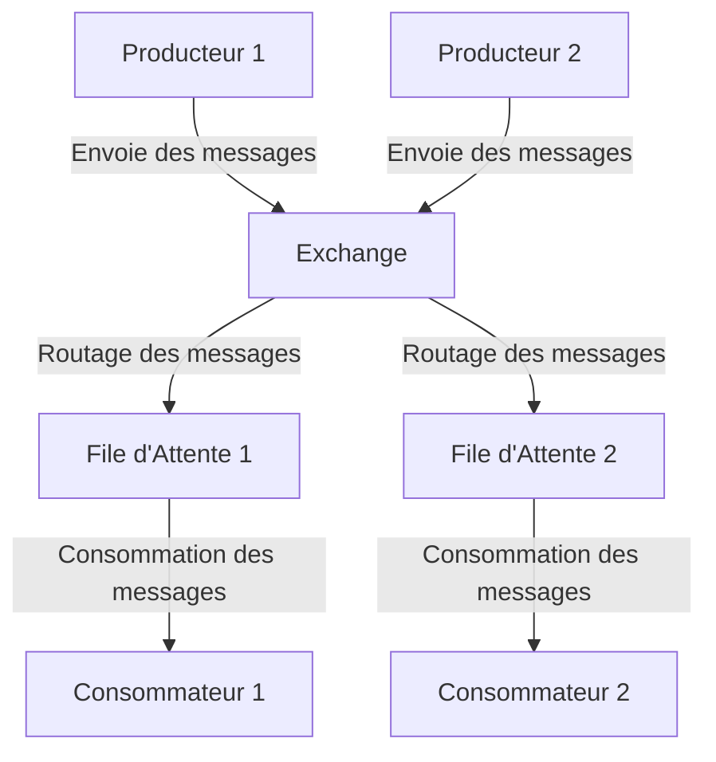
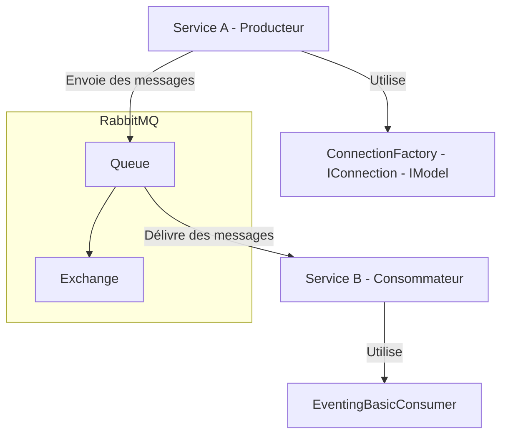

### Présentation de RabbitMQ

RabbitMQ est **un broker de messages open-source** qui facilite la communication entre différentes parties d'une application via un système de messagerie asynchrone. **Il permet l'envoi, la réception et le routage de messages** entre producteurs et consommateurs, assurant ainsi une communication fiable entre les services.

#### Fonctionnalités de RabbitMQ

1. **File d'Attente de Messages** : RabbitMQ permet de stocker des messages dans des files d'attente jusqu'à ce que les consommateurs soient prêts à les traiter.

2. **Routage des Messages** : RabbitMQ peut router les messages de manière flexible à différents consommateurs en fonction de règles définies (exchanges, bindings).

3. **Persistant et Résilient** : RabbitMQ offre des options pour rendre les messages persistants, garantissant ainsi qu'ils ne sont pas perdus en cas de panne du système.

4. **Support des Protocoles Multiples** : RabbitMQ prend en charge plusieurs protocoles de messagerie, notamment AMQP, MQTT, et STOMP.

Voici une brève explication de chacun des protocoles de messagerie pris en charge par RabbitMQ :
        
**AMQP (Advanced Message Queuing Protocol)** :
 - **Description** : AMQP est un protocole de messagerie orienté middleware, conçu pour permettre une communication fiable entre des systèmes distribués.
- **Utilisation** : Principalement utilisé dans des environnements où la fiabilité et l'interopérabilité sont essentielles exemple **les systèmes financiers.**
        
 **MQTT (Message Queuing Telemetry Transport)** :
   - **Description** : MQTT est un protocole léger de messagerie basé sur le modèle publish/subscribe, optimisé pour les connexions à faible bande passante.
   - **Utilisation** : Couramment utilisé dans les applications **IoT**, pour des **communications entre capteurs**, **dispositifs mobiles**.
        
**STOMP (Simple Text Oriented Messaging Protocol)** :
   - **Description** : STOMP est un protocole simple et textuel pour les systèmes de messagerie. Il fonctionne de manière similaire à HTTP.
   - **Utilisation** : Souvent utilisé avec les clients web, par exemple pour des applications web en temps réel.

Chacun de ces protocoles offre des avantages spécifiques en fonction des exigences de l'application, tels que la légèreté, la simplicité, ou la fiabilité.

6. **Gestion des Échecs** : RabbitMQ permet de gérer les messages en échec, avec la possibilité de les rejeter, de les ré-essayer ou de les rediriger vers des files d'attente spécifiques (dead-letter exchanges).

7. **Scalabilité et Haute Disponibilité** : RabbitMQ peut être déployé en cluster pour offrir une haute disponibilité et une scalabilité horizontale.

#### Schéma Mermaid de Fonctionnement de RabbitMQ



### Interfaces et Classes RabbitMQ Utilisées

Dans ce projet, nous avons utilisé les interfaces et classes suivantes pour permettre la communication entre les deux services :

1. **`IConnectionFactory`** : Interface qui définit les méthodes pour créer des connexions avec RabbitMQ. La classe `ConnectionFactory` en est une implémentation qui permet de configurer les paramètres de connexion comme `HostName`.

2. **`IConnection`** : Interface qui représente une connexion TCP avec le serveur RabbitMQ. Elle est créée par `ConnectionFactory` et utilisée pour ouvrir des canaux de communication.

3. **`IModel`** : Interface qui représente un canal de communication avec RabbitMQ. Les canaux sont utilisés pour exécuter des opérations comme déclarer des files d'attente, envoyer des messages et consommer des messages.

4. **`EventingBasicConsumer`** : Classe utilisée pour recevoir des messages de RabbitMQ de manière asynchrone. Elle déclenche des événements chaque fois qu'un message est reçu, permettant au consommateur de traiter les messages en temps réel.

#### Schéma Mermaid de la Communication entre Services



### Explication du Schéma

1. **Service A (Producteur)** : Envoie des messages à RabbitMQ via un `Exchange`. Il utilise un `ConnectionFactory` pour établir une connexion (`IConnection`) et créer un canal (`IModel`) pour envoyer les messages à une file d'attente.

2. **RabbitMQ** : Reçoit les messages via un `Exchange`, les route vers la file d'attente appropriée, et les stocke jusqu'à ce qu'un consommateur soit prêt à les traiter.

3. **Service B (Consommateur)** : Utilise `EventingBasicConsumer` pour écouter la file d'attente dans RabbitMQ et consommer les messages dès qu'ils sont disponibles.


# Exemple pratique de mise en oeuvre d'un système de communication basé sur Rabit MQ

### Tutoriel : Communication Asynchrone entre Deux Services avec RabbitMQ

Dans ce tutoriel, nous allons configurer deux services en .NET qui communiqueront de manière asynchrone en utilisant RabbitMQ comme broker de messages. RabbitMQ est un système de gestion de messages open-source qui permet de gérer les communications asynchrones entre différents services ou composants d'une application.

### Étape 1 : Configuration de RabbitMQ avec Docker

1. **Créez un fichier `docker-compose.yml`** pour déployer RabbitMQ :

```yaml
version: '3.8'
services:
  rabbitmq:
    image: rabbitmq:3-management
    ports:
      - "5672:5672"   # Port pour les connexions RabbitMQ
      - "15672:15672" # Port pour le tableau de bord de gestion
```

2. **Démarrez RabbitMQ** en exécutant la commande suivante dans le dossier où se trouve `docker-compose.yml` :

```bash
docker-compose up -d
```

RabbitMQ sera maintenant disponible à l'adresse `http://localhost:15672` avec le nom d'utilisateur et le mot de passe par défaut (`guest`/`guest`).

### Étape 2 : Création des Microservices

#### Service A : Producteur RabbitMQ

1. **Créez un projet ASP.NET Core Web API** pour ServiceA :

```bash
dotnet new webapi -n ServiceA
cd ServiceA
```

2. **Ajoutez les packages NuGet nécessaires** pour RabbitMQ :

```bash
dotnet add package RabbitMQ.Client
```

3. **Modifiez le fichier `ServiceA.csproj`** pour inclure la dépendance RabbitMQ :

```xml
<Project Sdk="Microsoft.NET.Sdk.Web">

  <PropertyGroup>
    <TargetFramework>net8.0</TargetFramework>
    <Nullable>enable</Nullable>
    <ImplicitUsings>enable</ImplicitUsings>
  </PropertyGroup>

  <ItemGroup>
    <PackageReference Include="RabbitMQ.Client" Version="6.2.2" />
  </ItemGroup>

</Project>
```

4. **Ajoutez un contrôleur pour envoyer des messages** :

Créez un contrôleur `MessagesController.cs` dans le répertoire `Controllers` :

```csharp
using Microsoft.AspNetCore.Mvc;
using RabbitMQ.Client;
using System.Text;

namespace ServiceA.Controllers
{
    [ApiController]
    [Route("api/[controller]")]
    public class MessagesController : ControllerBase
    {
        private readonly IConnection _connection;
        private readonly IModel _channel;

        public MessagesController()
        {
            var factory = new ConnectionFactory() { HostName = "localhost" };
            _connection = factory.CreateConnection();
            _channel = _connection.CreateModel();
            _channel.QueueDeclare(queue: "message_queue", durable: false, exclusive: false, autoDelete: false, arguments: null);
        }

        [HttpPost]
        public IActionResult SendMessage([FromBody] string message)
        {
            var body = Encoding.UTF8.GetBytes(message);
            _channel.BasicPublish(exchange: "", routingKey: "message_queue", basicProperties: null, body: body);
            return Ok("Message sent: " + message);
        }

        protected override void Dispose(bool disposing)
        {
            _channel.Close();
            _connection.Close();
            base.Dispose(disposing);
        }
    }
}
```

5. **Configurez `launchSettings.json`** pour spécifier les paramètres d'exécution :

```json
{
  "profiles": {
    "ServiceA": {
      "commandName": "Project",
      "dotnetRunMessages": true,
      "launchBrowser": false,
      "applicationUrl": "https://localhost:7101;http://localhost:5101",
      "environmentVariables": {
        "ASPNETCORE_ENVIRONMENT": "Development"
      }
    }
  }
}
```

#### Service B : Consommateur RabbitMQ

1. **Créez un projet ASP.NET Core Web API** pour ServiceB :

```bash
dotnet new webapi -n ServiceB
cd ServiceB
```

2. **Ajoutez les packages NuGet nécessaires** pour RabbitMQ :

```bash
dotnet add package RabbitMQ.Client
```

3. **Modifiez le fichier `ServiceB.csproj`** pour inclure la dépendance RabbitMQ :

```xml
<Project Sdk="Microsoft.NET.Sdk.Web">

  <PropertyGroup>
    <TargetFramework>net8.0</TargetFramework>
    <Nullable>enable</Nullable>
    <ImplicitUsings>enable</ImplicitUsings>
  </PropertyGroup>

  <ItemGroup>
    <PackageReference Include="RabbitMQ.Client" Version="6.2.2" />
  </ItemGroup>

</Project>
```

4. **Ajoutez un contrôleur pour consommer les messages** :

Créez un contrôleur `MessagesController.cs` dans le répertoire `Controllers` :

```csharp
using Microsoft.AspNetCore.Mvc;
using RabbitMQ.Client;
using RabbitMQ.Client.Events;
using System.Text;
using System.Threading.Channels;

namespace ServiceB.Controllers
{
    [ApiController]
    [Route("api/[controller]")]
    public class MessagesController : ControllerBase
    {
        private readonly IConnection _connection;
        private readonly IModel _channel;

        public MessagesController()
        {
            var factory = new ConnectionFactory() { HostName = "localhost" };
            _connection = factory.CreateConnection();
            _channel = _connection.CreateModel();
            _channel.QueueDeclare(queue: "message_queue", durable: false, exclusive: false, autoDelete: false, arguments: null);
        }

        [HttpGet]
        public IActionResult ConsumeMessage()
        {
            var consumer = new EventingBasicConsumer(_channel);
            string message = string.Empty;
            consumer.Received += (model, ea) =>
            {
                var body = ea.Body.ToArray();
                message = Encoding.UTF8.GetString(body);
            };
            _channel.BasicConsume(queue: "message_queue", autoAck: true, consumer: consumer);

            return Ok("Received message: " + message);
        }

        protected override void Dispose(bool disposing)
        {
            _channel.Close();
            _connection.Close();
            base.Dispose(disposing);
        }
    }
}
```

5. **Configurez `launchSettings.json`** pour ServiceB :

```json
{
  "profiles": {
    "ServiceB": {
      "commandName": "Project",
      "dotnetRunMessages": true,
      "launchBrowser": false,
      "applicationUrl": "https://localhost:7102;http://localhost:5102",
      "environmentVariables": {
        "ASPNETCORE_ENVIRONMENT": "Development"
      }
    }
  }
}
```

### Étape 3 : Exécution des Microservices

1. **Lancez `ServiceA`** en utilisant la commande suivante dans le répertoire du projet :

```bash
dotnet run
```

ServiceA sera maintenant en cours d'exécution et prêt à envoyer des messages à RabbitMQ.

2. **Lancez `ServiceB`** en utilisant la commande suivante dans le répertoire du projet :

```bash
dotnet run
```

ServiceB sera maintenant en cours d'exécution et prêt à consommer des messages depuis RabbitMQ.

### Étape 4 : Test de la Communication avec Postman

1. **Envoyez un message depuis ServiceA** :
   - Ouvrez Postman.
   - Créez une nouvelle requête `POST`.
   - Dans le champ `URL`, entrez `http://localhost:5101/api/messages`.
   - Sous l'onglet `Body`, sélectionnez `raw` et `JSON` comme type.
   - Entrez le message dans le corps de la requête, par exemple : `"Hello, RabbitMQ!"`.
   - Cliquez sur `Send`.

   Vous devriez recevoir une réponse indiquant que le message a été envoyé à RabbitMQ.

2. **Consommez le message dans ServiceB** :
   - Créez une nouvelle requête `GET`.
   - Dans le champ `URL`, entrez `http://localhost:5102/api/messages`.
   - Cliquez sur `Send`.

   Vous devriez recevoir une réponse contenant le message que vous avez envoyé depuis ServiceA.

### Conclusion

Ce tutoriel montre comment mettre en place une communication asynchrone entre deux microservices en utilisant RabbitMQ. Les services sont capables d'envoyer et de consommer des messages via RabbitMQ, permettant une communication fiable et scalable entre les composants d'une application. Vous pouvez maintenant étendre ce modèle pour inclure davantage de fonctionnalités, comme la gestion d'erreurs, la persistance des messages, et la mise en place de consommateurs multiples.


### Conclusion

RabbitMQ offre un cadre puissant et flexible pour la gestion de la messagerie asynchrone entre services. En utilisant les interfaces et classes comme `IConnectionFactory`, `IConnection`, `IModel`, et `EventingBasicConsumer`, nous pouvons facilement établir une communication fiable entre des services en .NET. Les schémas Mermaid aident à visualiser le flux de messages entre le producteur, RabbitMQ, et le consommateur, illustrant clairement le rôle de chaque composant dans cette architecture.
