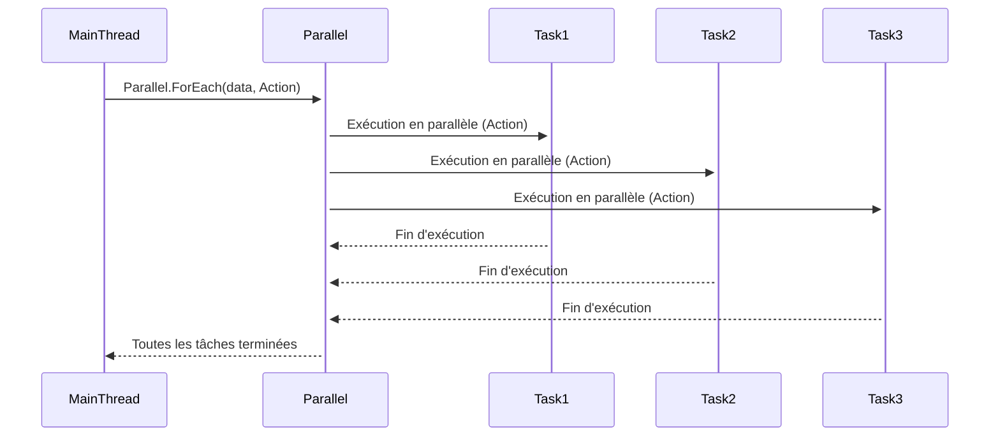
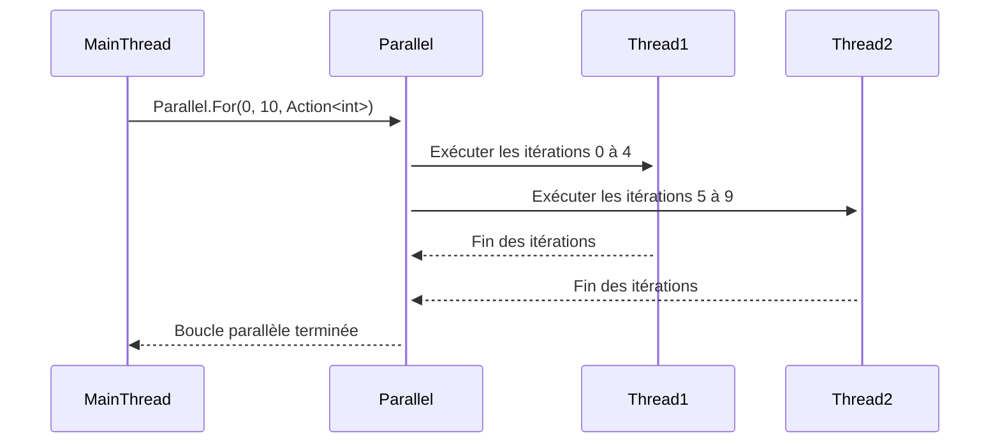
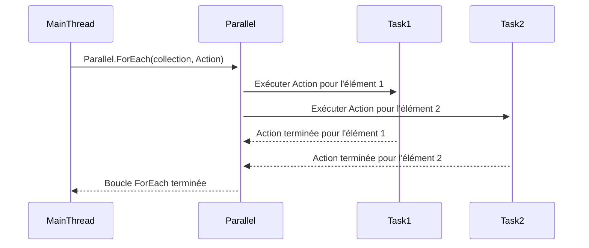
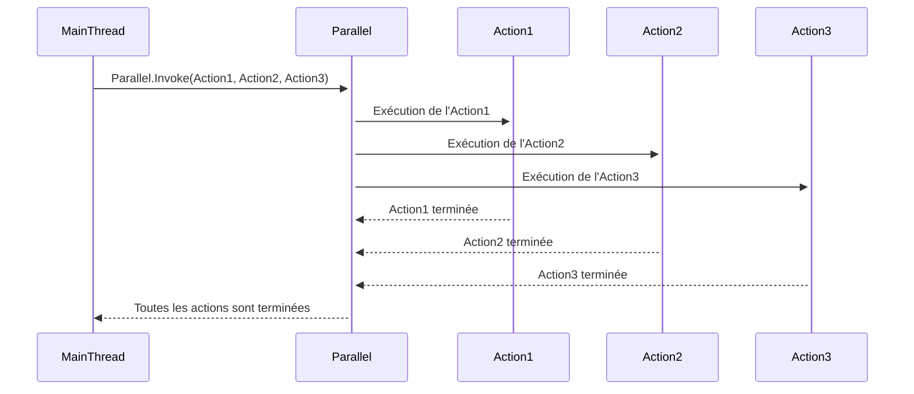

# La classe Parallel

#### 1. Définition
La classe **`Parallel`** fournit des méthodes permettant d'exécuter des boucles `for`, `foreach`, ou des actions distinctes de manière **parallèle** sur plusieurs threads. Elle est utilisée pour optimiser des opérations répétitives en exploitant les **ressources multi-cœurs** du système sans gérer manuellement les threads.

#### 2. États de `Parallel`



- **MainThread** appelle **`Parallel.ForEach()`** pour traiter un ensemble de données en parallèle.
- Les tâches (Task1, Task2, Task3, etc.) sont exécutées **concurremment** sur plusieurs threads.
- Lorsque toutes les tâches sont terminées, **`Parallel`** retourne le contrôle au **MainThread**.

#### 3. Membres importants (énumération)
- **`Parallel.For(int fromInclusive, int toExclusive, Action<int>)`** : Exécute une boucle **for** en parallèle, en répartissant l'itération entre plusieurs threads.
- **`Parallel.ForEach<TSource>(IEnumerable<TSource> source, Action<TSource>)`** : Exécute une boucle **foreach** en parallèle sur une collection, en répartissant chaque élément entre plusieurs threads.
- **`Parallel.Invoke(Action[] actions)`** : Exécute un ensemble d'actions de manière **concurrente**.
- **`Parallel.For(int fromInclusive, int toExclusive, ParallelOptions options, Action<int>)`** : Exécute une boucle **for** en parallèle avec des options spécifiques (comme le nombre maximal de threads).
- **`Parallel.ForEach<TSource>(IEnumerable<TSource> source, ParallelOptions options, Action<TSource>)`** : Exécute une boucle **foreach** avec des options spécifiées.

#### 4. Membres importants (implémentation simple)

##### **Exemple 1** : Utilisation de `Parallel.For`
```csharp
Parallel.For(0, 10, i =>
{
    Console.WriteLine($"Itération {i} exécutée par le thread {Task.CurrentId}");
});
```

##### **Exemple 2** : Utilisation de `Parallel.ForEach`
```csharp
List<int> numbers = new List<int> { 1, 2, 3, 4, 5 };

Parallel.ForEach(numbers, number =>
{
    Console.WriteLine($"Traitement du nombre {number} sur le thread {Task.CurrentId}");
});
```

##### **Exemple 3** : Utilisation de `Parallel.Invoke`
```csharp
Parallel.Invoke(
    () => Console.WriteLine("Action 1 exécutée"),
    () => Console.WriteLine("Action 2 exécutée"),
    () => Console.WriteLine("Action 3 exécutée")
);
```

#### 5. Exemple de synthèse

Cet exemple montre comment utiliser **`Parallel.For`** pour effectuer des opérations parallèles sur une plage d'itérations.

```csharp
class Program
{
    static void Main(string[] args)
    {
        // Utilisation de Parallel.For pour paralléliser une boucle
        Parallel.For(0, 10, i =>
        {
            Console.WriteLine($"Itération {i} exécutée sur le thread {Task.CurrentId}");
            Thread.Sleep(500);  // Simuler une tâche de longue durée
        });

        // Utilisation de Parallel.ForEach pour traiter une collection en parallèle
        List<string> names = new List<string> { "Alice", "Bob", "Charlie", "David", "Eve" };
        Parallel.ForEach(names, name =>
        {
            Console.WriteLine($"Traitement du nom {name} sur le thread {Task.CurrentId}");
        });

        // Utilisation de Parallel.Invoke pour exécuter plusieurs actions simultanément
        Parallel.Invoke(
            () => Console.WriteLine("Action 1 exécutée"),
            () => Console.WriteLine("Action 2 exécutée"),
            () => Console.WriteLine("Action 3 exécutée")
        );
    }
}
```

#### 6. Limites de `Parallel`
- **Pas de garantie d'ordre d'exécution** : Les actions dans une boucle parallèle ne sont pas nécessairement exécutées dans l'ordre.
- **Trop de parallélisme peut nuire aux performances** : Si la surcharge des threads devient trop importante, cela peut entraîner des performances sous-optimales.
- **Pas conçu pour des tâches nécessitant une grande synchronisation** : Si votre tâche nécessite beaucoup de coordination entre les threads, **`Parallel`** peut ne pas être l'outil idéal.

---

### Diagrammes de Séquences pour les Méthodes de `Parallel`

#### **1. Parallel.For**



Dans ce diagramme, **`Parallel.For`** divise l'itération d'une boucle entre deux threads pour exécuter les tâches en parallèle.

---

#### **2. Parallel.ForEach**



Dans ce diagramme, **`Parallel.ForEach`** répartit les éléments d'une collection entre plusieurs tâches pour les traiter en parallèle.

---

#### **3. Parallel.Invoke**



Dans ce diagramme, **`Parallel.Invoke`** exécute trois actions simultanément, en parallèle sur différents threads.

---

### Conclusion

La classe **`Parallel`** est idéale pour exécuter des boucles ou des actions de manière **concurrente** et **parallèle**, en utilisant efficacement les cœurs du processeur disponibles. Elle fournit une abstraction de haut niveau pour paralléliser des opérations courantes sans avoir à gérer manuellement des threads, ce qui simplifie l'écriture de code performant dans des scénarios multi-threads.

- **`Parallel.For`** et **`Parallel.ForEach`** : Parallélisation de boucles sur des plages d'itérations ou des collections.
- **`Parallel.Invoke`** : Exécution simultanée de plusieurs actions.

Cependant, il faut être prudent avec les cas où une coordination complexe ou des dépendances entre les tâches sont nécessaires, car **`Parallel`** ne fournit pas de mécanismes pour synchroniser les threads ou garantir l'ordre d'exécution.
