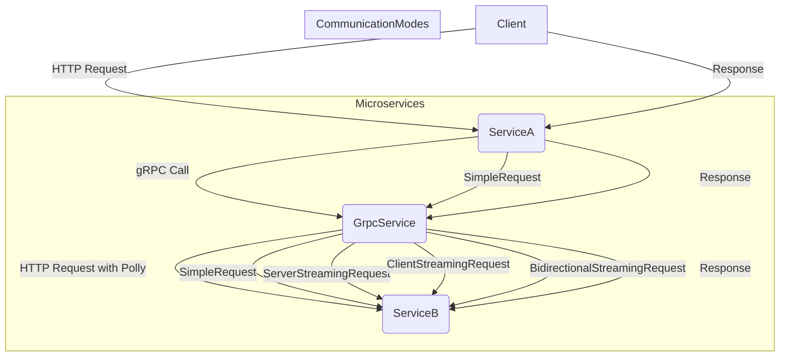

# Communication interservice avec Grpc

Voici un diagramme Mermaid qui reflète l'architecture de la solution que nous avons mise en place :



### Explication du Diagramme

- **Client** : Le point d'entrée pour l'utilisateur ou un autre service, qui envoie une requête HTTP à `ServiceA`.
- **ServiceA** : Microservice Web API qui reçoit la requête HTTP du client et fait un appel gRPC à `GrpcService`.
- **GrpcService** : Service gRPC qui reçoit l'appel de `ServiceA`, applique une stratégie de résilience avec Polly, puis envoie une requête HTTP à `ServiceB`.
- **ServiceB** : Microservice Web API qui traite la requête et renvoie une réponse.

### Communication Modes

Le diagramme montre également les différents modes de communication gRPC :

- **SimpleRequest** : Requête simple et réponse simple.
- **ServerStreamingRequest** : Requête simple avec réponse en streaming.
- **ClientStreamingRequest** : Requête en streaming avec réponse simple.
- **BidirectionalStreamingRequest** : Requête et réponse en streaming.

Chaque mode est représenté par une interaction entre `GrpcService` et `ServiceB`. 

Vous pouvez utiliser ce diagramme pour visualiser l'architecture et les flux de communication entre les microservices dans la solution.


### Pré-requis

- **.NET 8.0 SDK**
- **Visual Studio 2022** ou un autre IDE compatible avec .NET 8.0

### Étape 1 : Créer les Projets

#### 1.1. Créez trois projets dans votre solution :

- **ServiceA** : Un projet ASP.NET Core Web API.
- **GrpcService** : Un projet ASP.NET Core gRPC.
- **ServiceB** : Un projet ASP.NET Core Web API.

### Étape 2 : Installer les Bibliothèques Nécessaires

#### 2.1. ServiceA

Installez les packages suivants pour permettre la communication gRPC :

```bash
dotnet add package Grpc.Net.Client
dotnet add package Google.Protobuf
dotnet add package Grpc.Tools
dotnet add package Polly
```

#### 2.2. GrpcService

Installez les packages suivants pour permettre l'utilisation de gRPC et de Polly dans le service gRPC :

```bash
dotnet add package Grpc.AspNetCore
dotnet add package Polly
```

#### 2.3. ServiceB

Aucun package supplémentaire n'est requis pour `ServiceB` si c'est une simple Web API.

### Étape 3 : Créer le Fichier Protobuf (`communication.proto`)

Créez un fichier `communication.proto` dans les projets `GrpcService` et `ServiceA` (dans un dossier `Protos`), avec le contenu suivant :

```proto
syntax = "proto3";

option csharp_namespace = "GrpcCommunicationService";

service MyCommunicationService {
    rpc SimpleRequest (SimpleRequestMessage) returns (SimpleResponseMessage);
    rpc ServerStreamingRequest (SimpleRequestMessage) returns (stream SimpleResponseMessage);
    rpc ClientStreamingRequest (stream SimpleRequestMessage) returns (SimpleResponseMessage);
    rpc BidirectionalStreamingRequest (stream SimpleRequestMessage) returns (stream SimpleResponseMessage);
}

message SimpleRequestMessage {
    string message = 1;
}

message SimpleResponseMessage {
    string message = 1;
}
```

### Étape 4 : Configurer les Fichiers `.csproj`

#### 4.1. ServiceA (`ServiceA.csproj`)

Assurez-vous que le fichier `.csproj` de `ServiceA` inclut les lignes suivantes pour compiler le fichier `.proto` :

```xml
<Project Sdk="Microsoft.NET.Sdk.Web">

  <PropertyGroup>
    <TargetFramework>net8.0</TargetFramework>
  </PropertyGroup>

  <ItemGroup>
    <Protobuf Include="Protos\communication.proto" GrpcServices="Client" />
  </ItemGroup>

  <ItemGroup>
    <PackageReference Include="Grpc.Net.Client" Version="2.50.0" />
    <PackageReference Include="Google.Protobuf" Version="3.21.9" />
    <PackageReference Include="Grpc.Tools" Version="2.50.0">
      <PrivateAssets>all</PrivateAssets>
      <IncludeAssets>runtime; build; native; contentfiles; analyzers; buildtransitive</IncludeAssets>
    </PackageReference>
    <PackageReference Include="Polly" Version="7.2.3" />
  </ItemGroup>

</Project>
```

#### 4.2. GrpcService (`GrpcService.csproj`)

Le fichier `.csproj` pour `GrpcService` doit être configuré comme suit :

```xml
<Project Sdk="Microsoft.NET.Sdk.Web">

  <PropertyGroup>
    <TargetFramework>net8.0</TargetFramework>
  </PropertyGroup>

  <ItemGroup>
    <Protobuf Include="Protos\communication.proto" GrpcServices="Server" />
  </ItemGroup>

  <ItemGroup>
    <PackageReference Include="Grpc.AspNetCore" Version="2.50.0" />
    <PackageReference Include="Polly" Version="7.2.3" />
  </ItemGroup>

</Project>
```

#### 4.3. ServiceB (`ServiceB.csproj`)

Aucune configuration spécifique n'est requise dans `ServiceB`.

### Étape 5 : Implémenter les Services

#### 5.1. Implémentation de `ServiceB`

Créez un contrôleur Web API dans `ServiceB` pour recevoir les requêtes :

```csharp
[ApiController]
[Route("api/[controller]")]
public class ServiceBController : ControllerBase
{
    [HttpGet("ProcessRequest")]
    public IActionResult ProcessRequest([FromQuery] string message)
    {
        return Ok($"Processed by ServiceB: {message}");
    }
}
```

#### 5.2. Implémentation de `GrpcService` avec Polly

Voici l'implémentation de `GrpcService` avec Polly intégrée pour gérer les appels à `ServiceB` :

```csharp
using Grpc.Core;
using GrpcCommunicationService;
using static GrpcCommunicationService.MyCommunicationService;
using System.Text;
using Polly;
using Polly.Timeout;

namespace GrpcService.Services;

public class CommunicationService : MyCommunicationServiceBase
{
    private readonly HttpClient _httpClient;
    private readonly ILogger<CommunicationService> _logger;
    private readonly IAsyncPolicy<HttpResponseMessage> _policy;

    public CommunicationService(HttpClient httpClient, ILogger<CommunicationService> logger)
    {
        _httpClient = httpClient;
        _logger = logger;

        // Configure Polly with Retry and Timeout policies
        _policy = Policy
            .HandleResult<HttpResponseMessage>(r => !r.IsSuccessStatusCode)
            .Or<HttpRequestException>()
            .Or<TimeoutRejectedException>()
            .WaitAndRetryAsync(3, retryAttempt => TimeSpan.FromSeconds(Math.Pow(2, retryAttempt)),
                (outcome, timespan, retryAttempt, context) =>
                {
                    _logger.LogWarning($"Delaying for {timespan.TotalSeconds} seconds, then making retry {retryAttempt}. Outcome: {outcome?.Result?.StatusCode}");
                })
            .WrapAsync(Policy.TimeoutAsync<HttpResponseMessage>(10)); // 10 seconds timeout for each try
    }

    public override async Task<SimpleResponseMessage> SimpleRequest(SimpleRequestMessage request, ServerCallContext context)
    {
        _logger.LogInformation("Received request: {Message}", request.Message);

        try
        {
            var response = await _policy.ExecuteAsync(() => 
                _httpClient.GetAsync($"http://localhost:7038/api/ServiceB/ProcessRequest?message={request.Message}"));

            var result = await response.Content.ReadAsStringAsync();
            return new SimpleResponseMessage { Message = result };
        }
        catch (Exception ex)
        {
            _logger.LogError(ex, "Error processing request");
            throw new RpcException(new Status(StatusCode.Unknown, "An error occurred while processing the request"), ex);
        }
    }

    public override async Task ServerStreamingRequest(SimpleRequestMessage request, IServerStreamWriter<SimpleResponseMessage> responseStream, ServerCallContext context)
    {
        for (int i = 0; i < 5; i++)
        {
            try
            {
                var response = await _policy.ExecuteAsync(() =>
                    _httpClient.GetAsync($"http://localhost:7038/api/ServiceB/ProcessRequest?message={request.Message}_{i}"));

                var result = await response.Content.ReadAsStringAsync();
                await responseStream.WriteAsync(new SimpleResponseMessage { Message = result });
            }
            catch (Exception ex)
            {
                _logger.LogError(ex, "Error processing streaming request");
                throw new RpcException(new Status(StatusCode.Unknown, "An error occurred while processing the streaming request"), ex);
            }
            await Task.Delay(1000);
        }
    }

    public override async Task<SimpleResponseMessage> ClientStreamingRequest(IAsyncStreamReader<SimpleRequestMessage> requestStream, ServerCallContext context)
    {
        var builder = new StringBuilder();
        await foreach (var request in requestStream.ReadAllAsync())
        {
            builder.Append(request.Message).Append(" ");
        }

        try
        {
            var response = await _policy.ExecuteAsync(() =>
                _httpClient.GetAsync($"http://localhost:7038/api/ServiceB/ProcessRequest?message={builder.ToString().Trim()}"));

            var result = await response.Content.ReadAsStringAsync();
            return new SimpleResponseMessage { Message = result };
        }
        catch (Exception ex)
        {
            _logger.LogError(ex, "Error processing client streaming request");
            throw new RpcException(new Status(StatusCode.Unknown, "An error occurred while processing the client streaming request"), ex);
        }
    }

    public override async Task BidirectionalStreamingRequest(IAsyncStreamReader<SimpleRequestMessage> requestStream, IServerStreamWriter<SimpleResponseMessage> responseStream, ServerCallContext context)
    {
        await foreach (var request in requestStream.ReadAllAsync())
        {
            try
            {
                var response = await _policy.ExecuteAsync(() =>
                    _httpClient.GetAsync($"http://localhost:7038/api/ServiceB/ProcessRequest?message={request.Message}"));

                var result = await response.Content.ReadAsStringAsync();
                await responseStream.WriteAsync(new SimpleResponse

Message { Message = result });
            }
            catch (Exception ex)
            {
                _logger.LogError(ex, "Error processing bidirectional streaming request");
                throw new RpcException(new Status(StatusCode.Unknown, "An error occurred while processing the bidirectional streaming request"), ex);
            }
        }
    }
}
```

#### 5.3. Implémentation de `ServiceA`

Voici l'implémentation de `ServiceA` qui fait appel au service gRPC :

```csharp
[ApiController]
[Route("api/[controller]")]
public class ServiceAController : ControllerBase
{
    private readonly MyCommunicationService.MyCommunicationServiceClient _grpcClient;

    public ServiceAController(MyCommunicationService.MyCommunicationServiceClient grpcClient)
    {
        _grpcClient = grpcClient;
    }

    [HttpGet("SimpleRequest")]
    public async Task<IActionResult> SimpleRequest([FromQuery] string message)
    {
        var request = new SimpleRequestMessage { Message = message };
        var response = await _grpcClient.SimpleRequestAsync(request);
        return Ok(response.Message);
    }

    // Implement additional endpoints for other gRPC communication modes if needed
}
```

### Étape 6 : Configurer les Fichiers `launchSettings.json`

Voici les configurations pour les trois projets dans les fichiers `launchSettings.json` :

#### 6.1. `launchSettings.json` pour `ServiceA`

```json
{
  "profiles": {
    "ServiceA": {
      "commandName": "Project",
      "dotnetRunMessages": true,
      "launchBrowser": true,
      "applicationUrl": "http://localhost:5001",
      "environmentVariables": {
        "ASPNETCORE_ENVIRONMENT": "Development"
      }
    }
  }
}
```

#### 6.2. `launchSettings.json` pour `GrpcService`

```json
{
  "profiles": {
    "GrpcService": {
      "commandName": "Project",
      "dotnetRunMessages": true,
      "launchBrowser": false,
      "applicationUrl": "http://localhost:5002",
      "environmentVariables": {
        "ASPNETCORE_ENVIRONMENT": "Development"
      }
    }
  }
}
```

#### 6.3. `launchSettings.json` pour `ServiceB`

```json
{
  "profiles": {
    "ServiceB": {
      "commandName": "Project",
      "dotnetRunMessages": true,
      "launchBrowser": true,
      "applicationUrl": "http://localhost:7038",
      "environmentVariables": {
        "ASPNETCORE_ENVIRONMENT": "Development"
      }
    }
  }
}
```

### Étape 7 : Lancer et Tester les Services

1. **Lancez les trois services** (`ServiceA`, `GrpcService`, `ServiceB`) dans Visual Studio ou en utilisant la commande `dotnet run`.
2. **Testez les appels** en envoyant une requête à `ServiceA` via un navigateur ou Postman.

   Exemple de requête pour le mode simple :
   ```
   GET http://localhost:5001/api/ServiceA/SimpleRequest?message=HelloWorld
   ```

### Conclusion

Vous avez maintenant un système de communication inter-microservices utilisant gRPC, avec Polly intégré pour la gestion des erreurs et des délais d'attente. Cette configuration vous offre une solution robuste, capable de gérer divers scénarios de communication gRPC tout en étant résiliente face aux erreurs transitoires.
