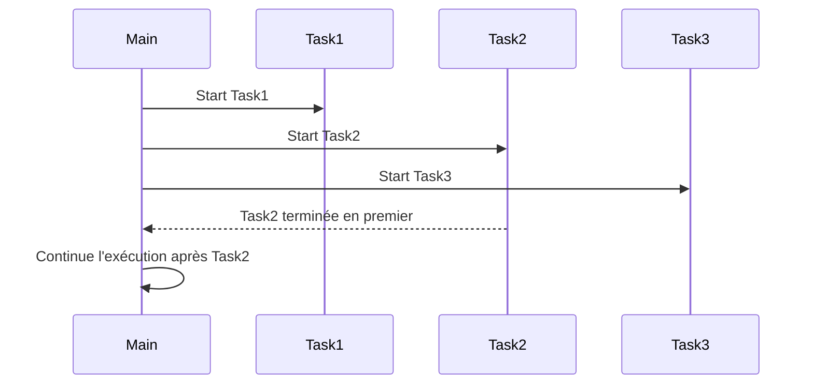
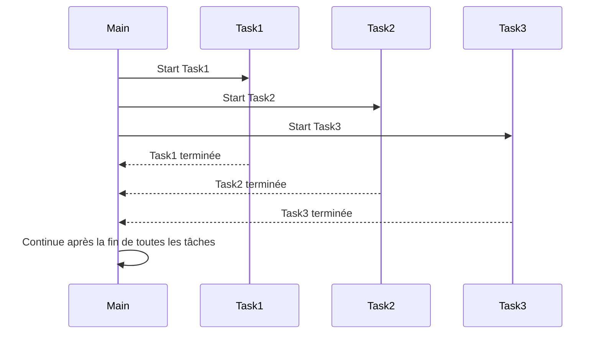
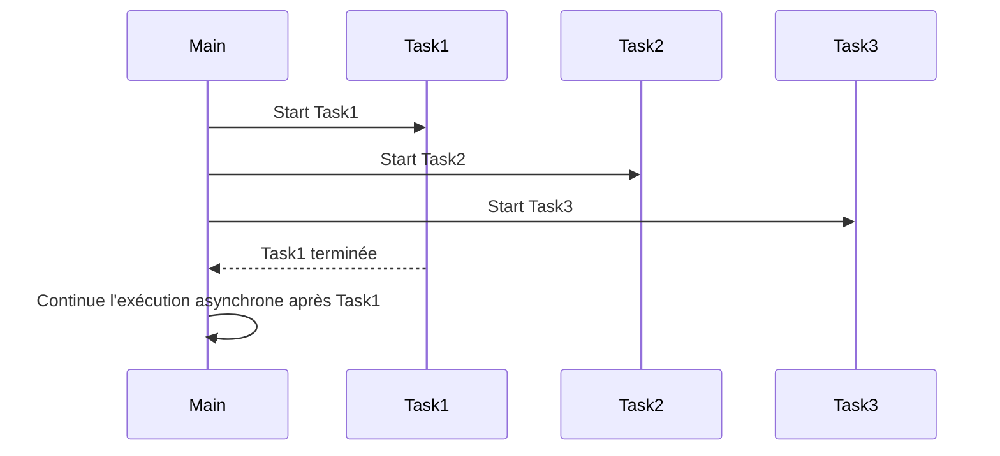
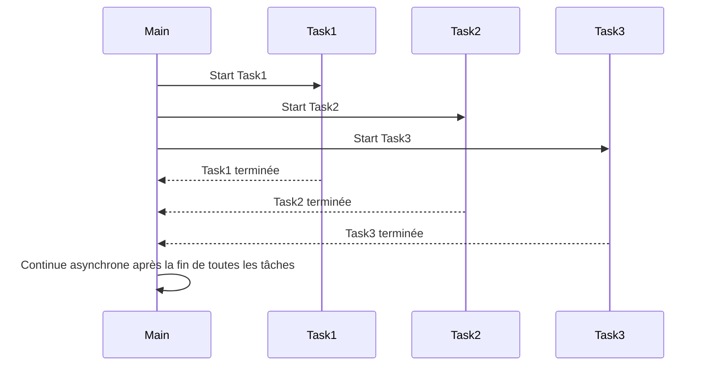

# Les Tasks

## 1. Comparaison entre `Task` et `Thread`

- **Gestion automatique** :
    - **`Thread`** : La classe `Thread` nécessite une gestion manuelle du cycle de vie des threads (création, démarrage, arrêt).
    C'est une approche plus bas niveau et moins flexible pour les tâches longues ou complexes.

    ``` mermaid
    stateDiagram
    [*] --> Unstarted : Création
    Unstarted --> Running : Start
    Running --> WaitSleepJoin : Sleep/Wait/Join
    Running --> Blocked : Ressource Indisponible
    WaitSleepJoin --> Running : Reprise
    Running --> Stopped : Fin
    Running --> Aborted : Abandon
    Aborted --> Stopped : Terminé
    Stopped --> [*] : Fin du thread

    ```


  - **`Task`** : La classe `Task` gère automatiquement le cycle de vie des threads sous-jacents via le pool de threads.

     Elle est conçue pour exécuter des tâches asynchrones avec un haut niveau d'abstraction,
     notamment grâce à des fonctionnalités comme
      - l'annulation,
      - les continuations
      -  l'attente synchronisée ou asynchrone.

    ``` mermaid
       stateDiagram
          [*] --> Created : Tâche créée
          Created --> WaitingForActivation : Planifiée
          WaitingForActivation --> Running : Commence à s'exécuter
          Running --> WaitingForChildrenToComplete : En attente de sous-tâches
          WaitingForChildrenToComplete --> RanToCompletion : Tâche principale et sous-tâches terminées
          Running --> RanToCompletion : Tâche terminée avec succès
          Running --> Faulted : Exception pendant l'exécution
          Running --> Canceled : Tâche annulée
          Canceled --> [*] : Fin de la tâche
          Faulted --> [*] : Fin de la tâche
          RanToCompletion --> [*] : Fin de la tâche

    ```

- **Simplicité et Flexibilité** :
  - **`Task`** : Simpler à utiliser avec `async` et `await`. Plus flexible pour enchaîner des tâches avec `Task.ContinueWith`.
  - **`Thread`** : Moins flexible, nécessite plus de gestion manuelle pour des scénarios comme la synchronisation ou l'annulation.

- **Performance** :
  - **`Task`** : Plus efficace en termes de performance pour des tâches courtes et des scénarios nécessitant une gestion dynamique des ressources.
  - **`Thread`** : Approprié pour des tâches longues et spécifiques, mais peut être coûteux si mal géré.

---

## 2. Nouveautés dans `Task` : Annulation et Continuation

#### Annulation
La classe `Task` supporte le mécanisme d'annulation via `CancellationToken`, qui permet de demander l'arrêt d'une tâche en cours.

**Exemple d'annulation avec `Task`** :
```csharp
CancellationTokenSource cts = new CancellationTokenSource();
CancellationToken token = cts.Token;

Task task = Task.Run(() =>
{
    for (int i = 0; i < 10; i++)
    {
        if (token.IsCancellationRequested)
        {
            Console.WriteLine("Tâche annulée.");
            return;
        }
        Console.WriteLine($"Iteration {i}");
        Thread.Sleep(500); // Simuler un travail
    }
}, token);

// Annuler la tâche après 2 secondes
Task.Delay(2000).ContinueWith(t => cts.Cancel());

task.Wait();  // Attendre la fin de la tâche
```

#### Continuation
La fonctionnalité de **continuation** permet d'exécuter une tâche après l'achèvement d'une autre.

**Exemple avec `ContinueWith`** :
```csharp
Task<int> firstTask = Task.Run(() =>
{
    Console.WriteLine("Première tâche exécutée.");
    return 42;
});

Task continuationTask = firstTask.ContinueWith(t =>
{
    Console.WriteLine($"Continuation exécutée. Résultat de la première tâche : {t.Result}");
});

continuationTask.Wait(); // Attendre que la continuation se termine
```

---

## 3. Diverses techniques d'instanciation de `Task`

1. **Utilisation de `Task.Run`** :
   - Crée et exécute une tâche simultanément.
   ```csharp
   Task.Run(() => Console.WriteLine("Tâche exécutée via Task.Run"));
   ```

2. **Utilisation de `Task.Factory.StartNew`** :
   - Crée et démarre une tâche avec plus de contrôle sur ses paramètres.
   ```csharp
   Task.Factory.StartNew(() => Console.WriteLine("Tâche avec Task.Factory.StartNew"));
   ```

3. **Instanciation explicite avec `new Task()`** :
   - Crée une tâche sans la démarrer immédiatement.
   ```csharp
   Task task = new Task(() => Console.WriteLine("Tâche créée avec new Task()"));
   task.Start();
   ```

4. **Tâches asynchrones avec `async` et `await`** :
   - Utilisation dans un contexte asynchrone.
   ```csharp
   async Task ExempleAsync()
   {
       await Task.Delay(1000);
       Console.WriteLine("Tâche asynchrone exécutée avec async/await");
   }
   ```

---

## 4. Membres importants de la classe `Task` (énumération)

1. **`Run(Action)`**
   - Exécute une action en tâche de fond.

2. **`Start()`**
   - Démarre une tâche manuellement.

3. **`Wait()`**
   - Bloque le thread appelant jusqu'à la fin de la tâche.

4. **`ContinueWith(Action<Task>)`**
   - Définit une continuation à exécuter après la tâche initiale.

5. **`Result`**
   - Obtient le résultat d'une tâche renvoyant une valeur.

6. **`IsCompleted`**
   - Indique si la tâche est terminée.

7. **`IsFaulted`**
   - Indique si la tâche a échoué avec une exception.

8. **`IsCanceled`**
   - Indique si la tâche a été annulée.

9. **`Factory`**
   - Fournit des méthodes de création de tâches avec plus de flexibilité.

10. **`Status`**
   - Renvoie l'état actuel de la tâche (`Running`, `Completed`, etc.).

---

## 5. Membres importants de la classe `Task` (exemple d'implémentation)

#### 1. **`Run(Action)`** :
```csharp
Task.Run(() => Console.WriteLine("Exécution d'une tâche via Task.Run."));
```

#### 2. **`Start()`** :
```csharp
Task task = new Task(() => Console.WriteLine("Tâche démarrée manuellement."));
task.Start();
```

#### 3. **`Wait()`** :
```csharp
Task task = Task.Run(() => Thread.Sleep(1000));
task.Wait(); // Attend que la tâche se termine
Console.WriteLine("Tâche terminée.");
```

#### 4. **`ContinueWith(Action<Task>)** :
```csharp
Task<int> task = Task.Run(() => 42);
task.ContinueWith(t => Console.WriteLine($"Résultat de la tâche : {t.Result}"));
```

#### 5. **`Result`** :
```csharp
Task<int> task = Task.Run(() => 42);
Console.WriteLine($"Résultat : {task.Result}"); // Bloque jusqu'à la fin et obtient le résultat
```

#### 6. **`IsCompleted`** :
```csharp
Task task = Task.Run(() => Thread.Sleep(1000));
task.Wait();
Console.WriteLine($"Tâche terminée : {task.IsCompleted}");
```

#### 7. **`IsFaulted`** :
```csharp
Task task = Task.Run(() => throw new Exception("Erreur dans la tâche"));
task.ContinueWith(t =>
{
    if (t.IsFaulted)
        Console.WriteLine("La tâche a échoué avec une exception.");
});
```

#### 8. **`IsCanceled`** :
```csharp
CancellationTokenSource cts = new CancellationTokenSource();
Task task = Task.Run(() =>
{
    cts.Token.ThrowIfCancellationRequested();
}, cts.Token);

cts.Cancel();
task.ContinueWith(t => Console.WriteLine($"Tâche annulée : {t.IsCanceled}"));
```

---

### 6. Exemple de synthèse qui groupe l'ensemble des membres importants

Voici un exemple complet qui combine plusieurs fonctionnalités de la classe `Task` :
```csharp
using System;
using System.Threading;
using System.Threading.Tasks;

class Program
{
    static void Main()
    {
        // Création d'un token d'annulation
        CancellationTokenSource cts = new CancellationTokenSource();
        CancellationToken token = cts.Token;

        // 1. Utilisation de Task.Run avec un annulation
        Task task = Task.Run(() =>
        {
            for (int i = 0; i < 5; i++)
            {
                if (token.IsCancellationRequested)
                {
                    Console.WriteLine("Tâche annulée.");
                    return;
                }
                Console.WriteLine($"Iteration {i}");
                Thread.Sleep(1000);
            }
        }, token);

        // 2. Continuer après l'achèvement de la tâche
        Task continuation = task.ContinueWith(t =>
        {
            if (t.IsCanceled)
                Console.WriteLine("La tâche a été annulée.");
            else if (t.IsFaulted)
                Console.WriteLine("Erreur dans la tâche.");
            else
                Console.WriteLine("Tâche réussie.");
        });

        // 3. Annuler la tâche après 2 secondes
        Task.Delay(2000).ContinueWith(t => cts.Cancel());

        // Attendre la fin de la continuation
        continuation.Wait();

        Console.WriteLine("Fin du programme.");
    }
}
```

### Explication :
- Une tâche est exécutée avec possibilité d'annulation.
- Une continuation est ajoutée après la tâche pour vérifier si elle s'est terminée, échouée ou annulée.
- Une annulation est demandée après 2 secondes, interrompant ainsi la tâche.

Passons maintenant à l'explication des méthodes `WaitAny`, `WaitAll`, `WhenAny` et `WhenAll`, qui sont essentielles pour la synchronisation et la gestion des tâches en .NET. Nous allons ajouter des diagrammes Mermaid pour mieux visualiser ces concepts, ainsi que des exemples de code pour chaque méthode.

### Différence entre `WaitAny`, `WaitAll`, `WhenAny`, et `WhenAll`

1. **`WaitAny`** :
   - **Description** : Bloque le thread actuel jusqu'à ce que **l'une des tâches** spécifiées soit terminée. C'est une opération synchrone.
   - **Usage** : Utilisé lorsqu'il faut réagir dès que l'une des tâches est terminée.

2. **`WaitAll`** :
   - **Description** : Bloque le thread actuel jusqu'à ce que **toutes les tâches** spécifiées soient terminées. C'est aussi une opération synchrone.
   - **Usage** : Utilisé lorsqu'il est nécessaire d'attendre que toutes les tâches soient terminées avant de continuer.

3. **`WhenAny`** :
   - **Description** : Renvoie une tâche qui est complétée lorsqu'une des tâches spécifiées est terminée. C'est une opération **asynchrone**.
   - **Usage** : Utile pour exécuter des actions après la fin de l'une des tâches de manière asynchrone.

4. **`WhenAll`** :
   - **Description** : Renvoie une tâche qui est complétée lorsque **toutes les tâches** spécifiées sont terminées. C'est une opération **asynchrone**.
   - **Usage** : Utilisé pour exécuter une action après que toutes les tâches aient terminé leur exécution de manière asynchrone.

---

### Schémas explicatifs des méthodes avec Mermaid

Voici des diagrammes pour visualiser la manière dont ces méthodes fonctionnent :

#### `WaitAny` - Diagramme séquentiel

- `WaitAny` réagit dès que **l'une des tâches** (ici `Task2`) est terminée.

#### `WaitAll` - Diagramme séquentiel

- `WaitAll` bloque jusqu'à ce que **toutes les tâches** soient terminées.

#### `WhenAny` - Diagramme séquentiel (Asynchrone)

- `WhenAny` renvoie une tâche qui s'achève lorsque **l'une des tâches** est terminée.

#### `WhenAll` - Diagramme séquentiel (Asynchrone)

- `WhenAll` renvoie une tâche qui se complète lorsque **toutes les tâches** sont terminées.

---

### Exemples d'implémentation

#### 1. **`WaitAny`**
   Exemple où le thread principal attend que l'une des tâches soit terminée.
```csharp
Task[] tasks = new Task[3];

tasks[0] = Task.Run(() => { Thread.Sleep(1000); Console.WriteLine("Task 1 done"); });
tasks[1] = Task.Run(() => { Thread.Sleep(2000); Console.WriteLine("Task 2 done"); });
tasks[2] = Task.Run(() => { Thread.Sleep(1500); Console.WriteLine("Task 3 done"); });

int completedIndex = Task.WaitAny(tasks);
Console.WriteLine($"Task {completedIndex + 1} is completed first.");
```
- Le programme attend jusqu'à ce que **l'une des tâches** soit terminée, et l'index de la tâche terminée est affiché.

#### 2. **`WaitAll`**
   Exemple où le thread principal attend la fin de toutes les tâches avant de continuer.
```csharp
Task[] tasks = new Task[3];

tasks[0] = Task.Run(() => { Thread.Sleep(1000); Console.WriteLine("Task 1 done"); });
tasks[1] = Task.Run(() => { Thread.Sleep(2000); Console.WriteLine("Task 2 done"); });
tasks[2] = Task.Run(() => { Thread.Sleep(1500); Console.WriteLine("Task 3 done"); });

Task.WaitAll(tasks);
Console.WriteLine("All tasks are completed.");
```
- Le programme bloque jusqu'à ce que **toutes les tâches** soient terminées.

#### 3. **`WhenAny`**
   Exemple d'utilisation asynchrone de `WhenAny` où l'exécution continue dès que l'une des tâches est terminée.
```csharp
async Task RunWhenAny()
{
    Task<int>[] tasks = new Task<int>[3];

    tasks[0] = Task.Run(async () => { await Task.Delay(1000); Console.WriteLine("Task 1 done"); return 1; });
    tasks[1] = Task.Run(async () => { await Task.Delay(2000); Console.WriteLine("Task 2 done"); return 2; });
    tasks[2] = Task.Run(async () => { await Task.Delay(1500); Console.WriteLine("Task 3 done"); return 3; });

    Task<int> completedTask = await Task.WhenAny(tasks);
    Console.WriteLine($"Task {completedTask.Result} is completed first.");
}

await RunWhenAny();
```
- L'exécution continue de manière **asynchrone** dès que l'une des tâches est terminée.

#### 4. **`WhenAll`**
   Exemple d'utilisation asynchrone de `WhenAll` où l'exécution continue après la fin de toutes les tâches.
```csharp
async Task RunWhenAll()
{
    Task[] tasks = new Task[3];

    tasks[0] = Task.Run(async () => { await Task.Delay(1000); Console.WriteLine("Task 1 done"); });
    tasks[1] = Task.Run(async () => { await Task.Delay(2000); Console.WriteLine("Task 2 done"); });
    tasks[2] = Task.Run(async () => { await Task.Delay(1500); Console.WriteLine("Task 3 done"); });

    await Task.WhenAll(tasks);
    Console.WriteLine("All tasks are completed.");
}

await RunWhenAll();
```
- L'exécution se poursuit **asynchrone** après la fin de **toutes les tâches**.

---

### Conclusion

Voici un résumé des différences entre ces méthodes de synchronisation et de gestion des tâches en .NET, accompagnées de schémas Mermaid pour clarifier leur comportement. 

- **`WaitAny`** et **`WaitAll`** bloquent le thread actuel et sont synchrones, tandis que **`WhenAny`** et **`WhenAll`** permettent d'attendre de manière asynchrone.
- `WaitAny` et `WhenAny` réagissent à la première tâche qui se termine, tandis que `WaitAll` et `WhenAll` attendent que toutes les tâches soient terminées avant de continuer.

Ces outils sont très puissants pour gérer des scénarios de concurrence et d'asynchronie en .NET. ✔️
